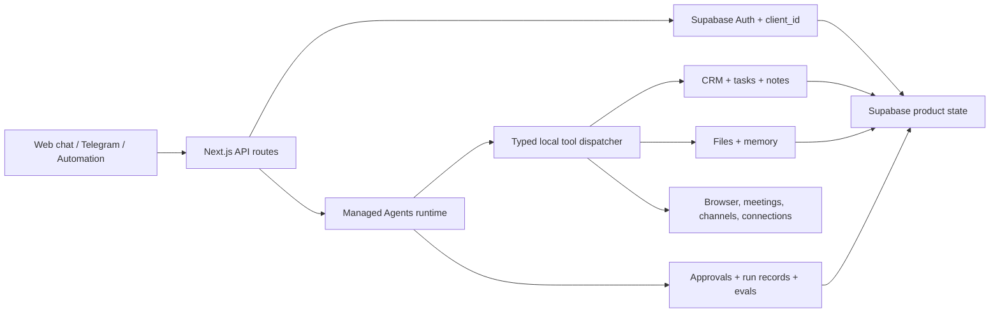

<p align="center">
  
</p>

<h2 align="center">AI CRM workspace for advisory sales</h2>

<p align="center">
  <a href="https://neobot-ai-crm.vercel.app/">Website</a> ·
  <a href="./PRODUCT.md">Product notes</a> ·
  <a href="./AGENTS.md">Agent guide</a> ·
  <a href="#architecture">Architecture</a> ·
  <a href="#run-locally">Run locally</a>
</p>

<p align="center">
  
</p>

<br />

# What It Is

NeoBot is an AI CRM workspace for solo practitioners in advisory sales:
real estate agents, insurance advisors, financial planners, and other
client-facing operators.

The product goal is simple: make the work visible and controllable. NeoBot
updates CRM records, prepares follow-ups, briefs the user, coordinates
automations, and keeps memory close to the customer context. The practitioner
keeps judgment; the agent handles repeatable intelligence work behind an
approval gate.

## Run Locally

```bash
pnpm install
pnpm dev
```

For a clean local restart:

```bash
pnpm neo
```

Copy `.env.example` to `.env.local` and fill in Supabase, AI, and integration
credentials. Local environment files, auth state, generated screenshots, and
test scratch are ignored.

## Product Principles

- Keep work close to the task: chat, CRM records, meetings, automations,
  approvals, and memory should feel like one workspace.
- Make agent work reviewable: users should see what changed, what needs
  approval, and what the agent knows.
- Design for real operators: the UI should be calm, dense, mobile-capable, and
  useful under repeated daily use.
- Prefer operational density over SaaS theater.

## What It Supports

- CRM records for people, companies, deals, tasks, and relationships.
- Chat workspace for Managed Agent runs connected to CRM and memory context.
- Automations for scheduled agent work and recurring workflows.
- Messaging channels, including Telegram pairing and approval flows.
- Meeting workflow surfaces for handoffs into agent work.
- Settings for agent profile, memory, notifications, billing, and workspace
  behavior.
- Product QA and design audits preserved as markdown reports under `docs/`.

## Architecture



NeoBot is a Next.js App Router workspace with Supabase-backed CRM data, chat
and agent flows, scheduled task hooks, and integration surfaces. AI work enters
a reusable Anthropic Managed Agents runtime with persistent sessions, typed
tools, approval gates, run lifecycle tracking, and tenant-scoped state.

## Stack

- Next.js 15 App Router and React 19
- TypeScript
- Supabase Auth, Postgres, Storage, and Realtime
- Anthropic Managed Agents for the primary agent loop
- Vercel AI SDK for chat UI types, title generation, and compaction helpers
- TanStack Query and TanStack Table
- ShadCN-style local UI primitives and Tailwind 4
- Trigger.dev for scheduled work
- Vitest and Testing Library

## Repo Map

- `app/` - App Router pages and API routes.
- `src/components/` - Dashboard, chat, CRM, settings, and shared UI.
- `src/lib/managed-agents/` - session runner, event translation, dispatcher,
  tool handlers, approvals, and cost helpers.
- `managed-agents/skills/` - runtime skill catalog uploaded to Anthropic.
- `scripts/managed-agents/` - agent registration, skill upload, and migration
  utilities.
- `supabase/` - migrations, seed data, and database support files.
- `tests/` - cross-cutting tests and test utilities.
- `docs/product/` - current plans, handovers, audits, and product evidence.
- `docs/archive/roadmap/` - historical specs and reference research.
- `internal/media/demo-video/` - standalone Remotion video prototype.

## Agent Workbench

The repository also contains checked-in assistant workbench folders such as
`.agents/`, `.claude/`, `.codex/`, `.context/`, `.kiro/`, `.windsurf/`,
`skills/`, and `skills-lock.json`. These are development workflow assets, not
product runtime code. The production agent runtime lives in
`src/lib/managed-agents/`, `managed-agents/skills/`, and
`scripts/managed-agents/`.

## Legacy Names

NeoBot is the public product name. Some internal identifiers still use the
former `sunder-*` naming convention where renaming would touch runtime
compatibility or history: database migrations, persisted storage keys, webhook
headers, CSS token names, Managed Agent registry IDs, and archived planning
material. Treat those as compatibility names, not current product copy.

## Inspection Guide

Start here when reviewing the project:

1. Read `PRODUCT.md` for product framing and market positioning.
2. Read `AGENTS.md` for architecture, conventions, and runtime boundaries.
3. Inspect `src/lib/managed-agents/` and `scripts/managed-agents/` for the
   core agent harness.
4. Inspect `supabase/` for tenant-scoped database structure.
5. Inspect `docs/product/plans/2026-04-13-PR-list-neobot-current.json` for
   shipped and remaining work.

## Health Checks

```bash
pnpm lint
pnpm test:run
pnpm build
```

`next build` is configured separately from lint gating. Use lint and focused
test suites to verify product changes before treating a branch as clean.
