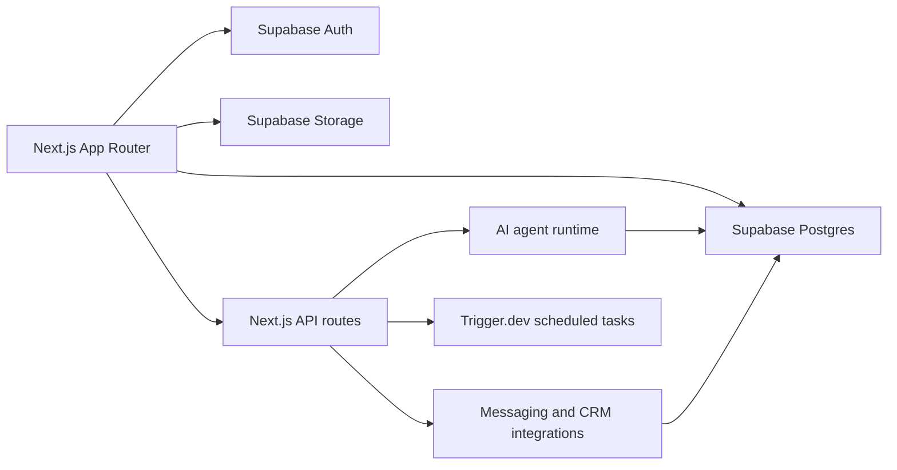

# NeoBot

An AI CRM workspace for solo advisory sales. NeoBot helps client-facing operators keep track of people, companies, deals, meetings, follow-ups, automations, approvals, and memory without turning their day into CRM admin.

## Why I Built NeoBot

Advisory sales work is full of tiny, high-context tasks: update the deal after a meeting, remember what a client cared about, prep for the next conversation, send the follow-up, check whether a task is waiting, and keep records clean enough to be useful later.

Most CRMs are built as databases first. NeoBot is built as a work surface first. The goal is to make completed work visible and controllable: what changed, what needs approval, what the agent knows, and what the user should do next.

## Quick Start

```bash
npm install
npm run dev
```

For a clean local restart:

```bash
npm run neo
```

Copy `.env.example` to `.env.local` and fill in the required Supabase, AI, and integration credentials. Do not commit local environment files.

## Philosophy

Keep work close to the task. Chat, CRM records, meetings, automations, approvals, and memory should feel like one workspace rather than separate apps.

Make agent work reviewable. NeoBot should show what the agent did, what it needs, and what still requires human approval before anything external-facing happens.

Design for real operators. The product should work for advisory sales users who move between mobile, meetings, desktop review, and admin cleanup.

Prefer operational density over SaaS theater. The interface should feel calm, scannable, and useful under repeated daily use.

## What It Supports

CRM records - manage people, companies, deals, and related relationships.

Meeting workflow - organize meeting rows, details, and handoffs into agent work.

Chat workspace - run agent conversations that can connect back to CRM context and product workflows.

Automations - define and inspect recurring workflows or scheduled agent tasks.

Messaging channels - manage external channel setup and disabled/available channel states.

Settings and profile - configure agent, memory, notifications, workspace, billing, and messaging behavior.

Approvals and review surfaces - keep external-facing work visible before it leaves the workspace.

Product QA and design audits - preserve launch-readiness reviews, screenshots, and design-system notes as product evidence.

## Architecture



The app is a Next.js App Router workspace with Supabase-backed CRM data, chat and agent flows, scheduled task hooks, and integration surfaces. Product UI is organized around dashboard routes for chat, customers, meetings, automations, skills, pricing, and settings.

## Stack

- Next.js App Router
- React 19
- TypeScript
- Supabase Auth, Postgres, and Storage
- TanStack Query
- ShadCN-style local UI primitives
- Trigger.dev for scheduled work
- AI SDK and model/provider integrations
- Vitest and Testing Library

## Key Files

- `app/(dashboard)/chat/` - chat workspace and thread pages
- `app/(dashboard)/customers/` - companies, deals, and people CRM views
- `app/(dashboard)/channels/` - messaging channel management
- `app/settings/` - agent, memory, notifications, profile, workspace, and billing settings
- `src/components/chat/` - chat welcome, quota, and message surfaces
- `src/components/layout/` - dashboard shell and sidebar
- `src/components/settings/` - settings page components and messaging channel rows
- `src/hooks/use-crm-views.ts` - CRM view state and query behavior
- `docs/product/` - audits, product plans, and launch-readiness evidence
- `.agents/skills/impeccable/` - local product/design tooling workstream

## Health Checks

```bash
npm run build
npm run test:run
npm run lint
```

`next build` is configured separately from lint gating. Use lint and focused test suites to verify product changes before treating a branch as clean.
