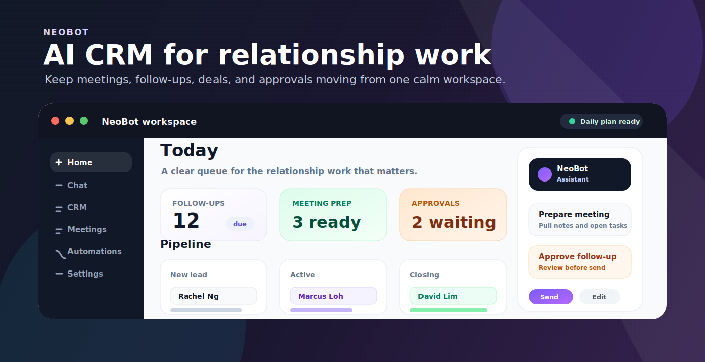
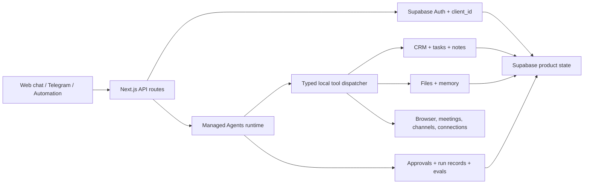

<p align="center">
  
</p>

<h2 align="center">AI CRM workspace for advisory sales</h2>

<p align="center">
  <a href="https://neobot-ai-crm.vercel.app/">Website</a> ·
  <a href="./PRODUCT.md">Product notes</a> ·
  <a href="./AGENTS.md">Agent guide</a> ·
  <a href="#architecture">Architecture</a> ·
  <a href="#quick-start">Quick start</a>
</p>

<p align="center">
  
</p>

<br />

# Why NeoBot

Advisory sales work is full of tiny, high-context tasks: update the deal after a meeting, remember what a client cared about, prep for the next conversation, send the follow-up, check whether a task is waiting, and keep records clean enough to be useful later.

Most CRMs are built as databases first. NeoBot is built as a work surface first. The goal is to make completed work visible and controllable: what changed, what needs approval, what the agent knows, and what the user should do next.

## Quick Start

```bash
pnpm install
pnpm dev
```

For a clean local restart:

```bash
pnpm neo
```

Copy `.env.example` to `.env.local` and fill in the required Supabase, AI, and integration credentials. Do not commit local environment files.

## Philosophy

Keep work close to the task. Chat, CRM records, meetings, automations, approvals, and memory should feel like one workspace rather than separate apps.

Make agent work reviewable. NeoBot should show what the agent did, what it needs, and what still requires human approval before anything external-facing happens.

Design for real operators. The product should work for advisory sales users who move between mobile, meetings, desktop review, and admin cleanup.

Prefer operational density over SaaS theater. The interface should feel calm, scannable, and useful under repeated daily use.

## What It Supports

CRM records - manage people, companies, deals, and related relationships.

Meeting workflow - organize meeting rows, details, and handoffs into agent work.

Chat workspace - run agent conversations that can connect back to CRM context and product workflows.

Automations - define and inspect recurring workflows or scheduled agent tasks.

Messaging channels - manage external channel setup and disabled/available channel states.

Settings and profile - configure agent, memory, notifications, workspace, billing, and messaging behavior.

Approvals and review surfaces - keep external-facing work visible before it leaves the workspace.

Product QA and design audits - preserve launch-readiness reviews, screenshots, and design-system notes as product evidence.

## System Shape

NeoBot is easiest to understand as a product shell around a shared agent harness:

1. **Workspace shell** - dashboard routes expose chat, CRM, meetings, automations, channels, skills, billing, and settings.
2. **Tenant state** - Supabase stores clients, threads, messages, runs, CRM records, files, approvals, triggers, and usage data.
3. **Agent runtime** - chat, Telegram, and automations can enter the same Managed Agents loop instead of becoming separate prototypes.
4. **Tool layer** - typed tools operate on CRM records, files, browser tasks, meetings, integrations, triggers, and messaging surfaces.
5. **Control layer** - approvals, run records, costs, evaluator scores, and tenant filters make agent work inspectable.

The important boundary is intentional: NeoBot is an AI CRM/workflow prototype for advisory-sales operators. It helps prepare, update, remember, and coordinate work; it does not replace the user's commercial judgment or make every external action autonomous.

## Architecture



The app is a Next.js App Router workspace with Supabase-backed CRM data, chat and agent flows, scheduled task hooks, and integration surfaces. Product UI is organized around dashboard routes for chat, customers, meetings, automations, skills, pricing, and settings. When AI work is needed, the request enters a reusable agent runtime with persistent sessions, typed tools, approval gates, run lifecycle tracking, and tenant-scoped state.

## Stack

- Next.js App Router
- React 19
- TypeScript
- Supabase Auth, Postgres, and Storage
- TanStack Query
- ShadCN-style local UI primitives
- Trigger.dev for scheduled work
- AI SDK and model/provider integrations
- Vitest and Testing Library

## Key Files

- `app/(dashboard)/chat/` - chat workspace and thread pages
- `app/(dashboard)/customers/` - companies, deals, and people CRM views
- `app/(dashboard)/channels/` - messaging channel management
- `app/settings/` - agent, memory, notifications, profile, workspace, and billing settings
- `src/components/chat/` - chat welcome, quota, and message surfaces
- `src/components/layout/` - dashboard shell and sidebar
- `src/components/settings/` - settings page components and messaging channel rows
- `src/hooks/use-crm-views.ts` - CRM view state and query behavior
- `docs/product/` - audits, product plans, and launch-readiness evidence
- `.agents/skills/impeccable/` - local product/design tooling workstream

## Health Checks

```bash
pnpm build
pnpm test:run
pnpm lint
```

`next build` is configured separately from lint gating. Use lint and focused test suites to verify product changes before treating a branch as clean.
