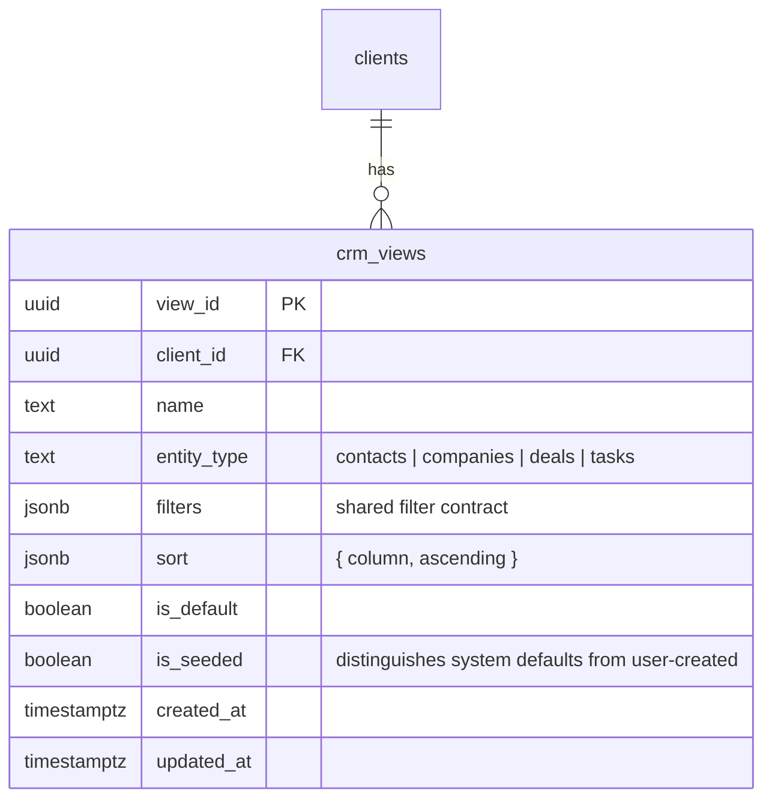

# feat: CRM Saved Views

## Overview

Add saved filter+sort views to CRM list pages (deals, tasks, contacts, companies). The agent creates/manages views via a new `manage_views` tool. Users see a horizontal pill tab bar above each CRM table — "All" plus saved views. Clicking a pill re-queries Supabase server-side with the view's filters. New accounts ship with sensible seeded defaults.

This reverses a deliberate scope exclusion from PR 42a and PR 46 (see origin: `docs/product/ideations/2026-04-05-crm-saved-views-requirements.md`).

## Problem Statement / Motivation

CRM pages show all records with no filtering. Users who want a focused slice ("overdue tasks", "active pipeline") must ask the agent in chat every time. Saved views are table-stakes CRM functionality (see `docs/product/references/2026-03-11-feature-comparison-sunder-vs-denchclaw.md` section 3 — saved views listed as Tier 1 gap).

## Proposed Solution

1. **DB table** `crm_views` stores named filter+sort presets per entity per client
2. **Shared filter contract** — one schema defining supported operators, used by `manage_views`, page hooks, and `search_crm`
3. **Agent tool** `manage_views` (create/update/delete/list) — no manual filter-builder UI (see origin: R1)
4. **Pill tab view picker** above each CRM table — "All" default + saved views (see origin: R2)
5. **Server-side filtering** — views drive Supabase queries via extended hooks (see origin: R3)
6. **Seeded defaults** per entity type, config-driven not hardcoded (see origin: R4)
7. **URL param** `?savedView=<view_id>` persists active view across navigation (see origin: R6)

## Technical Considerations

### Architecture



### Key Design Decisions

**URL param: `?savedView=<view_id>` (not name)**
View IDs are stable across renames. The param name `savedView` avoids collision with the existing `?view=table|kanban|calendar` param from PR 46.

**RLS uses `public.get_my_client_id()` (not `auth.uid()`)**
All tenant-scoped tables in this repo use `public.get_my_client_id()` — a function that resolves `auth.uid()` → `client_id` via the `clients` table (see `supabase/migrations/20260301000005_add_rls_policies.sql:4`). The `crm_views` migration must follow this exact pattern.

**Shared filter contract — one schema, three consumers**
A single filter schema (`src/lib/crm/view-filters.ts`) defines supported operators per entity type. This schema is used by:
1. The `manage_views` agent tool (validates filters on write)
2. The frontend data hooks (applies filters on read)
3. Eventually `search_crm` (can be aligned to the same contract)

Supported operators:
- **Equality**: `.eq(column, value)` — stage, status, type, industry, company_id, contact_id, deal_id
- **Array inclusion**: `.in(column, values)` — for multi-value filters like "stage in [leads, offer]"
- **Date range**: `{column}_after` → `.gte()`, `{column}_before` → `.lte()` — for due_date, created_at, close_date
- **Symbolic date tokens**: `$today`, `$week_start`, `$week_end`, `$month_start`, `$month_end` — resolved at query time

This is intentionally a superset of what `search_crm` currently supports. `search_crm` only handles scalar equality + `occurred_after`/`occurred_before`. Rather than pretend parity, we define the view filter contract explicitly and optionally align `search_crm` later.

**Active view is authoritative — replaces local filter state**
When a saved view is active, it is the **single source of truth** for table filters and sort. Local page filter state (search bar, filter dropdowns) is cleared/ignored while a view is selected. Clicking "All" restores normal filter behavior. This avoids unpredictable intersections of stale local state with view filters (see adversarial review finding).

The saved view's `sort` field, when present, overrides the hook's default ordering. Each hook must accept an optional `sort` param and apply it instead of its hardcoded `.order()`.

**Seed defaults are config-driven, not hardcoded**
The "Active pipeline" default must not hardcode stage names like `["leads", "viewing", "offer", "negotiation"]` — the actual default stages are `["leads", "negotiation", "offer", "closing", "lost"]` (see `src/lib/crm/schemas.ts:81`), and users can configure custom stages via `crm_config`. Instead, the seed function reads `crm_config` to determine which stages are non-terminal, or uses a semantic filter like `stage_not_in: ["lost"]` (exclude terminal stages).

**Realtime invalidation for `crm_views` table**
The `useCrmViews` hook must use `useRealtimeTable` (same pattern as `useCrmTasks` at `src/hooks/use-crm-tasks.ts:99-104`) so that when the agent creates/deletes a view, the pill tabs update without a page refresh. This requires adding `"crm_views"` to the `RealtimeTableName` union in `src/hooks/use-realtime.ts:12`.

### System-Wide Impact

- **Interaction graph**: Pill tab click → URL param update → hook re-fetch with view filters → Supabase query → table re-renders. Agent creates view → Supabase insert → realtime event → query invalidation → pill tabs update.
- **Error propagation**: Invalid view ID in URL → fallback to "All" (no view filters). Deleted view in URL → same fallback. Malformed filter JSON in DB → skip that filter key, log warning.
- **State lifecycle risks**: Minimal. Views are independent rows. Deleting a view while a user has it selected just falls back to "All" on next realtime invalidation or navigation.
- **API surface parity**: The shared filter contract (`src/lib/crm/view-filters.ts`) is the single definition. `manage_views` validates against it. Page hooks apply from it. `search_crm` can optionally adopt it later.
- **Integration test scenarios**: (1) Agent creates view → pill appears via realtime within seconds. (2) User clicks pill → local filter state cleared, table shows view-filtered results with view-specified sort. (3) Navigate away and back with `?savedView=<id>` → same view active, same results. (4) Agent deletes view → pill disappears, falls back to "All". (5) Seeded "Active pipeline" view works correctly even when user has custom stages configured.

## Acceptance Criteria

### Functional Requirements

- [ ] `crm_views` table exists with RLS using `public.get_my_client_id()` (matching existing CRM table pattern)
- [ ] Agent can create a saved view via `manage_views` tool with name, entity, filters, sort
- [ ] Agent can list, update, and delete saved views
- [ ] Each CRM list page (/tasks, /customers/deals, /customers/people, /customers/companies) shows pill tabs: "All" + saved views for that entity
- [ ] Clicking a saved view pill re-queries Supabase with the view's filters and sort
- [ ] Active saved view is authoritative: local filter/sort state is cleared when a view is selected
- [ ] Clicking "All" restores normal unfiltered behavior with default sort
- [ ] "All" is always first, not deletable, shows unfiltered data
- [ ] Active view persists in URL as `?savedView=<view_id>`
- [ ] Navigating back to a page with `?savedView=<id>` restores the active view
- [ ] Invalid or deleted view ID in URL falls back to "All"
- [ ] New accounts have seeded default views (Deals: "Active pipeline", "Closing this month"; Tasks: "Overdue", "Due this week", "Done"; Contacts: "Buyers", "Sellers")
- [ ] Seeded defaults are deletable
- [ ] "Active pipeline" seed reads from CRM config (not hardcoded stage names)
- [ ] Pill tabs update in realtime when agent creates/deletes views (no page refresh needed)
- [ ] Pill tabs scroll horizontally on mobile
- [ ] System prompt guides agent on when/how to use `manage_views`

### Non-Functional Requirements

- [ ] View filters applied server-side (Supabase query, not client-side)
- [ ] No client-side TanStack Table filtering added
- [ ] One shared filter contract used by agent tool + page hooks
- [ ] RLS follows existing `get_my_client_id()` pattern (not `auth.uid()`)

## Implementation Phases

### Phase 1: Shared Filter Contract + Database

**New file: `src/lib/crm/view-filters.ts`**

Defines the canonical filter schema shared by agent tool and frontend:

```typescript
/** Operators supported in saved view filters. */
export const VIEW_FILTER_OPERATORS = {
  /** Equality: .eq(column, value) */
  eq: ["stage", "status", "type", "industry", "company_id", "contact_id", "deal_id"],
  /** Array inclusion: .in(column, values) */
  in: ["stage", "status", "type"],
  /** Date range: column_after → .gte(), column_before → .lte() */
  dateRange: ["due_date", "created_at", "close_date", "occurred_at"],
} as const;

/** Symbolic date tokens resolved at query time. */
export const SYMBOLIC_DATE_TOKENS = ["$today", "$week_start", "$week_end", "$month_start", "$month_end"] as const;

/** Resolves symbolic tokens to ISO date strings. */
export function resolveSymbolicDates(filters: Record<string, unknown>): Record<string, unknown> { ... }

/** Applies resolved view filters to a Supabase query builder. */
export function applyViewFilters(query: SupabaseQueryBuilder, filters: Record<string, unknown>): SupabaseQueryBuilder { ... }

/** Zod schema for validating view filter objects. */
export const viewFiltersSchema = z.record(...);
```

The `applyViewFilters` function handles eq, in, gte/lte for date ranges — one place, used by all hooks.

**Migration: create `crm_views` table**

```sql
CREATE TABLE crm_views (
  view_id UUID PRIMARY KEY DEFAULT gen_random_uuid(),
  client_id UUID NOT NULL REFERENCES clients(client_id) ON DELETE CASCADE,
  name TEXT NOT NULL,
  entity_type TEXT NOT NULL CHECK (entity_type IN ('contacts', 'companies', 'deals', 'tasks')),
  filters JSONB NOT NULL DEFAULT '{}'::jsonb,
  sort JSONB,
  is_default BOOLEAN NOT NULL DEFAULT FALSE,
  is_seeded BOOLEAN NOT NULL DEFAULT FALSE,
  created_at TIMESTAMPTZ NOT NULL DEFAULT now(),
  updated_at TIMESTAMPTZ NOT NULL DEFAULT now()
);

-- RLS: use get_my_client_id() matching all other CRM tables
ALTER TABLE crm_views ENABLE ROW LEVEL SECURITY;

CREATE POLICY "crm_views_select" ON crm_views FOR SELECT
  USING (client_id = public.get_my_client_id());

CREATE POLICY "crm_views_insert" ON crm_views FOR INSERT
  WITH CHECK (client_id = public.get_my_client_id());

CREATE POLICY "crm_views_update" ON crm_views FOR UPDATE
  USING (client_id = public.get_my_client_id())
  WITH CHECK (client_id = public.get_my_client_id());

CREATE POLICY "crm_views_delete" ON crm_views FOR DELETE
  USING (client_id = public.get_my_client_id());

-- Enable realtime for crm_views
ALTER PUBLICATION supabase_realtime ADD TABLE crm_views;

-- Index for fast lookups
CREATE INDEX idx_crm_views_client_entity ON crm_views(client_id, entity_type);

-- Unique name per client per entity
CREATE UNIQUE INDEX idx_crm_views_unique_name ON crm_views(client_id, entity_type, name);
```

**Zod schemas** in `src/lib/crm/schemas.ts`:

```typescript
export const crmViewEntityTypes = ["contacts", "companies", "deals", "tasks"] as const;

export const crmViewSchema = z.object({
  view_id: z.string().uuid(),
  client_id: z.string().uuid(),
  name: z.string().min(1),
  entity_type: z.enum(crmViewEntityTypes),
  filters: z.record(z.string(), z.union([z.string(), z.number(), z.boolean(), z.null(), z.array(z.string())])),
  sort: z.object({
    column: z.string(),
    ascending: z.boolean(),
  }).nullable(),
  is_default: z.boolean(),
  is_seeded: z.boolean(),
  created_at: z.string(),
  updated_at: z.string(),
});

export type CrmView = z.infer<typeof crmViewSchema>;
```

**Regenerate database types** via `supabase gen types typescript`.

### Phase 2: Agent Tool

**New file: `src/lib/runner/tools/crm/views.ts`**

Factory function `createViewTools(supabase, clientId)` returning `{ manage_views }`.

Single tool with `operation` discriminator. Validates filters against `viewFiltersSchema` from the shared contract on create/update.

```typescript
inputSchema: z.discriminatedUnion("operation", [
  z.object({
    operation: z.literal("create"),
    name: z.string().min(1).describe("Display name for the view"),
    entity_type: z.enum(crmViewEntityTypes).describe("CRM entity this view filters"),
    filters: viewFiltersSchema.describe("Filter object — keys are column names or column_after/column_before for date ranges. Values can be strings, numbers, booleans, or string arrays for IN filters. Use symbolic tokens like $today, $week_start, $month_end for dynamic dates."),
    sort: z.object({ column: z.string(), ascending: z.boolean() }).optional(),
  }),
  z.object({
    operation: z.literal("list"),
    entity_type: z.enum(crmViewEntityTypes).optional(),
  }),
  z.object({
    operation: z.literal("update"),
    view_id: z.string().uuid(),
    name: z.string().min(1).optional(),
    filters: viewFiltersSchema.optional(),
    sort: z.object({ column: z.string(), ascending: z.boolean() }).nullable().optional(),
  }),
  z.object({
    operation: z.literal("delete"),
    view_id: z.string().uuid(),
  }),
])
```

**Register in `src/lib/runner/tools/crm/index.ts`:**
- Import `createViewTools`
- Add `manage_views: viewTools.manage_views` in the write-tools block (alongside `create_task`, `update_task`)

**Update system prompt** in `src/lib/ai/system-prompt.ts`:
Add under `<crm>` section:
```
CRM — Views:
- Use manage_views to create, update, delete, or list saved CRM views.
- A view is a named filter+sort preset for contacts, companies, deals, or tasks.
- Views appear as pill tabs on CRM pages — users click to filter instantly.
- Only create views when the user explicitly asks. Don't create views speculatively.
- Supported filter operators: equality (stage, status, type), array inclusion (stage in [...]), date ranges (due_date_after, due_date_before, created_at_after, created_at_before).
- Use symbolic date tokens for dynamic views: $today, $week_start, $week_end, $month_start, $month_end.
```

### Phase 3: Frontend — Data Layer

**Add `"crm_views"` to `RealtimeTableName` union** in `src/hooks/use-realtime.ts:12`.

**New hook: `src/hooks/use-crm-views.ts`**

```typescript
export function useCrmViews(entityType: CrmViewEntityType) {
  const { data: clientId } = useClientId();

  // Realtime invalidation — pill tabs update when agent creates/deletes views
  useRealtimeTable({
    table: "crm_views",
    filter: clientId ? `client_id=eq.${clientId}` : undefined,
    queryKeys: [["crm-views", entityType]],
    enabled: Boolean(clientId),
  });

  return useQuery({
    queryKey: ["crm-views", entityType],
    queryFn: () => supabase.from("crm_views")
      .select("*")
      .eq("entity_type", entityType)
      .order("is_seeded", { ascending: false })
      .order("created_at", { ascending: true }),
    enabled: Boolean(clientId),
  });
}
```

**Extend existing data hooks to accept view filters + sort:**

Each hook (`useCrmTasks`, `usePaginatedDeals`, `usePaginatedContacts`, `usePaginatedCompanies`) gets:
1. An optional `viewFilters?: Record<string, unknown>` param
2. An optional `viewSort?: { column: string; ascending: boolean }` param

The hooks call `resolveSymbolicDates()` then `applyViewFilters()` from the shared contract. When `viewSort` is provided, it overrides the hook's default `.order()` call.

**Specific hook changes needed:**

| Hook | File | Changes |
|------|------|---------|
| `useCrmTasks` | `src/hooks/use-crm-tasks.ts` | Add `viewFilters`/`viewSort` params; call `applyViewFilters()` in query builder |
| `usePaginatedDeals` | `src/hooks/use-deals.ts` | Add `viewFilters`/`viewSort` params; call `applyViewFilters()` in `applyDealFilters()` |
| `usePaginatedContacts` | `src/hooks/use-contacts.ts` | Add `viewFilters`/`viewSort` params; call `applyViewFilters()` in query builder |
| `usePaginatedCompanies` | `src/hooks/use-companies.ts` | Add `viewFilters`/`viewSort` params; call `applyViewFilters()` in query builder |

### Phase 4: Frontend — View Picker Component

**New component: `src/components/crm/view-picker.tsx`**

Pill tab bar component:

```typescript
interface ViewPickerProps {
  entityType: CrmViewEntityType;
  activeViewId: string | null;  // null = "All"
  onViewChange: (viewId: string | null) => void;
}
```

- Fetches views via `useCrmViews(entityType)`
- Renders horizontal scrollable pill bar: "All" (always first) + saved views
- Active pill gets accent styling
- Mobile: `overflow-x-auto` with horizontal scroll
- Uses Flexoki semantic tokens per CLAUDE.md design system rules

### Phase 5: Wire Up CRM Pages

Each CRM list page gets:

1. **URL param reading**: `const savedViewId = searchParams?.get("savedView")`
2. **View data lookup**: Find active view from `useCrmViews` result
3. **Authoritative view state**: When a saved view is active, **clear local filter state** (search, filter dropdowns). Pass only the view's filters and sort to the data hook:
   ```typescript
   const activeView = views?.find(v => v.view_id === savedViewId);
   const filters = activeView
     ? { viewFilters: activeView.filters, viewSort: activeView.sort }  // view is authoritative
     : { search, status, ...localFilters };  // "All" uses local state
   ```
4. **ViewPicker component**: Rendered above the table/view-switcher area
5. **View change handler**: Updates URL param via `router.replace`. When switching to a view, clears local filter state. When switching to "All", restores defaults.

Pages to update:
- `app/(dashboard)/tasks/page.tsx`
- `app/(dashboard)/customers/deals/page.tsx`
- `app/(dashboard)/customers/people/page.tsx`
- `app/(dashboard)/customers/companies/page.tsx`

**URL param coexistence**: `?savedView=<id>` lives alongside existing `?view=table|kanban`. When a saved view is active, page-level filter controls (FilterBar, search input) are hidden or visually disabled to signal the view is the active lens.

### Phase 6: Seed Defaults

**Config-driven seeding function** (not hardcoded stage names):

```typescript
async function seedDefaultViews(supabase: SupabaseClient, clientId: string) {
  // Read CRM config to get actual configured stages
  const { data: config } = await supabase
    .from("crm_config")
    .select("config")
    .eq("client_id", clientId)
    .single();

  const stages = config?.config?.deals?.stages ?? dealStageValues;
  const terminalStages = ["lost"];  // semantic: terminal stages to exclude from "active"
  const activeStages = stages.filter((s: string) => !terminalStages.includes(s));

  const defaults = [
    // Deals
    { name: "Active pipeline", entity_type: "deals", filters: { stage: activeStages } },
    { name: "Closing this month", entity_type: "deals", filters: { close_date_after: "$month_start", close_date_before: "$month_end" } },
    // Tasks
    { name: "Overdue", entity_type: "tasks", filters: { status: "todo", due_date_before: "$today" } },
    { name: "Due this week", entity_type: "tasks", filters: { due_date_after: "$today", due_date_before: "$week_end" } },
    { name: "Done", entity_type: "tasks", filters: { status: "done" } },
    // Contacts
    { name: "Buyers", entity_type: "contacts", filters: { type: "buyer" } },
    { name: "Sellers", entity_type: "contacts", filters: { type: "seller" } },
  ];

  await supabase.from("crm_views").upsert(
    defaults.map(d => ({ ...d, client_id: clientId, is_seeded: true })),
    { onConflict: "client_id,entity_type,name" }
  );
}
```

**Seeding trigger:** Called during onboarding flow (existing account creation path). For existing accounts, run a one-time backfill migration or RPC.

### Phase 7: Tests

- **Shared filter contract tests** (`src/lib/crm/__tests__/view-filters.test.ts`): symbolic date resolution, `applyViewFilters` applies eq/in/gte/lte correctly, rejects unknown operators
- **Agent tool tests** (`src/lib/runner/tools/crm/__tests__/views.test.ts`): create, list, update, delete operations; duplicate name handling; client isolation; filter validation against shared contract
- **Hook tests** (`src/hooks/__tests__/use-crm-views.test.tsx`): fetch views, filter by entity, realtime invalidation
- **Component tests** (`src/components/crm/__tests__/view-picker.test.tsx`): renders pills, active state, "All" always first, click handler
- **Page integration**: Active view in URL → local filters cleared → correct view filters applied → correct data shown with correct sort order
- **Seed tests**: Seeded views use config-driven stages, symbolic date tokens resolve correctly

## Adversarial Review Findings (Addressed)

This plan was updated after an adversarial review. All five findings have been addressed:

| Finding | Severity | Resolution |
|---------|----------|------------|
| RLS keyed to wrong identifier (`auth.uid()` vs `get_my_client_id()`) | Critical | Migration now uses `public.get_my_client_id()` matching all existing CRM tables |
| Filter contract drift (plan claims search_crm parity while adding new operators) | High | Shared filter contract (`view-filters.ts`) used by tool + hooks. Explicitly a superset of search_crm, not pretending parity |
| "Active pipeline" seed hardcodes wrong stages | High | Seed function reads `crm_config` at runtime, filters by semantic terminal/non-terminal |
| View list won't refresh when agent creates views | Medium | `useCrmViews` uses `useRealtimeTable` (same as `useCrmTasks`). `crm_views` added to realtime publication + `RealtimeTableName` union |
| Active view not authoritative (merges with stale local state) | Medium | Active view is now single source of truth — local filter state cleared when view selected. View sort overrides hook defaults |

## Dependencies & Risks

- **Deals `close_date` column**: The "Closing this month" seed needs a `close_date` or equivalent on deals. Verify this column exists — if not, substitute `created_at` or defer that specific seed.
- **Symbolic date tokens add a resolution layer**: Kept minimal — 5 tokens, one `resolveSymbolicDates()` function. Well-tested, no ambiguity.
- **Realtime publication**: Adding `crm_views` to `supabase_realtime` publication requires a migration. Standard pattern, no risk.

## Sources & References

### Origin
- **Origin document:** [docs/product/ideations/2026-04-05-crm-saved-views-requirements.md](docs/product/ideations/2026-04-05-crm-saved-views-requirements.md) — Key decisions: agent-only creation (R1), pill tab picker (R2), server-side filtering (R3), seeded defaults (R4), URL persistence (R6)

### Internal References
- RLS pattern: `supabase/migrations/20260301000005_add_rls_policies.sql:4` (`get_my_client_id()`)
- CRM RLS: `supabase/migrations/20260301110005_crm_rls_policies.sql:4`
- Tool factory pattern: `src/lib/runner/tools/crm/tasks.ts`
- Tool registration: `src/lib/runner/tools/crm/index.ts:35-80`
- Filter application: `src/lib/runner/tools/crm/search.ts:118-169`
- Deal stages: `src/lib/crm/schemas.ts:81` (`["leads", "negotiation", "offer", "closing", "lost"]`)
- Realtime hook: `src/hooks/use-realtime.ts:12` (`RealtimeTableName` union)
- Realtime usage pattern: `src/hooks/use-crm-tasks.ts:99-104`
- Data hooks: `src/hooks/use-crm-tasks.ts`, `src/hooks/use-deals.ts`, `src/hooks/use-contacts.ts`, `src/hooks/use-companies.ts`
- View switcher pattern (PR 46): `docs/product/tasks/2026-03-11-pr46-crm-working-surfaces-tasklist.md`

### CRM Pages
- Tasks: `app/(dashboard)/tasks/page.tsx`
- Deals: `app/(dashboard)/customers/deals/page.tsx`
- People: `app/(dashboard)/customers/people/page.tsx`
- Companies: `app/(dashboard)/customers/companies/page.tsx`
