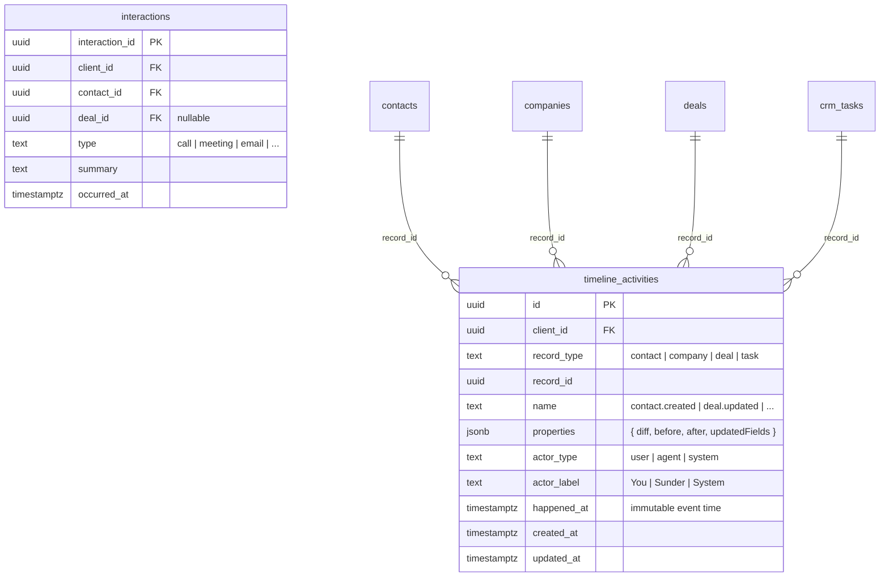

# feat: Timeline Audit Log

## Overview

Every CRM mutation (create, update, delete) on contacts, companies, deals, and tasks produces a timeline activity entry with actor attribution, field-level diffs, and immutable timestamps. The drawer's Timeline tab becomes a unified chronological feed merging these audit events with existing manual interactions. (see origin: `docs/product/ideations/2026-04-05-timeline-audit-log-requirements.md`)

## Problem Statement / Motivation

Sunder modifies CRM records autonomously. Today there's no record of what changed, who changed it, or when. The Timeline tab only shows manually-logged interactions. This is a trust gap — practitioners need to see their autopilot's work trail.

## Proposed Solution

Clone Twenty CRM's timeline audit log pattern with minimal drift (see reference: `roadmap docs/Sunder - Source of Truth/references/twenty-crm/timeline-audit-log-reference.md`). Four layers:

1. **Database** — `timeline_activities` table with dedup RPC
2. **Capture utility** — Shared `captureTimelineActivity()` that calculates diffs and calls the RPC
3. **Instrumentation** — Inject capture calls into all 14 CRM write paths
4. **Frontend** — Unified timeline components replacing current `ContactTimeline` / `InteractionTimeline`

## Technical Approach

### Architecture

```
CRM Write (UI hook / agent tool / API route)
  ↓
captureTimelineActivity({ clientId, recordType, recordId, action, actor, before, after })
  ↓ calculates diff, skips if empty
upsert_timeline_activity RPC (Postgres function)
  ↓ dedup: same record + action + actor within 10 min → merge diffs
  ↓ else → insert new row
timeline_activities table
  ↓
useUnifiedTimeline(recordType, recordId) hook
  ↓ fetches timeline_activities + interactions, merges by timestamp
UnifiedTimeline component (month grouping, diff rendering)
```

### ERD



### Implementation Phases

#### Phase 1: Database — Migration + Dedup RPC

**Files:**
- `supabase/migrations/20260405100001_create_timeline_activities.sql` (new)

**Table:**
```sql
CREATE TABLE public.timeline_activities (
  id UUID PRIMARY KEY DEFAULT gen_random_uuid(),
  client_id UUID NOT NULL REFERENCES public.clients(client_id) ON DELETE CASCADE,
  record_type TEXT NOT NULL CHECK (record_type IN ('contact', 'company', 'deal', 'task')),
  record_id UUID NOT NULL,
  name TEXT NOT NULL,                    -- 'contact.created', 'deal.updated', etc.
  properties JSONB,                      -- { diff, before, after, updatedFields }
  actor_type TEXT NOT NULL DEFAULT 'user' CHECK (actor_type IN ('user', 'agent', 'system')),
  actor_label TEXT,                      -- Display name
  happened_at TIMESTAMPTZ NOT NULL DEFAULT now(),  -- R8: immutable event time
  created_at TIMESTAMPTZ NOT NULL DEFAULT now(),
  updated_at TIMESTAMPTZ NOT NULL DEFAULT now()
);

CREATE INDEX idx_timeline_activities_lookup
  ON public.timeline_activities(client_id, record_type, record_id, happened_at DESC);

CREATE INDEX idx_timeline_activities_dedup
  ON public.timeline_activities(client_id, record_type, record_id, name, actor_type, created_at DESC);

CREATE TRIGGER update_timeline_activities_updated_at
  BEFORE UPDATE ON public.timeline_activities
  FOR EACH ROW EXECUTE FUNCTION update_updated_at_column();

-- RLS (standard 4-policy pattern)
ALTER TABLE public.timeline_activities ENABLE ROW LEVEL SECURITY;
CREATE POLICY timeline_activities_select_own ON public.timeline_activities
  FOR SELECT USING (client_id = public.get_my_client_id());
CREATE POLICY timeline_activities_insert_own ON public.timeline_activities
  FOR INSERT WITH CHECK (client_id = public.get_my_client_id());
CREATE POLICY timeline_activities_update_own ON public.timeline_activities
  FOR UPDATE USING (client_id = public.get_my_client_id());
CREATE POLICY timeline_activities_delete_own ON public.timeline_activities
  FOR DELETE USING (client_id = public.get_my_client_id());
```

**Dedup RPC** (Postgres function matching Twenty's 10-minute window, R3):
```sql
CREATE OR REPLACE FUNCTION public.upsert_timeline_activity(
  p_client_id UUID,
  p_record_type TEXT,
  p_record_id UUID,
  p_name TEXT,
  p_properties JSONB,
  p_actor_type TEXT,
  p_actor_label TEXT,
  p_happened_at TIMESTAMPTZ DEFAULT now()
) RETURNS UUID AS $$
DECLARE
  v_existing_id UUID;
  v_existing_props JSONB;
  v_merged_diff JSONB;
  v_result_id UUID;
BEGIN
  -- Find recent matching activity within 10-minute window (R3)
  -- FOR UPDATE prevents TOCTOU race between concurrent calls
  SELECT id, properties INTO v_existing_id, v_existing_props
  FROM public.timeline_activities
  WHERE client_id = p_client_id
    AND record_type = p_record_type
    AND record_id = p_record_id
    AND name = p_name
    AND actor_type = p_actor_type
    AND created_at > (now() - INTERVAL '10 minutes')
  ORDER BY created_at DESC
  LIMIT 1
  FOR UPDATE SKIP LOCKED;

  IF v_existing_id IS NOT NULL THEN
    -- Merge diffs: keep 'before' from existing, 'after' from new for common keys
    -- Build merged diff by iterating both old and new diffs
    v_merged_diff := COALESCE(v_existing_props->'diff', '{}'::jsonb);

    IF p_properties ? 'diff' THEN
      DECLARE
        v_new_diff JSONB := p_properties->'diff';
        v_key TEXT;
        v_new_val JSONB;
      BEGIN
        FOR v_key, v_new_val IN SELECT * FROM jsonb_each(v_new_diff)
        LOOP
          IF v_merged_diff ? v_key THEN
            -- Common key: keep old 'before', take new 'after'
            v_merged_diff := jsonb_set(
              v_merged_diff,
              ARRAY[v_key],
              jsonb_build_object('before', v_merged_diff->v_key->'before', 'after', v_new_val->'after')
            );
          ELSE
            -- New key: take entire diff entry
            v_merged_diff := jsonb_set(v_merged_diff, ARRAY[v_key], v_new_val);
          END IF;
        END LOOP;
      END;
    END IF;

    UPDATE public.timeline_activities
    SET properties = jsonb_build_object(
          'diff', v_merged_diff,
          'updatedFields', (
            SELECT jsonb_agg(key) FROM jsonb_object_keys(v_merged_diff) AS key
          ),
          'before', COALESCE(v_existing_props->'before', p_properties->'before'),
          'after', COALESCE(p_properties->'after', v_existing_props->'after')
        ),
        updated_at = now()
    WHERE id = v_existing_id
    RETURNING id INTO v_result_id;
  ELSE
    INSERT INTO public.timeline_activities
      (client_id, record_type, record_id, name, properties, actor_type, actor_label, happened_at)
    VALUES
      (p_client_id, p_record_type, p_record_id, p_name, p_properties, p_actor_type, p_actor_label, p_happened_at)
    RETURNING id INTO v_result_id;
  END IF;

  RETURN v_result_id;
END;
$$ LANGUAGE plpgsql SECURITY DEFINER;
```

**Success criteria:** Migration runs cleanly. RPC can be called from Supabase client.

---

#### Phase 2: Shared Capture Utility + Types

**Files:**
- `src/lib/crm/timeline-capture.ts` (new) — core capture utility
- `src/lib/crm/schemas.ts` — add `TimelineActivity` schema
- `src/types/database.ts` — regenerate types

**`timeline-capture.ts`** — the audit boundary (R1):

```typescript
import type { SupabaseClient } from "@supabase/supabase-js";

type ActorType = "user" | "agent" | "system";
type RecordType = "contact" | "company" | "deal" | "task";
type CrmAction = "created" | "updated" | "deleted";

interface CaptureParams {
  supabase: SupabaseClient;
  clientId: string;
  recordType: RecordType;
  recordId: string;
  action: CrmAction;
  actorType: ActorType;
  actorLabel?: string;
  before?: Record<string, unknown> | null;
  after?: Record<string, unknown> | null;
}

/** Fields to exclude from diff calculation (matches Twenty pattern) */
const SKIP_FIELDS = new Set(["updated_at", "created_at", "client_id", "search_vector"]);

function calculateDiff(
  before: Record<string, unknown>,
  after: Record<string, unknown>,
): Record<string, { before: unknown; after: unknown }> | null {
  const diff: Record<string, { before: unknown; after: unknown }> = {};
  for (const key of Object.keys(after)) {
    if (SKIP_FIELDS.has(key)) continue;
    const oldVal = before[key];
    const newVal = after[key];
    // Deep equality check
    if (JSON.stringify(oldVal) !== JSON.stringify(newVal)) {
      diff[key] = { before: oldVal, after: newVal };
    }
  }
  return Object.keys(diff).length > 0 ? diff : null;
}

export async function captureTimelineActivity(params: CaptureParams): Promise<void> {
  const { supabase, clientId, recordType, recordId, action, actorType, actorLabel, before, after } = params;

  let properties: Record<string, unknown>;

  if (action === "created") {
    properties = { after };
  } else if (action === "deleted") {
    properties = { before };
  } else {
    // updated — calculate diff
    if (!before || !after) return; // Can't diff without both
    const diff = calculateDiff(before, after);
    if (!diff) return; // No actual changes
    properties = {
      diff,
      before,
      after,
      updatedFields: Object.keys(diff),
    };
  }

  const name = `${recordType}.${action}`;

  // Fire-and-forget — don't block the mutation
  void supabase.rpc("upsert_timeline_activity", {
    p_client_id: clientId,
    p_record_type: recordType,
    p_record_id: recordId,
    p_name: name,
    p_properties: properties,
    p_actor_type: actorType,
    p_actor_label: actorLabel ?? (actorType === "agent" ? "Sunder" : actorType === "system" ? "System" : null),
  });
}
```

**Key design decisions:**
- Fire-and-forget (`void`) — capture must never block or fail the mutation
- `calculateDiff` skips `updated_at`, `created_at`, `client_id` (matches Twenty's skip list)
- Uses `JSON.stringify` for equality (adequate for our field types; Twenty uses `deepEqual`)
- Actor label defaults: agent → "Sunder", system → "System", user → null (frontend shows "You")

**Success criteria:** `captureTimelineActivity()` can be called from any write path with a Supabase client.

---

#### Phase 3: Instrument All Write Paths

14 write paths need instrumentation. For each, add a `captureTimelineActivity()` call.

**Challenge: "before" state.** Most update hooks don't read the record before updating. Solution: add a pre-read in the capture utility call site, reading from TanStack Query cache when available, falling back to a Supabase `.select()`.

##### 3a. UI Mutation Hooks (5 files)

| File | Change |
|------|--------|
| `src/hooks/use-update-contact.ts` | Read before state from query cache (`useContact` key), call `captureTimelineActivity` in `onSuccess` |
| `src/hooks/use-update-company.ts` | Same pattern |
| `src/hooks/use-update-deal.ts` | Already reads before state for analytics — extend to capture full record |
| `src/hooks/use-update-crm-task.ts` | Same pattern as contact |
| Page-level creates/deletes in `app/(dashboard)/customers/*/page.tsx` | Capture creates and deletes that happen outside hooks (direct Supabase calls in page components) |

**Pattern for each hook:**
```typescript
// Before the .update() call, snapshot "before" from cache
const queryClient = useQueryClient();
const beforeSnapshot = queryClient.getQueryData<RecordType>(queryKey);

// In onSuccess:
void captureTimelineActivity({
  supabase, clientId, recordType, recordId,
  action: "updated", actorType: "user",
  before: beforeSnapshot, after: { ...beforeSnapshot, ...payload },
});
```

##### 3b. Agent Tool Functions (6 files)

| File | Change |
|------|--------|
| `src/lib/runner/tools/crm/create-record.ts` | Capture after insert with `action: "created"` |
| `src/lib/runner/tools/crm/update-record.ts` | Read before state (extend existing stage/amount read to full record), capture diff |
| `src/lib/runner/tools/crm/delete-records.ts` | Read before state before delete, capture with `action: "deleted"` |
| `src/lib/runner/tools/crm/tasks.ts` | Capture task create and update |
| `src/lib/runner/tools/crm/link-records.ts` | Capture FK changes (company_id updates on contacts/deals) |

**Pattern for agent tools:**
```typescript
// In tool execute function, after successful Supabase operation:
void captureTimelineActivity({
  supabase, clientId, recordType, recordId,
  action: "created", actorType: "agent",
  after: insertedRecord,
});
```

##### 3c. API Routes (1 file)

| File | Change |
|------|--------|
| `app/api/crm/config/route.ts` | Skip — config changes are not CRM record mutations |

**Success criteria:** Every contact/company/deal/task create/update/delete produces a timeline_activities row.

---

#### Phase 4: Data Fetching — Unified Timeline Hook

**Files:**
- `src/hooks/use-unified-timeline.ts` (new)
- `src/lib/crm/schemas.ts` — add `TimelineActivity` and `UnifiedTimelineEntry` types

**`use-unified-timeline.ts`:**

```typescript
type UnifiedTimelineEntry =
  | { kind: "audit"; data: TimelineActivity }
  | { kind: "interaction"; data: Interaction };

function useUnifiedTimeline(recordType: string, recordId: string) {
  // Fetch timeline_activities for this record
  const { data: activities = [] } = useQuery({
    queryKey: ["timeline-activities", recordType, recordId],
    queryFn: () => supabase
      .from("timeline_activities")
      .select("*")
      .eq("record_type", recordType)
      .eq("record_id", recordId)
      .order("happened_at", { ascending: false }),
  });

  // Fetch interactions for this record (contact/deal only)
  const { data: interactions = [] } = useQuery({
    queryKey: contactRelationKeys.interactions(recordId),
    queryFn: () => /* existing interaction fetch */,
    enabled: recordType === "contact" || recordType === "deal",
  });

  // Merge and sort by timestamp
  const entries: UnifiedTimelineEntry[] = useMemo(() => {
    const all = [
      ...activities.map(a => ({ kind: "audit" as const, data: a, ts: a.happened_at })),
      ...interactions.map(i => ({ kind: "interaction" as const, data: i, ts: i.occurred_at })),
    ];
    return all.sort((a, b) => new Date(b.ts).getTime() - new Date(a.ts).getTime());
  }, [activities, interactions]);

  return entries;
}
```

**Realtime:** Add `useRealtimeTable("timeline_activities", ...)` for live updates.

**Pagination:** Initial fetch limited to 50 entries. Add a "Load more" button that fetches the next page using cursor-based pagination on `happened_at`/`occurred_at`. Company and task records won't have interactions (only audit events), so the interaction query is disabled for those types.

**Success criteria:** Hook returns a merged, sorted feed of audit events + interactions.

---

#### Phase 5: Frontend Components

**Files (all new):**

| File | Twenty Equivalent | Description |
|------|-------------------|-------------|
| `src/components/crm/timeline/unified-timeline.tsx` | `TimelineCard` + `EventList` | Entry point: fetches data, filters, groups by month |
| `src/components/crm/timeline/timeline-month-group.tsx` | `EventsGroup` | Month header + vertical bar + list of rows |
| `src/components/crm/timeline/timeline-event-row.tsx` | `EventRow` | Individual row: icon + content + timestamp |
| `src/components/crm/timeline/timeline-audit-row.tsx` | `EventRowMainObject` | Routes to created/updated/deleted rendering |
| `src/components/crm/timeline/timeline-field-diff.tsx` | `EventFieldDiff` | `[FieldIcon] [FieldName] -> [newValue]` |
| `src/components/crm/timeline/timeline-interaction-row.tsx` | N/A (Sunder-specific) | Renders existing interaction types in unified style |
| `src/components/crm/timeline/timeline-event-icon.tsx` | `EventIconDynamicComponent` | Action → icon mapping |
| `src/components/crm/timeline/utils.ts` | Various utils | `groupByMonth`, `getAuthorLabel`, field display helpers |

**Visual patterns (matching Twenty exactly, R5-R7):**

Created:
```
(+)  was created by You                              2 hours ago
```

Single field update:
```
(pencil) You updated [Phone icon] Phone -> +65 9876 5432     2 hours ago
```

Multi-field update (expandable card):
```
(pencil) Sunder updated 3 fields on Sarah Tan    [v]         yesterday
  ┌─────────────────────────────────────────────────────┐
  │ [Building] Company -> PropNex Realty                 │
  │ [Tag] Type -> Client                                │
  │ [StickyNote] Notes -> Investor, wants >3.5% yield   │
  └─────────────────────────────────────────────────────┘
```

Deleted:
```
(trash) Sarah Tan was deleted by Sunder                       3 days ago
```

Interaction (existing type, new visual):
```
(phone) Call with Sarah Tan                                   1 week ago
         Discussed Sunday viewing
```

**Field icon/label map** (`utils.ts`):
```typescript
const fieldIconMap: Record<string, LucideIcon> = {
  phone: Phone,
  email: Mail,
  company_id: Building2,
  type: Tag,
  notes: StickyNote,
  stage: Kanban,
  amount: Banknote,
  address: MapPin,
  // ... etc
};
```

**Month grouping** (ported from Twenty's `groupEventsByMonth`):
```typescript
type TimelineGroup = { month: number; year: number; items: UnifiedTimelineEntry[] };
```

**Author display** (matching Twenty, R2):
- `actor_type === "user"` and matches current user → "You"
- `actor_type === "agent"` → "Sunder"
- `actor_type === "system"` → "System"

**Success criteria:** Components render the unified timeline matching Twenty's visual pattern.

---

#### Phase 6: Drawer Integration

**Files to modify:**

| File | Change |
|------|--------|
| `src/components/crm/record-drawer/contact-drawer-content.tsx` | Replace `<ContactTimeline>` with `<UnifiedTimeline recordType="contact" recordId={contactId} />` |
| `src/components/crm/record-drawer/deal-drawer-content.tsx` | Replace `<InteractionTimeline>` with `<UnifiedTimeline recordType="deal" recordId={dealId} />` |
| `src/components/crm/record-drawer/company-drawer-content.tsx` | Add "Timeline" tab (currently only Home, Contacts, Deals, Notes). Render `<UnifiedTimeline recordType="company" recordId={companyId} />` |
| `src/components/crm/record-drawer/task-drawer-content.tsx` | Add "Timeline" tab (currently no tabs). Render `<UnifiedTimeline recordType="task" recordId={taskId} />` |

**Company drawer tab update:**
```typescript
type CompanyDrawerTab = "home" | "contacts" | "deals" | "notes" | "timeline";
// tabs array: add { id: "timeline", label: "Timeline", icon: <Clock3 /> }
```

**Task drawer:** Currently has no tab navigation — needs to be wrapped in `RecordDetailPanelShell` to support tabs.

**Success criteria:** All 4 record types show a Timeline tab with unified audit + interaction feed.

---

#### Phase 7: Tests

| File | Scope |
|------|-------|
| `src/lib/crm/__tests__/timeline-capture.test.ts` (new) | `calculateDiff` unit tests, `captureTimelineActivity` integration test with mock Supabase |
| `src/hooks/__tests__/use-unified-timeline.test.tsx` (new) | Merge + sort logic, handles empty states |
| `src/components/crm/timeline/__tests__/unified-timeline.test.tsx` (new) | Renders month groups, audit rows, interaction rows, field diffs |
| `src/components/crm/record-drawer/__tests__/company-drawer-content.test.tsx` | Add Timeline tab assertion |
| `src/components/crm/record-drawer/__tests__/task-drawer-content.test.tsx` | Add Timeline tab assertion |

**Success criteria:** All tests pass. Diff calculation covers edge cases (empty diff, null values, custom fields).

---

## System-Wide Impact

### Interaction Graph
- `captureTimelineActivity()` fires on every CRM mutation — it must be non-blocking (fire-and-forget)
- The dedup RPC runs in Postgres, isolated from the application layer
- Realtime subscriptions on `timeline_activities` trigger re-renders in open drawers

### Error Propagation
- Timeline capture failures are silently swallowed — they must never block the CRM mutation
- RPC errors logged to console but not surfaced to user
- If dedup query fails, falls back to insert (duplicates are preferable to missing entries)

### State Lifecycle Risks
- **Partial failure:** If a mutation succeeds but capture fails, the timeline has a gap. Acceptable — audit is best-effort from the UI, reliable from server tools.
- **Race condition:** Two concurrent writes to the same record could produce two timeline entries that should have been merged. The dedup RPC handles this atomically.
- **Cache staleness:** "Before" state from TanStack Query cache could be stale if another tab/device made changes. Acceptable — the diff will show the user's perspective of what changed.

### API Surface Parity
- All CRM write paths (14 identified) must call `captureTimelineActivity()`
- New write paths added in future must also call it — add a lint/review convention

## Acceptance Criteria

### Functional Requirements (from origin R1-R8)
- [ ] R1: Every CRM create/update/delete on contacts, companies, deals, tasks produces a timeline_activities row
- [ ] R2: Actor attribution works — user shows "You", agent shows "Sunder", system shows "System"
- [ ] R3: Rapid edits within 10 minutes by same actor + same action merge via dedup RPC
- [ ] R4: Timeline tab shows unified feed of audit events + all 6 interaction types
- [ ] R5: Single-field updates inline, multi-field updates in expandable card
- [ ] R6: Created/deleted events have distinct rendering and icons
- [ ] R7: Month grouping with vertical timeline bar
- [ ] R8: Sorting uses immutable `happened_at`, not `created_at`/`updated_at`

### Non-Functional Requirements
- [ ] Timeline capture never blocks CRM mutations (fire-and-forget)
- [ ] Dedup is atomic (Postgres RPC, not client-side)
- [ ] Company and Task drawers gain a Timeline tab
- [ ] Existing interaction-based timeline data is preserved and visible

### Quality Gates
- [ ] Unit tests for diff calculation, dedup merge logic, month grouping
- [ ] Integration test for unified timeline rendering
- [ ] Manual verification: edit a contact in drawer → see audit entry in Timeline tab

## Dependencies & Risks

| Risk | Mitigation |
|------|------------|
| "Before" state unavailable in some update hooks | Read from TanStack Query cache; fall back to Supabase `.select()` before update |
| Dedup RPC complexity in PL/pgSQL | Test with edge cases; keep JSONB merge logic simple |
| Task drawer has no tab navigation today | Wrap in `RecordDetailPanelShell` (same as other drawers) |
| Performance: extra DB read for "before" state | Cache-first approach minimizes round trips; fire-and-forget capture |
| Future write paths bypass capture | Document convention; add to PR review checklist |

## Sources & References

### Origin
- **Origin document:** [docs/product/ideations/2026-04-05-timeline-audit-log-requirements.md](docs/product/ideations/2026-04-05-timeline-audit-log-requirements.md) — Key decisions: shared server-side capture, server-side dedup keyed by record+action+actor, `record_type`+`record_id` instead of polymorphic FKs, unified feed, immutable `happened_at`

### Internal References
- Twenty CRM reference analysis: `roadmap docs/Sunder - Source of Truth/references/twenty-crm/timeline-audit-log-reference.md`
- Existing interaction timeline: `src/components/crm/interaction-timeline.tsx`
- CRM mutation hooks: `src/hooks/use-update-contact.ts`, `use-update-company.ts`, `use-update-deal.ts`, `use-update-crm-task.ts`
- Agent CRM tools: `src/lib/runner/tools/crm/create-record.ts`, `update-record.ts`, `delete-records.ts`, `tasks.ts`
- Migration patterns: `supabase/migrations/20260405000001_create_record_notes.sql`

### Write Path Inventory (13 paths)

**Excluded from capture:**
- `use-record-notes.ts` — Note CRUD is not a record-level mutation (scope boundary: no linked-note events)
- `configure-crm.ts` / `/api/crm/config` — Config changes, not CRM record mutations
- `interactions.ts` tool — Interactions already appear in the unified timeline directly

| # | Path | File | Actor |
|---|------|------|-------|
| 1 | useUpdateContact | `src/hooks/use-update-contact.ts:37-40` | user |
| 2 | useUpdateCompany | `src/hooks/use-update-company.ts:37-40` | user |
| 3 | useUpdateDeal | `src/hooks/use-update-deal.ts:56-59` | user |
| 4 | useUpdateCrmTask | `src/hooks/use-update-crm-task.ts:32-35` | user |
| 5 | Page-level creates | `app/(dashboard)/customers/*/page.tsx` (inline Supabase inserts) | user |
| 6 | Page-level deletes | `app/(dashboard)/customers/*/page.tsx` (inline Supabase deletes) | user |
| 7 | create_record tool | `src/lib/runner/tools/crm/create-record.ts:309-336` | agent |
| 8 | update_record tool | `src/lib/runner/tools/crm/update-record.ts:180-186` | agent |
| 9 | delete_records tool | `src/lib/runner/tools/crm/delete-records.ts:57-61` | agent |
| 10 | create_task tool | `src/lib/runner/tools/crm/tasks.ts:52-65` | agent |
| 11 | update_task tool | `src/lib/runner/tools/crm/tasks.ts:127-133` | agent |
| 12 | link_records tool | `src/lib/runner/tools/crm/link-records.ts:97-196` | agent |
| 13 | Page-level task creates | `app/(dashboard)/tasks/page.tsx` (inline task inserts) | user |
