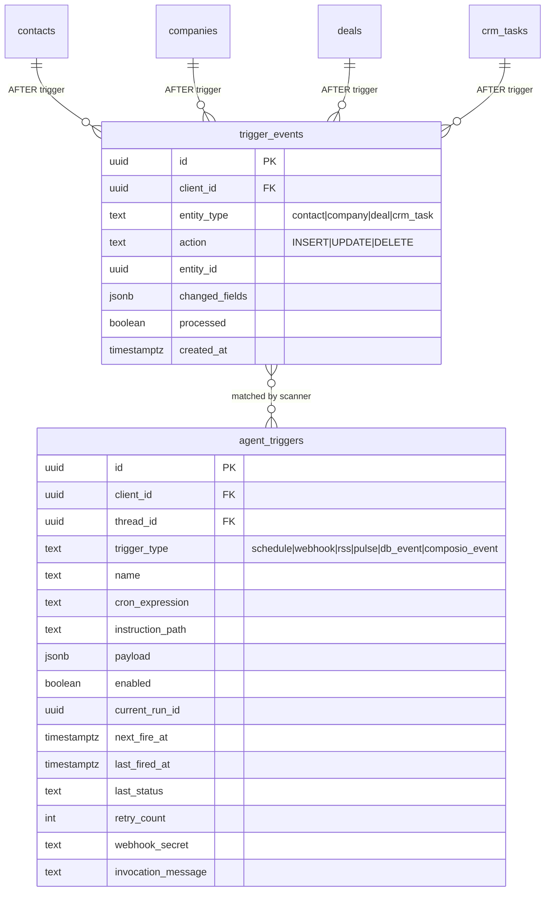

# feat: Event-Driven Triggers (Internal CRM + External Composio)

## Overview

Add two new trigger types to Sunder's existing trigger system: **`db_event`** for internal CRM record changes and **`composio_event`** for external app events (Gmail, Calendar) via Composio webhooks. Both integrate into the existing scanner/executor/agent-tool infrastructure. Shipped as two independent PRs.

## Problem Statement / Motivation

Sunder's trigger system today only supports poll-based scheduling (cron, RSS) and manual webhooks. Two high-value trigger categories are missing:

1. **Internal CRM events** — practitioners want automations like "when a deal moves to Closing, draft a follow-up." These events happen in Sunder's own DB but can't fire agent runs.
2. **External app events** — practitioners want "when I get an email, triage it." Events in Gmail/Calendar have no ingestion path.

(see origin: `docs/product/ideations/2026-04-06-event-driven-triggers-requirements.md`)

## Proposed Solution

### PR A: Internal CRM Event Triggers (`db_event`)

Postgres `AFTER INSERT/UPDATE/DELETE` triggers on CRM tables capture events into a `trigger_events` queue table. The existing cron scanner picks up queued events, matches them against `agent_triggers` rows of type `db_event`, and invokes the agent with the event context.

### PR B: External Composio Event Triggers (`composio_event`)

A new webhook receiver route (`/api/webhooks/composio`) accepts Composio trigger events, verifies HMAC, maps to an `agent_trigger` row, and invokes the agent. The agent creates/deletes Composio trigger instances via the existing `@composio/core` SDK.

## Technical Considerations

### PR A: Internal CRM Event Triggers

#### Database Layer

**New `trigger_events` queue table:**

```sql
CREATE TABLE public.trigger_events (
  id            UUID PRIMARY KEY DEFAULT gen_random_uuid(),
  client_id     UUID NOT NULL REFERENCES clients(client_id) ON DELETE CASCADE,
  entity_type   TEXT NOT NULL,      -- 'contact', 'company', 'deal', 'crm_task'
  action        TEXT NOT NULL,      -- 'INSERT', 'UPDATE', 'DELETE'
  entity_id     UUID NOT NULL,
  changed_fields JSONB,             -- { "stage": { "old": "Lead", "new": "Closing" } }
  processed     BOOLEAN NOT NULL DEFAULT false,
  created_at    TIMESTAMPTZ NOT NULL DEFAULT now()
);

CREATE INDEX idx_trigger_events_unprocessed
  ON public.trigger_events (created_at)
  WHERE processed = false;
```

RLS enabled, same pattern as other CRM tables. Service-role access for scanner.

**Postgres trigger function (shared across all 4 CRM tables):**

```sql
CREATE OR REPLACE FUNCTION capture_crm_event()
RETURNS TRIGGER AS $$
DECLARE
  v_changed JSONB := '{}';
  v_entity_id UUID;
  v_entity_type TEXT;
BEGIN
  -- Determine entity type from table name
  v_entity_type := CASE TG_TABLE_NAME
    WHEN 'contacts' THEN 'contact'
    WHEN 'companies' THEN 'company'
    WHEN 'deals' THEN 'deal'
    WHEN 'crm_tasks' THEN 'crm_task'
  END;

  -- Determine entity ID (each table has a different PK column name)
  v_entity_id := CASE TG_TABLE_NAME
    WHEN 'contacts' THEN COALESCE(NEW.contact_id, OLD.contact_id)
    WHEN 'companies' THEN COALESCE(NEW.company_id, OLD.company_id)
    WHEN 'deals' THEN COALESCE(NEW.deal_id, OLD.deal_id)
    WHEN 'crm_tasks' THEN COALESCE(NEW.task_id, OLD.task_id)
  END;

  -- Compute changed fields for UPDATE
  IF TG_OP = 'UPDATE' THEN
    SELECT jsonb_object_agg(key, jsonb_build_object(
      'old', old_val,
      'new', new_val
    ))
    INTO v_changed
    FROM (
      SELECT key, old_row.value AS old_val, new_row.value AS new_val
      FROM jsonb_each(to_jsonb(OLD)) old_row
      FULL OUTER JOIN jsonb_each(to_jsonb(NEW)) new_row USING (key)
      WHERE old_row.value IS DISTINCT FROM new_row.value
        AND key NOT IN ('updated_at', 'created_at')
    ) diffs;
  END IF;

  INSERT INTO trigger_events (client_id, entity_type, action, entity_id, changed_fields)
  VALUES (
    COALESCE(NEW.client_id, OLD.client_id),
    v_entity_type,
    TG_OP,
    v_entity_id,
    v_changed
  );

  RETURN COALESCE(NEW, OLD);
END;
$$ LANGUAGE plpgsql SECURITY DEFINER SET search_path = '';
```

**AFTER triggers on each CRM table:**

```sql
CREATE TRIGGER trg_capture_crm_event_contacts
  AFTER INSERT OR UPDATE OR DELETE ON public.contacts
  FOR EACH ROW EXECUTE FUNCTION capture_crm_event();

-- Repeat for companies, deals, crm_tasks
```

**New `trigger_type` value:** Follow the pulse migration pattern (`20260306030001`):

```sql
ALTER TABLE public.agent_triggers
  DROP CONSTRAINT IF EXISTS agent_triggers_trigger_type_check;
ALTER TABLE public.agent_triggers
  ADD CONSTRAINT agent_triggers_trigger_type_check
    CHECK (trigger_type IN ('schedule', 'webhook', 'rss', 'pulse', 'db_event'));
```

**New scanner RPC: `claim_due_db_events()`**

Atomically claims unprocessed `trigger_events` rows, matches them against `agent_triggers` where `trigger_type = 'db_event'`, and returns matched pairs. Sets `processed = true` on claimed events.

```sql
CREATE OR REPLACE FUNCTION claim_due_db_events()
RETURNS TABLE (
  trigger_row  JSONB,
  event_row    JSONB
) LANGUAGE plpgsql SECURITY DEFINER SET search_path = '' AS $$
BEGIN
  RETURN QUERY
  WITH pending_events AS (
    UPDATE public.trigger_events te
    SET processed = true
    WHERE te.processed = false
      AND te.id IN (
        SELECT te2.id FROM public.trigger_events te2
        WHERE te2.processed = false
        ORDER BY te2.created_at
        LIMIT 100
      )
    RETURNING te.*
  ),
  matched AS (
    SELECT
      to_jsonb(at.*) AS trigger_row,
      to_jsonb(pe.*) AS event_row
    FROM pending_events pe
    JOIN public.agent_triggers at
      ON at.client_id = pe.client_id
      AND at.trigger_type = 'db_event'
      AND at.enabled = true
      AND at.current_run_id IS NULL
      AND (at.payload->>'entity_type') = pe.entity_type
      AND (
        (at.payload->>'action') IS NULL
        OR (at.payload->>'action') = pe.action
      )
  )
  SELECT matched.trigger_row, matched.event_row FROM matched;
END;
$$;
```

Field-level filter matching happens in the executor (application layer), not in the RPC — keeps the SQL simple and the filter logic testable in TypeScript.

#### Application Layer

**`src/lib/triggers/schemas.ts`** — Add `"db_event"` to `triggerTypeValues` (line 16).

**`src/lib/triggers/scanner.ts`** — Add a new phase after the main `claim_due_triggers()` loop:

```typescript
// After existing trigger dispatch loop
const dbEvents = await deps.supabase.rpc("claim_due_db_events");
for (const { trigger_row, event_row } of dbEvents.data ?? []) {
  // Field-level filter matching
  if (!matchesFieldFilters(trigger_row.payload, event_row)) continue;
  // Dispatch to executor
  await deps.dispatch(buildDbEventDispatchPayload(trigger_row, event_row));
}
```

**`src/lib/triggers/db-event-matching.ts`** (new file) — Field filter matching logic:

```typescript
interface FieldFilter {
  old?: string | number | boolean;
  new?: string | number | boolean;
}

// payload.field_filters: { "stage": { "new": "Closing" } }
// event.changed_fields: { "stage": { "old": "Lead", "new": "Closing" } }
function matchesFieldFilters(
  triggerPayload: { field_filters?: Record<string, FieldFilter> },
  event: { changed_fields: Record<string, { old?: unknown; new?: unknown }> }
): boolean
```

Supports: equality on `new` value ("changed to X"), equality on both `old` and `new` ("changed from X to Y"), no filter (matches all changes).

**`src/lib/triggers/executor.ts`** — Add `db_event` branch before the fallthrough (line 160). Enrich the `triggerEventPayload` with event-specific fields:

```typescript
case "db_event": {
  triggerEventPayload = {
    ...triggerEventPayload,
    entity_type: dispatchPayload.triggerPayload.event_entity_type,
    action: dispatchPayload.triggerPayload.event_action,
    entity_id: dispatchPayload.triggerPayload.event_entity_id,
    changed_fields: dispatchPayload.triggerPayload.event_changed_fields,
  };
  break;
}
```

Then falls through to the shared `buildTriggerEventMessage()` → `createMessage()` → `runAgent()` path.

**Agent tools — `search-triggers.ts`:**

Add `db_event` entry to `TRIGGER_CATALOG`:

```typescript
{
  trigger_id: "db_event",
  name: "CRM Event",
  description: "Fires when a CRM record is created, updated, or deleted. Supports contacts, companies, deals, and tasks. Can filter by entity type, action, and specific field changes.",
  keywords: ["crm", "contact", "company", "deal", "task", "created", "updated", "deleted", "changed", "event", "database"],
  setupSchema: {
    entity_type: { type: "string", required: true, description: "CRM entity: 'contact', 'company', 'deal', or 'crm_task'" },
    action: { type: "string", required: false, description: "Action filter: 'INSERT', 'UPDATE', or 'DELETE'. Omit to match all." },
    field_filters: { type: "object", required: false, description: "Field-level filters. Example: { \"stage\": { \"new\": \"Closing\" } } to match when stage changes to Closing." },
  },
  editSchema: {
    action: { type: "string", required: false, description: "New action filter." },
    field_filters: { type: "object", required: false, description: "New field filters. Replaces all existing filters." },
  },
}
```

**Agent tools — `setup-trigger.ts`:**

Add `buildDbEventInsertRow()` function and `case "db_event":` in the switch. Validates `entity_type` is one of `["contact", "company", "deal", "crm_task"]`. Stores `entity_type`, `action`, `field_filters` in `payload`. Sets `cron_expression: null`, `next_fire_at: null` (event-driven, not scheduled).

**Agent tools — `manage-triggers.ts`:**

Add `db_event` branch in `buildUpdatedTriggerRow()` for edit support. Allow editing `action` and `field_filters` in payload.

#### Migration Files

- `20260406000000_create_trigger_events.sql` — queue table + indexes + RLS
- `20260406000001_add_db_event_trigger_type.sql` — CHECK constraint update
- `20260406000002_create_crm_event_triggers.sql` — Postgres AFTER triggers on 4 CRM tables
- `20260406000003_create_claim_due_db_events_rpc.sql` — scanner RPC

---

### PR B: External Composio Event Triggers

#### Database Layer

**Extend `trigger_type` CHECK constraint** (same DROP/ADD pattern):

```sql
CHECK (trigger_type IN ('schedule', 'webhook', 'rss', 'pulse', 'db_event', 'composio_event'))
```

No new tables needed. `agent_triggers.payload` stores:

```json
{
  "composio_trigger_id": "trig_abc123",
  "composio_slug": "GMAIL_NEW_GMAIL_MESSAGE",
  "toolkit": "gmail",
  "trigger_config": { "labelIds": "INBOX", "interval": 2 }
}
```

#### Webhook Receiver Route

**`app/api/webhooks/composio/route.ts`** (new file):

```typescript
export async function POST(request: Request) {
  // 1. Read raw body (must be raw for HMAC verification)
  const rawBody = await request.text();
  
  // 2. Extract verification headers
  const signature = request.headers.get("webhook-signature");
  const webhookId = request.headers.get("webhook-id");
  const timestamp = request.headers.get("webhook-timestamp");
  
  // 3. Verify via @composio/core
  const composio = getComposio();
  const verified = await composio.triggers.verifyWebhook({
    payload: rawBody,
    signature,
    secret: process.env.COMPOSIO_WEBHOOK_SECRET,
    webhookId,
    webhookTimestamp: timestamp,
  });
  
  // 4. Parse payload — IncomingTriggerPayload shape
  const event = JSON.parse(rawBody);
  const composioTriggerId = event.id; // Composio trigger instance ID
  
  // 5. Look up agent_trigger by composio_trigger_id in payload
  const { data: trigger } = await supabase
    .from("agent_triggers")
    .select("*")
    .eq("trigger_type", "composio_event")
    .eq("enabled", true)
    .is("current_run_id", null)
    .filter("payload->>'composio_trigger_id'", "eq", composioTriggerId)
    .maybeSingle();
  
  if (!trigger) return NextResponse.json({ ok: true }, { status: 200 });
  
  // 6. Atomic claim (same CAS pattern as webhook-claim.ts)
  const runId = await claimComposioTrigger(supabase, trigger.id);
  if (!runId) return NextResponse.json({ error: "Already running" }, { status: 409 });
  
  // 7. Deferred execution via after()
  after(async () => {
    await executeTrigger({
      ...buildDispatchPayload(trigger),
      triggerPayload: {
        ...trigger.payload,
        composio_event: event.payload,          // The actual app event data
        composio_metadata: event.metadata,
      },
    });
  });
  
  return NextResponse.json({ ok: true }, { status: 202 });
}
```

#### Composio Trigger Lifecycle

**`src/lib/composio/triggers.ts`** (new file):

```typescript
export async function createComposioTrigger(
  userId: string,
  slug: string,
  connectedAccountId: string,
  triggerConfig: Record<string, unknown>,
): Promise<{ triggerId: string }> {
  const composio = getComposio();
  return composio.triggers.create(userId, slug, {
    connectedAccountId,
    triggerConfig,
  });
}

export async function deleteComposioTrigger(triggerId: string): Promise<void> {
  const composio = getComposio();
  await composio.triggers.delete(triggerId);
}
```

#### Application Layer

**`src/lib/triggers/schemas.ts`** — Add `"composio_event"` to `triggerTypeValues`.

**`src/lib/triggers/executor.ts`** — Add `composio_event` branch. Enrich trigger event payload with the Composio event data:

```typescript
case "composio_event": {
  triggerEventPayload = {
    ...triggerEventPayload,
    composio_slug: dispatchPayload.triggerPayload.composio_slug,
    toolkit: dispatchPayload.triggerPayload.toolkit,
    event_data: dispatchPayload.triggerPayload.composio_event,
  };
  break;
}
```

**Agent tools — `search-triggers.ts`:**

Add curated Composio entries to `TRIGGER_CATALOG`. Initial catalog (6 triggers):

| Catalog ID | Composio Slug | Display Name |
|---|---|---|
| `gmail_new_message` | `GMAIL_NEW_GMAIL_MESSAGE` | New Gmail Message |
| `gmail_email_sent` | `GMAIL_EMAIL_SENT_TRIGGER` | Gmail Email Sent |
| `gcal_event_created` | `GOOGLECALENDAR_GOOGLE_CALENDAR_EVENT_CREATED_TRIGGER` | Calendar Event Created |
| `gcal_event_updated` | `GOOGLECALENDAR_GOOGLE_CALENDAR_EVENT_UPDATED_TRIGGER` | Calendar Event Updated |
| `gcal_event_cancelled` | `GOOGLECALENDAR_EVENT_CANCELED_DELETED_TRIGGER` | Calendar Event Cancelled |
| `gcal_event_starting_soon` | `GOOGLECALENDAR_EVENT_STARTING_SOON_TRIGGER` | Calendar Event Starting Soon |

Each entry's `setupSchema` includes `connection_id` (required, the Composio connected account ID) plus trigger-specific config (e.g., `labelIds` for Gmail, `calendarId` and `minutes_before_start` for Calendar).

**Agent tools — `setup-trigger.ts`:**

Add `buildComposioEventInsertRow()` function and cases for each curated catalog ID. On insert:
1. Call `createComposioTrigger()` to create the Composio trigger instance
2. Store `composio_trigger_id`, `composio_slug`, `toolkit`, `trigger_config` in `agent_triggers.payload`
3. Set `cron_expression: null`, `next_fire_at: null` (event-driven via Composio webhook)

**Agent tools — `manage-triggers.ts`:**

Add `composio_event` branch in delete action — call `deleteComposioTrigger()` before removing the DB row. For edit, call delete + recreate on the Composio side (simpler than trying to patch).

#### Composio Webhook Claim

**`src/lib/triggers/composio-claim.ts`** (new file):

Same CAS pattern as `webhook-claim.ts`, but filters on `trigger_type = 'composio_event'` instead of `'webhook'`.

#### Migration Files

- `20260406100000_add_composio_event_trigger_type.sql` — CHECK constraint update

---

## System-Wide Impact

### Interaction Graph

- **CRM mutation → Postgres trigger → `trigger_events` INSERT** — fires on every CRM write (UI, agent tools, direct SQL). No opt-out.
- **Scanner tick → `claim_due_db_events()` → executor → agent run** — adds a new phase to each scanner tick.
- **Composio webhook → `/api/webhooks/composio` → executor → agent run** — new ingress route, bypasses scanner entirely.
- **Agent `setup_trigger` tool → Composio `triggers.create()`** — external API call during agent tool execution.
- **Agent `manage_active_triggers` delete → Composio `triggers.delete()`** — external API call on trigger deletion.

### Error Propagation

- Postgres trigger function failures are non-fatal to the CRM mutation (AFTER trigger, not BEFORE). The CRM write succeeds; the event capture fails silently. We should add error logging in the trigger function.
- Composio `triggers.create()` failure during `setup_trigger` returns `{ success: false, error }` to the agent — standard tool error pattern.
- Composio webhook verification failure returns 401 — the event is dropped.
- Scanner `claim_due_db_events()` failure is caught by the scanner's existing error handling — logged, next tick retries.

### State Lifecycle Risks

- **Orphaned Composio triggers**: If `agent_triggers` row is deleted but Composio delete fails, the Composio trigger keeps firing into a dead webhook. Mitigation: wrap delete in try/catch, log failures, and add a periodic cleanup job later if needed.
- **Duplicate events**: The `trigger_events` queue uses `processed = true` as the dedup mechanism. The `claim_due_db_events()` RPC atomically marks events as processed. No duplicate risk within a single scanner tick. Cross-tick duplicates are prevented by the `processed` flag.
- **Stale `trigger_events` rows**: Processed events accumulate. Add a scheduled cleanup (e.g., delete processed events older than 7 days) as a follow-up.

### API Surface Parity

- The `search_triggers`, `setup_trigger`, and `manage_active_triggers` tools all need updates for both new types — covered in the plan above.
- The scanner, executor, and schemas all need the new type values.
- No REST API or UI changes — agent-only interaction.

### Integration Test Scenarios

1. **CRM update → db_event trigger fires**: Update a deal's stage → verify `trigger_events` row created → scanner claims → agent invoked with correct event context.
2. **Field filter matching**: Set up a trigger with `field_filters: { "stage": { "new": "Closing" } }` → update deal stage to "Lead" (should NOT fire) → update to "Closing" (should fire).
3. **Composio webhook → agent run**: POST a mock Composio webhook payload to `/api/webhooks/composio` → verify HMAC check → verify trigger matched → verify agent invoked.
4. **Composio trigger lifecycle**: Agent creates a Gmail trigger → verify Composio `triggers.create()` called → agent deletes it → verify Composio `triggers.delete()` called.
5. **No regression**: Existing schedule/webhook/rss/pulse triggers continue to work. Scanner processes all types in the same tick.

## Acceptance Criteria

### PR A: Internal CRM Event Triggers

- [ ] `trigger_events` queue table created with RLS and indexes
- [ ] Postgres AFTER triggers on `contacts`, `companies`, `deals`, `crm_tasks` capture INSERT/UPDATE/DELETE events with changed_fields diff
- [ ] `db_event` trigger type added to CHECK constraint and `triggerTypeValues`
- [ ] `claim_due_db_events()` RPC atomically claims and matches events
- [ ] Scanner calls `claim_due_db_events()` on each tick and dispatches matched events
- [ ] Field-level filter matching works: equality on `new`, equality on `old`+`new`, no filter
- [ ] `db_event` entry in `TRIGGER_CATALOG` with correct setup/edit schemas
- [ ] Agent can create/list/view/edit/delete/simulate `db_event` triggers
- [ ] Executor enriches trigger event message with entity_type, action, entity_id, changed_fields
- [ ] Tests: trigger function, field matching, scanner integration, agent tool CRUD

### PR B: External Composio Event Triggers

- [ ] `composio_event` trigger type added to CHECK constraint and `triggerTypeValues`
- [ ] `/api/webhooks/composio` route: HMAC verification, trigger lookup, atomic claim, deferred execution
- [ ] `composio.triggers.create()` called when agent sets up a Composio trigger
- [ ] `composio.triggers.delete()` called when agent deletes a Composio trigger
- [ ] Composio trigger instance ID stored in `agent_triggers.payload`
- [ ] Curated catalog: 2 Gmail + 4 Calendar triggers in `TRIGGER_CATALOG`
- [ ] Agent can create/list/view/delete Composio triggers via existing tools
- [ ] Executor enriches trigger event message with composio_slug, toolkit, event_data
- [ ] Tests: webhook verification, trigger matching, lifecycle management, agent tool CRUD
- [ ] No regression on existing trigger types

## Success Metrics

- Internal triggers fire within 60 seconds of CRM mutation
- External triggers fire within Composio polling interval (15 min managed / 1 min custom OAuth)
- Zero regressions on existing schedule/webhook/rss/pulse triggers
- Agent successfully discovers, creates, and manages both new trigger types conversationally

## Dependencies & Risks

| Risk | Mitigation |
|---|---|
| Postgres AFTER trigger adds latency to CRM writes | Trigger function is lightweight (single INSERT). Monitor via Supabase dashboard. |
| `trigger_events` table grows unbounded | Add periodic cleanup of processed events (follow-up task). |
| Composio webhook format changes | Pin to V3 webhook version. Verify `x-composio-webhook-version: V3` header. |
| Composio `triggers.create()` rate limits | Agent creates triggers infrequently. Not a concern at current scale. |
| Orphaned Composio triggers on failed delete | Log failures. Add cleanup job as follow-up if needed. |
| `message_text` in Gmail payload may be snippet | Agent should use `payload` (raw Gmail object) for full body when needed. Document in trigger catalog description. |

## Sources & References

### Origin
- **Origin document:** [docs/product/ideations/2026-04-06-event-driven-triggers-requirements.md](../ideations/2026-04-06-event-driven-triggers-requirements.md) — Key decisions: Composio over Pipedream, agent-only UX, curated catalog, two separate PRs.

### Internal References
- Trigger schemas: `src/lib/triggers/schemas.ts:16` — `triggerTypeValues`
- Scanner: `src/lib/triggers/scanner.ts:216` — `runScan()`
- Executor: `src/lib/triggers/executor.ts:84` — `executeTrigger()`
- Trigger event message: `src/lib/triggers/trigger-event.ts:21` — `buildTriggerEventMessage()`
- Search triggers catalog: `src/lib/runner/tools/triggers/search-triggers.ts:26` — `TRIGGER_CATALOG`
- Setup trigger tool: `src/lib/runner/tools/triggers/setup-trigger.ts:172`
- Manage triggers tool: `src/lib/runner/tools/triggers/manage-triggers.ts:165`
- Webhook route: `app/api/trigger/webhook/[triggerId]/route.ts:56`
- Webhook claim: `src/lib/triggers/webhook-claim.ts:14`
- Pulse migration (pattern): `supabase/migrations/20260306030001_add_pulse_trigger_type.sql`
- Composio client: `src/lib/composio/client.ts`
- CRM tables: `contacts`, `companies`, `deals`, `crm_tasks` — all have BEFORE UPDATE triggers for `updated_at`, no existing AFTER triggers

### External References
- Composio triggers docs: https://docs.composio.dev/docs/triggers
- Composio webhook verification: https://docs.composio.dev/docs/webhook-verification
- Composio webhook subscriptions API: https://docs.composio.dev/reference/api-reference/webhooks/postWebhookSubscriptions
- Full Tasklet/Pipedream research: `roadmap docs/Sunder - Source of Truth/references/tasklet/trigger-system-internals.md`

### ERD: New Tables and Relationships


