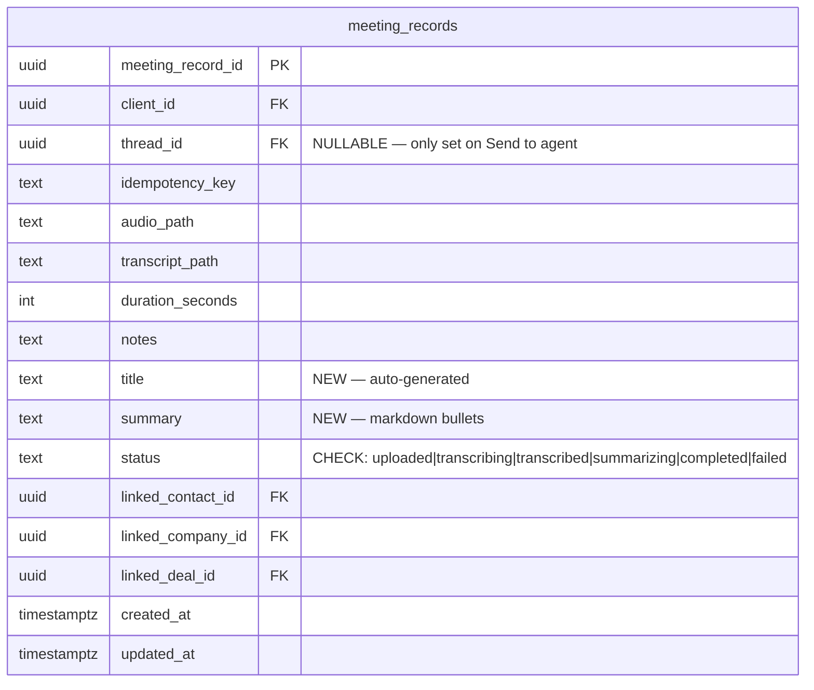

# feat: Meetings Surface — Dedicated Recording & Summary Experience

## Overview

Separate meeting recording from the chat thread into its own first-class surface. Recording, transcription, and auto-summary happen on a dedicated `/meetings` page. Agent actions become opt-in via "Send to agent" which opens a chat thread pre-loaded with meeting context. The chat surface returns to its pre-PR68 state for messaging.

**Why:** PR 68 embedded recording in chat. The UX is fundamentally broken — meetings are artifacts, chat is interactive. Users record, see "Uploading · Transcribing..." and nothing visible happens. This redesign gives each surface a clear mental model (see origin: `docs/product/ideations/2026-04-06-meetings-surface-requirements.md`).

## Problem Statement

The current PR 68 flow:
1. User records in chat → uploads → transcribes → background agent run → agent response buried in thread
2. No list of past meetings — recordings are scattered across chat threads
3. No auto-summary — user waits for a full agent run just to see what was said
4. Recording UI pollutes the chat composer

The new flow:
1. User records on `/meetings` → uploads → transcribes → auto-summary → detail page with title + bullets
2. Browse all meetings at `/meetings`, grouped by date
3. "Send to agent" is opt-in — creates a new chat thread with meeting context
4. Chat is clean — no mic button

## Proposed Solution

### Phase 1: Database Migration + Backend Pipeline

Add `title`, `summary` columns to `meeting_records`. Make `thread_id` nullable. Add `summarizing` status. Modify the ingest route to call `generateObject()` for auto-summary after transcription. Remove `runMeetingFollowUp()` from the ingest flow. Upgrade Groq to `verbose_json` for segment timestamps.

### Phase 2: Frontend — Meetings List + Detail Pages

New `/meetings` route with date-grouped list. New `/meetings/[id]` detail page with summary, collapsible transcript, notes, and "Send to agent" button. TanStack Query hooks for data fetching with Supabase Realtime invalidation.

### Phase 3: Recording Flow on Meetings Surface

Move `recording-bar.tsx` and `meeting-notepad.tsx` from chat to meetings surface. New recording state on the `/meetings` page. On stop → upload → wait for ingest response → navigate to detail.

### Phase 4: Agent Handoff + Cleanup

"Send to agent" creates a user message with the handoff prompt, then starts an agent run. Remove mic button from chat composer. Add `search_meetings` agent tool.

## Technical Approach

### Architecture

```
[Meetings List /meetings]
     │
     ├─ [+ New Meeting] → Recording state (notepad + bar)
     │     │
     │     └─ Stop → PUT audio → POST /api/meetings/ingest
     │                              │
     │                              ├── Insert row (status: uploaded)
     │                              ├── Groq Whisper verbose_json (status: transcribing → transcribed)
     │                              ├── generateObject() title + summary (status: summarizing → completed)
     │                              └── Return { meetingRecordId, title, summary, transcriptPath }
     │
     ├─ [Meeting Row] → /meetings/[id] detail page
     │     │
     │     ├── Summary (markdown, rendered)
     │     ├── Transcript (collapsible, [MM:SS] segments)
     │     ├── Notes (read-only)
     │     └── [Send to agent] → creates chat thread + runAgent
     │
     └─ Data: TanStack Query + Supabase Realtime invalidation
```

### Data Model Changes



### Implementation Phases

#### Phase 1: Database + Backend (PR 70a)

**Migration:** `supabase/migrations/YYYYMMDDHHMMSS_meetings_surface.sql`

```sql
-- Add new columns
ALTER TABLE public.meeting_records
  ADD COLUMN IF NOT EXISTS title TEXT,
  ADD COLUMN IF NOT EXISTS summary TEXT;

-- Make thread_id nullable
ALTER TABLE public.meeting_records
  ALTER COLUMN thread_id DROP NOT NULL;

-- Update status check constraint
ALTER TABLE public.meeting_records
  DROP CONSTRAINT IF EXISTS meeting_records_status_check;

ALTER TABLE public.meeting_records
  ADD CONSTRAINT meeting_records_status_check
  CHECK (status IN ('uploaded', 'transcribing', 'transcribed', 'summarizing', 'completed', 'failed'));

-- Index for meetings list query (newest first per client)
CREATE INDEX IF NOT EXISTS idx_meeting_records_client_created
  ON public.meeting_records (client_id, created_at DESC);
```

**Groq Whisper upgrade:** `src/lib/transcription/groq-whisper.ts`

- Change `response_format` from `"json"` to `"verbose_json"`
- Add `timestamp_granularities[]` = `"segment"`
- Expand `TranscribeAudioResult` to include `segments?: Array<{ start: number; end: number; text: string }>`
- Store segments in the transcript markdown file as `[MM:SS] text` lines

**Ingest route refactor:** `app/api/meetings/ingest/route.ts`

- Remove `threadId` from `ingestSchema` (no longer required)
- Remove thread existence check and `createMessage()` call
- Remove `runMeetingFollowUp()` call
- After transcription, add `generateObject()` call:

```typescript
import { generateObject } from "ai";
import { gateway, gatewayProviderOptions } from "@/lib/ai/gateway";

const { object } = await generateObject({
  model: gateway("tier-1", gatewayProviderOptions),
  schema: z.object({
    title: z.string().describe("Short meeting title, 3-8 words"),
    summary: z.string().describe("Markdown bullet-point summary"),
  }),
  prompt: buildSummaryPrompt(transcription.text, notes),
});
```

- Update meeting record with `title`, `summary`, `status: "completed"`
- Return `{ meetingRecordId, title, summary, transcriptPath }` in response

**Summary prompt:** `src/lib/meetings/summary-prompt.ts`

Copy the prompt from the design doc verbatim (see origin: requirements doc, "Summary Prompt Template" section). Uses `{transcript}` and `{notes}` placeholders.

**Upload URL route:** `app/api/meetings/upload-url/route.ts`

- Remove `threadId` from the request schema if present (meetings now start without a thread)

**Files touched:**
- `supabase/migrations/YYYYMMDDHHMMSS_meetings_surface.sql` — new
- `src/lib/transcription/groq-whisper.ts` — modify
- `app/api/meetings/ingest/route.ts` — modify
- `app/api/meetings/upload-url/route.ts` — modify
- `src/lib/meetings/summary-prompt.ts` — new
- `src/types/database.ts` — regenerate after migration

**Tests:**
- `app/api/meetings/ingest/route.test.ts` — update for new response shape, no threadId
- `app/api/meetings/upload-url/route.test.ts` — update for nullable threadId
- New: `src/lib/meetings/__tests__/summary-prompt.test.ts` — prompt builder unit test

---

#### Phase 2: Frontend — Meetings List + Detail Pages (PR 70b)

**Sidebar nav item:** `src/components/layout/app-sidebar.tsx`

Add to `databaseNavItems`:
```typescript
const databaseNavItems: NavigationItem[] = [
  { label: "Channels", href: "/channels", icon: "channels" },
  { label: "Meetings", href: "/meetings", icon: "meeting" },  // icon already registered
];
```

**TanStack Query hooks:** `src/hooks/use-meetings.ts`

```typescript
// Query key factory
export const meetingKeys = {
  all: ["meetings"] as const,
  lists: () => [...meetingKeys.all, "list"] as const,
  list: (clientId: string) => [...meetingKeys.lists(), clientId] as const,
  details: () => [...meetingKeys.all, "detail"] as const,
  detail: (id: string) => [...meetingKeys.details(), id] as const,
};

// List hook with Realtime invalidation
export function useMeetings() { ... }

// Detail hook
export function useMeeting(id: string) { ... }
```

Follow the `use-record-notes.ts` pattern exactly: query key factory, fetch function, `queryOptions` builder, Realtime invalidation via `useRealtimeTable`, mutations for future use.

**Meetings list page:** `app/(dashboard)/meetings/page.tsx`

- Client component (`"use client"`)
- `useMeetings()` hook for data
- Group by date: Today, Yesterday, named dates
- Each row: title, duration (formatted as `XX min`), time
- `[+ New Meeting]` button → sets recording state
- Empty state when no meetings

**Meeting detail page:** `app/(dashboard)/meetings/[id]/page.tsx`

- Client component
- `useMeeting(id)` hook for data
- Rendered markdown summary via `ReactMarkdown`
- Collapsible transcript section (default collapsed, `useState` toggle)
- Transcript segments rendered with `[MM:SS]` timestamps
- User notes displayed below transcript
- `[Send to agent]` button at bottom
- `← Meetings` back link

**Shared components:** `src/components/meetings/`

- `meetings-list.tsx` — date-grouped list container
- `meeting-row.tsx` — single row with title + duration + time
- `summary-view.tsx` — markdown rendering of summary
- `transcript-section.tsx` — collapsible section with `[MM:SS]` segments
- `format-helpers.ts` — `formatDuration`, `formatRecordingTime`, `cleanStopWords` (copy from Meetily reference, see reference doc section 8-9)

**Files touched:**
- `src/components/layout/app-sidebar.tsx` — modify (add nav item)
- `app/(dashboard)/meetings/page.tsx` — new
- `app/(dashboard)/meetings/[id]/page.tsx` — new
- `src/hooks/use-meetings.ts` — new
- `src/components/meetings/meetings-list.tsx` — new
- `src/components/meetings/meeting-row.tsx` — new
- `src/components/meetings/summary-view.tsx` — new
- `src/components/meetings/transcript-section.tsx` — new
- `src/components/meetings/format-helpers.ts` — new

---

#### Phase 3: Recording Flow on Meetings Surface (PR 70c)

**Recording view on meetings page:** `src/components/meetings/meeting-recording-view.tsx`

When `[+ New Meeting]` is clicked, the page transitions to recording state:
- Recording bar (red dot + timer + pause + stop) pinned at top — reuse `recording-bar.tsx`
- Notepad area below — reuse `meeting-notepad.tsx`
- Same `MediaRecorder` + `useAudioRecorder` hook from PR 68

**Recording state machine:** `src/hooks/meetings/use-meeting-recording.ts`

Local state enum (copy Meetily's naming convention):
```typescript
type RecordingStatus = "idle" | "recording" | "paused" | "stopping" | "uploading" | "transcribing" | "done" | "error";
```

Manages: `MediaRecorder` lifecycle, elapsed time counter, audio blob collection, upload via presigned URL, POST to ingest, navigation on success.

**Stop flow:**
1. Stop `MediaRecorder` → collect blob
2. Status: `uploading` — PUT blob to presigned URL
3. Status: `transcribing` — POST to `/api/meetings/ingest` (blocks for ~25-40s)
4. Response arrives → Status: `done` — navigate to `/meetings/[id]`

**Waveform:** Simulated random bar heights on 300ms interval (copy Meetily pattern — NOT real audio). See reference doc section 2.

**Files touched:**
- `src/components/meetings/meeting-recording-view.tsx` — new
- `src/hooks/meetings/use-meeting-recording.ts` — new
- `app/(dashboard)/meetings/page.tsx` — modify (add recording state toggle)

---

#### Phase 4: Agent Handoff + Cleanup (PR 70d)

**"Send to agent" handler:** In the meeting detail page:

1. Create a new `conversation_threads` row
2. Create a `messages` row with `role: "user"` containing the handoff prompt (see origin: requirements doc, "Agent Handoff Prompt Template")
3. Navigate to `/chat/${threadId}`
4. `runAgent()` picks up the thread and responds naturally

**Why user message, not `instructions` param:** The injected context is visible in thread history, inspectable by the user, and follows the existing `runAgent` message flow. `instructions` hides the context from the thread.

**Implementation:** `src/lib/meetings/agent-handoff.ts`

```typescript
export async function sendMeetingToAgent(supabase, meeting): Promise<string> {
  // 1. Create thread
  // 2. Create user message with handoff prompt
  // 3. Update meeting_records.thread_id
  // 4. Return threadId
}
```

API route: `app/api/meetings/[id]/send-to-agent/route.ts`
- POST — creates thread + message + updates meeting record + fires `runAgent()`
- Returns `{ threadId }`

**`search_meetings` tool:** `src/lib/runner/tools/meetings/search.ts`

Follow the `search_crm` pattern in `src/lib/runner/tools/crm/search.ts`:

```typescript
export function createMeetingTools(supabase: SupabaseClient<Database>, clientId: string) {
  const search_meetings = tool({
    description: "Search past meeting recordings by date, keyword, or linked CRM record.",
    inputSchema: z.object({
      query: z.string().optional().describe("Keyword search in title, notes, or summary"),
      dateFrom: z.string().optional().describe("ISO date lower bound"),
      dateTo: z.string().optional().describe("ISO date upper bound"),
      linkedContactId: z.string().uuid().optional(),
      linkedDealId: z.string().uuid().optional(),
      limit: z.number().int().min(1).max(20).optional().default(10),
    }),
    execute: async ({ query, dateFrom, dateTo, linkedContactId, linkedDealId, limit }) => {
      let q = supabase.from("meeting_records").select("meeting_record_id, title, summary, duration_seconds, notes, created_at, status")
        .eq("client_id", clientId)
        .eq("status", "completed")
        .order("created_at", { ascending: false })
        .limit(limit);

      if (query) q = q.or(`title.ilike.%${query}%,notes.ilike.%${query}%,summary.ilike.%${query}%`);
      if (dateFrom) q = q.gte("created_at", dateFrom);
      if (dateTo) q = q.lte("created_at", dateTo);
      if (linkedContactId) q = q.eq("linked_contact_id", linkedContactId);
      if (linkedDealId) q = q.eq("linked_deal_id", linkedDealId);

      const { data, error } = await q;
      if (error) return { success: false, error: error.message };
      return { success: true, entity: data };
    },
  });

  return { search_meetings };
}
```

Register in `src/lib/runner/tools/index.ts` and `src/lib/runner/tool-registry.ts`.

**Chat cleanup (R10):**
- `src/components/chat/chat-panel.tsx` — remove mic button from composer
- Move `recording-bar.tsx` and `meeting-notepad.tsx` to `src/components/meetings/` (or delete if fully replaced)
- Remove recording-related imports from chat components

**Files touched:**
- `src/lib/meetings/agent-handoff.ts` — new
- `app/api/meetings/[id]/send-to-agent/route.ts` — new
- `src/lib/runner/tools/meetings/search.ts` — new
- `src/lib/runner/tools/index.ts` — modify (add meeting tools export)
- `src/lib/runner/tool-registry.ts` — modify (register meeting tools)
- `src/components/chat/chat-panel.tsx` — modify (remove mic button)
- `app/(dashboard)/meetings/[id]/page.tsx` — modify (add send-to-agent handler)

---

## System-Wide Impact

### Interaction Graph

1. `POST /api/meetings/ingest` → Groq Whisper → `generateObject()` → Supabase `meeting_records` update
2. "Send to agent" → `POST /api/meetings/[id]/send-to-agent` → `createMessage()` → `runAgent()` → agent stream consumed to completion
3. `search_meetings` tool → Supabase query → returns meeting list to agent mid-run

### Error Propagation

- Groq failure → ingest returns 500, meeting record set to `failed`, client shows error state
- `generateObject()` failure → transcript saved but no summary, record stays `transcribed` (degraded but usable)
- "Send to agent" failure → toast error, meeting record unmodified, user can retry

### State Lifecycle Risks

- **Partial ingest failure**: If `generateObject()` crashes after transcription succeeds, the record stays at `transcribed` with no summary. Mitigate: the detail page handles `status === "transcribed"` gracefully (shows transcript, no summary, "retry" option).
- **Orphaned thread**: If "Send to agent" creates a thread but `runAgent()` fails, the thread exists with the user message but no agent response. The user sees an empty thread — can type a message to retry. `thread_id` is set on the meeting record, so re-clicking "Send to agent" returns to the same thread.

### API Surface Parity

- `search_meetings` follows the same `{ success, entity/error }` return shape as all other tools
- The ingest route response shape changes (adds `title`, `summary`, removes requirement for `threadId`) — update all callers (currently only the recording UI)

### Integration Test Scenarios

1. Full recording flow: record → upload → ingest → auto-summary → navigate to detail → verify title + summary rendered
2. "Send to agent" → agent reads transcript via `read_file`, suggests CRM linking
3. Agent uses `search_meetings` to find a past meeting by keyword
4. Ingest with Groq failure → verify `failed` status, user sees error state on detail page
5. Double-submit with same idempotency key → verify deduplication, no duplicate summary

## Acceptance Criteria

### Functional Requirements (from origin doc)

- [ ] R1: "Meetings" nav item in sidebar DATABASE section → `/meetings`
- [ ] R2: Meetings list grouped by date (Today, Yesterday, older), sorted newest first
- [ ] R3: `[+ New Meeting]` button starts recording on meetings page
- [ ] R4: Meeting detail page: title, duration, summary, collapsible transcript, notes, "Send to agent"
- [ ] R5: Recording state: recording bar + notepad, same UX as PR 68 but on meetings surface
- [ ] R6: On stop: auto-transcribe (Groq verbose_json) + auto-summarize (`generateObject`)
- [ ] R7: Auto-generated title from summary LLM call
- [ ] R8: "Send to agent" creates chat thread with handoff prompt, navigates to thread
- [ ] R9: `search_meetings` agent tool queries meeting_records
- [ ] R10: Remove mic button from chat composer, clean chat surface

### Non-Functional Requirements

- [ ] End-to-end flow (record → stop → summary visible) completes in under 2 minutes for a 60-min recording
- [ ] Summary generation adds <10 seconds to the ingest pipeline
- [ ] Cost per summary: <$0.01 (Gemini Flash 3 / Tier 1)
- [ ] Idempotency: duplicate ingest with same key returns cached result

### Quality Gates

- [ ] Unit tests for summary prompt builder, format helpers, `search_meetings` tool
- [ ] Integration tests for ingest route (happy path + Groq failure + summary failure)
- [ ] Manual QA: Chrome desktop, Safari mobile (recording + full flow)

## Success Metrics

(see origin: requirements doc, "Success Criteria")

- User can record → see auto-summary → browse past meetings without touching chat
- "Send to agent" creates a pre-loaded chat thread
- End-to-end under 2 minutes for a 60-min recording
- Chat surface is clean — no recording UI

## Dependencies & Prerequisites

- PR 68 migration for `meeting_records` table (already applied)
- `GROQ_API_KEY` environment variable (already configured)
- Vercel AI SDK `generateObject()` + `@ai-sdk/gateway` (already in `package.json`)
- `meeting` icon already registered in `app-icons.tsx` (line 146: `CalendarDaysIcon`)

## Risk Analysis & Mitigation

| Risk | Impact | Mitigation |
|---|---|---|
| `generateObject()` unreliable for short recordings (<1 min) | Empty or nonsensical title/summary | Fallback: skip summary if transcript is < 50 words, set status to `transcribed` |
| Groq Whisper `verbose_json` changes segment format | Broken `[MM:SS]` display | Defensive parsing: if `segments` is undefined, fall back to full transcript as one block |
| Long recordings (60+ min) time out the 300s function limit | Ingest fails | `maxDuration = 300` already set. Groq processes 60 min in ~30s. Summary adds ~10s. Total ~40s — well within limit. |
| User navigates away during ingest | Orphaned processing state | Ingest completes server-side. When user returns, meeting appears in list. |

## Scope Boundaries (from origin doc)

- No inline agent actions on the meeting page — all via "Send to agent"
- No real-time streaming transcription — batch only
- No meeting editing — user can re-record or ask agent
- No calendar integration
- No audio playback — transcript is the artifact
- Same browser constraints as PR 68 (mic-only)

## Sources & References

### Origin
- **Origin document:** [docs/product/ideations/2026-04-06-meetings-surface-requirements.md](docs/product/ideations/2026-04-06-meetings-surface-requirements.md) — Key decisions: meetings as first-class surface, auto-summary not agent, synchronous ingest, single entry point on meetings page

### Internal References
- **Meetily reference:** [roadmap docs/Sunder - Source of Truth/references/meetily/meetily-reference.md](roadmap%20docs/Sunder%20-%20Source%20of%20Truth/references/meetily/meetily-reference.md) — UI patterns, format helpers, drift analysis
- **PR 68 plan:** [docs/product/plans/2026-04-06-001-feat-meeting-recorder-plan.md](docs/product/plans/2026-04-06-001-feat-meeting-recorder-plan.md) — original recorder architecture
- **Sidebar nav:** `src/components/layout/app-sidebar.tsx:64-67` — DATABASE section nav items
- **Tool factory:** `src/lib/runner/tools/crm/search.ts` — pattern for `search_meetings`
- **Query hook:** `src/hooks/use-record-notes.ts` — pattern for `use-meetings.ts`
- **Meeting instructions:** `src/lib/ai/meeting-prompt.ts:28-65` — existing `buildMeetingInstructions()` for agent handoff reference
- **Migration:** `supabase/migrations/20260406000000_create_meeting_records.sql` — existing schema

### External References
- Groq Whisper `verbose_json` docs — returns `segments[].start`, `.end`, `.text` with `timestamp_granularities: ["segment"]`
