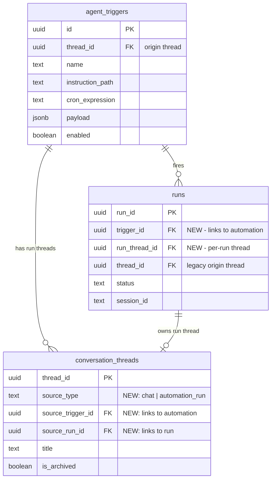

# feat: Automations UX Overhaul

## Overview

Replace the bare automations table with a polished, self-contained automations experience modeled after Micro.so. Two major changes: (1) each automation run creates its own thread instead of dumping into a shared thread, and (2) a dedicated automation detail page with editable instructions, run history, and schedule config.

## Problem Statement

- **Cluttered threads:** All trigger runs append to a single thread. The agent can't read past run output (different Anthropic session), but users see it mixed with their chat. Context accumulates as expensive fluff.
- **No management UI:** Editing schedule, instructions, or deleting automations requires going through chat. The automations page is a read-only table with an enable/disable toggle.
- **No run history:** Users can't browse past runs or compare outputs. Output is buried in a scrollable thread.
- **No manual trigger:** Users must wait for the scheduled time or send a webhook to test.

## Proposed Solution

Clone Micro.so's automations UX (see origin: `docs/plans/2026-04-12-automations-ux-overhaul-design.md`).

### Reference Screenshots (Micro.so)

Stored at `docs/plans/assets/micro-automations-reference/`:

| Screenshot | What it shows |
|------------|---------------|
| [`01-list-page.png`](../plans/assets/micro-automations-reference/01-list-page.png) | Automations list — Active/Inactive sections, emoji + name + schedule + countdown + toggle. Top tabs: Automations / Runs. |
| [`02-detail-instructions.png`](../plans/assets/micro-automations-reference/02-detail-instructions.png) | Automation detail — Instructions tab with SOP content rendered as rich text. Right sidebar: Schedule (recurrence, days, time), Model selector, Notifications toggle. Header: emoji + name + schedule + countdown + Active badge + toggle + Run button. |
| [`03-detail-runs.png`](../plans/assets/micro-automations-reference/03-detail-runs.png) | Automation detail — Runs tab showing past runs with titles, output previews, timestamps. Same header and sidebar. |

### Changes:

1. **New-thread-per-run** — `spawnTriggerRun` creates a fresh `conversation_threads` row per execution
2. **Automations list page** — Card-style rows grouped by active/inactive, replacing the data table
3. **Automation detail page** at `/automations/[triggerId]` — Instructions tab (Novel WYSIWYG editor for SOP files) + Runs tab (linked run threads) + schedule sidebar
4. **Manual "Run" button** on detail page
5. Run threads appear in chat sidebar mixed with regular chats

## Resolved Questions

From the design doc's unresolved questions:

| # | Question | Resolution | Rationale |
|---|----------|------------|-----------|
| 1 | Run thread title generation | Timestamp-based: `"{triggerName} — {MMM DD, h:mm A}"` | Available at spawn time. Agent-generated titles require waiting for async completion. Can add post-run rename later (same pattern as chat title generation). |
| 2 | Run thread cleanup | Keep indefinitely. Users can archive. | Sidebar already filters `is_archived=false`. Same as Micro. No TTL complexity. |
| 3 | Sidebar visual distinction | Small zap icon (lucide `Zap`) next to automation run thread titles | CRM sidebar items already use icons. Subtle but scannable. |
| 4 | SOP file locking | Last-write-wins, no locking | Runs read SOP atomically at start. UI edits don't conflict meaningfully. Overengineering for a solo-practitioner product. |
| 5 | Manual run from list page | Detail page only | Keeps list page clean. Manual run is an advanced action. |
| 6 | Templates/marketplace | Deferred | 15 templates already exist in `src/lib/automations/templates.ts`. Surface as "Templates" button in a follow-up. |

## Technical Approach

### Architecture

```
                ┌──────────────────────────────────────────┐
                │           agent_triggers                  │
                │  id, name, instruction_path, cron, ...    │
                │  thread_id (origin — where created)       │
                └──────────┬───────────────────────────────┘
                           │ 1:N
                ┌──────────▼───────────────────────────────┐
                │              runs                         │
                │  run_id, trigger_id (NEW), run_thread_id  │
                │  status, cost, tokens, ...                │
                └──────────┬───────────────────────────────┘
                           │ 1:1
                ┌──────────▼───────────────────────────────┐
                │       conversation_threads                │
                │  thread_id, source_type (NEW)             │
                │  source_trigger_id (NEW)                  │
                │  source_run_id (NEW)                      │
                └──────────────────────────────────────────┘
```

**ERD:**



### Implementation Phases

#### Phase 1: Data Model + Thread-Per-Run Backend

Foundation. No UI changes yet — existing automations page still works.

**Tasks:**

- [ ] **Migration: Add columns to `conversation_threads`** (`supabase/migrations/`)
  ```sql
  ALTER TABLE conversation_threads
    ADD COLUMN source_type TEXT NOT NULL DEFAULT 'chat',
    ADD COLUMN source_trigger_id UUID REFERENCES agent_triggers(id) ON DELETE SET NULL,
    ADD COLUMN source_run_id UUID;

  CREATE INDEX idx_threads_source_trigger
    ON conversation_threads(source_trigger_id)
    WHERE source_type = 'automation_run';

  -- Verify RLS: conversation_threads RLS is on client_id.
  -- Run threads inherit the same client_id as the trigger owner,
  -- so existing RLS policies cover reads/writes without changes.
  -- No new RLS policies needed for source_type/source_trigger_id columns.
  ```

- [ ] **Migration: Add `trigger_id` and `run_thread_id` to `runs`** (`supabase/migrations/`)
  ```sql
  ALTER TABLE runs
    ADD COLUMN trigger_id UUID REFERENCES agent_triggers(id) ON DELETE SET NULL,
    ADD COLUMN run_thread_id UUID REFERENCES conversation_threads(id) ON DELETE SET NULL;
  ```

- [ ] **Update `spawnTriggerRun`** (`src/lib/managed-agents/spawn-trigger-run.ts`)
  - Accept `triggerId` and `triggerName` in `SpawnTriggerRunInput`
  - Before creating the Anthropic session, create a new thread:
    ```typescript
    const runThread = await createThread(supabase, input.clientId,
      `${input.triggerName} — ${format(new Date(), "MMM d, h:mm a")}`
    );
    // Then set source columns:
    await supabase.from("conversation_threads")
      .update({
        source_type: "automation_run",
        source_trigger_id: input.triggerId,
        source_run_id: runId,
      })
      .eq("thread_id", runThread.thread_id);
    ```
  - Insert `runs` row with `trigger_id` and `run_thread_id`
  - Pass `runThread.thread_id` as `threadId` to `runTriggerAgent.trigger()`

- [ ] **Update `executeTrigger`** (`src/lib/triggers/executor.ts`)
  - Pass `triggerId` and `triggerName` through to `spawnTriggerRun`
  - System message (trigger event XML) goes into the **run thread**, not origin thread

- [ ] **Update `finalizeTriggerRun`** (`src/lib/managed-agents/finalize-trigger-run.ts`)
  - Already receives `threadId` from the runner payload — this will now be the run thread ID
  - No code change needed if `spawnTriggerRun` passes the run thread ID through

- [ ] **Update `persistTriggerRunSnapshot`** — same as above, uses `threadId` from payload

- [ ] **Regenerate TypeScript types** (`npm run supabase:types`)

- [ ] **Update `createThread` helper** (`src/lib/chat/threads.ts`)
  - Add optional `sourceType`, `sourcTriggerId`, `sourceRunId` params
  - Or: keep `createThread` simple, set source columns via separate update (avoids touching a well-used function)

**Acceptance criteria:**
- [ ] New trigger runs create a separate thread per run
- [ ] Run threads have `source_type = 'automation_run'`, `source_trigger_id`, `source_run_id` set
- [ ] Run threads appear in chat sidebar automatically (existing `listThreads` query picks them up)
- [ ] Existing triggers continue to work — old output stays in origin thread
- [ ] `runs` rows have `trigger_id` and `run_thread_id` populated for new runs

---

#### Phase 2: Automations List Page Overhaul

Replace the data table with card-style rows. Add cron-to-human-readable conversion.

**Tasks:**

- [ ] **Install `cronstrue`** for human-readable cron descriptions
  ```bash
  npm install cronstrue
  ```

- [ ] **Create `cronToHuman` utility** (`src/lib/triggers/cron-display.ts`)
  - Wrapper around `cronstrue.toString()` with fallback to raw cron
  - Helper for countdown text: `formatCountdown(nextFireAt: string): string` → "in 18hr", "in 3 days"

- [ ] **Create `AutomationsList` component** (`src/components/automations/automations-list.tsx`)
  - Replace `AutomationsTable` with card-style rows
  - Group triggers into "Active" and "Inactive" sections
  - Each row: emoji/icon + name + human-readable schedule + countdown + toggle
  - Row click → navigate to `/automations/${trigger.id}`
  - **Reference:** [`01-list-page.png`](../plans/assets/micro-automations-reference/01-list-page.png)

  ```
  ┌─────────────────────────────────────────────────────────────┐
  │  Active                                                     │
  │  ┌─────────────────────────────────────────────────────────┐│
  │  │ * Morning Briefing    Weekdays at 8:00 AM    in 18hr [=]││
  │  │ @ Pipeline Health     Mondays at 9:00 AM     in 19hr [=]││
  │  └─────────────────────────────────────────────────────────┘│
  │                                                             │
  │  Inactive                                                   │
  │  ┌─────────────────────────────────────────────────────────┐│
  │  │ > New automation      Daily at 9:00 AM              [ ] ││
  │  └─────────────────────────────────────────────────────────┘│
  └─────────────────────────────────────────────────────────────┘
  ```

- [ ] **Update automations page** (`app/(dashboard)/automations/page.tsx`)
  - Swap `AutomationsTable` for `AutomationsList`
  - Add top-level tabs: "Automations" (list) and "Runs" (global run history)
  - "Runs" tab: query `runs` joined with `conversation_threads` where `source_type = 'automation_run'`, ordered by `created_at DESC`

- [ ] **Add sidebar icon for run threads** (`src/components/layout/app-sidebar.tsx`)
  - Check `thread.source_type` (requires adding `source_type` to thread list select)
  - If `automation_run`, show `Zap` icon from lucide-react next to title

- [ ] **Update `listThreads` select** (`src/lib/chat/threads.ts`)
  - Add `source_type` to the select query so sidebar can differentiate

- [ ] **Update `useThreads` / `ThreadRow` type** (`src/hooks/use-threads.ts`)
  - Include `source_type` in the type

**Acceptance criteria:**
- [ ] List page shows card-style rows grouped by active/inactive
- [ ] Schedule shown as human-readable text, not raw cron
- [ ] Countdown to next run displayed
- [ ] Clicking a row navigates to detail page
- [ ] Runs tab shows global run history across all automations
- [ ] Automation run threads have zap icon in sidebar

---

#### Phase 3: Automation Detail Page — Layout + Runs Tab

Build the detail page shell with header and runs tab. Instructions tab comes in Phase 4 (requires Novel setup).

**Reference:** [`02-detail-instructions.png`](../plans/assets/micro-automations-reference/02-detail-instructions.png) (header + sidebar layout), [`03-detail-runs.png`](../plans/assets/micro-automations-reference/03-detail-runs.png) (runs tab).

**Tasks:**

- [ ] **Create detail page route** (`app/(dashboard)/automations/[triggerId]/page.tsx`)
  - Server component wrapper, client component content
  - Breadcrumb: `Automations / {name}`
  - Fetch trigger row via new `useTrigger(triggerId)` hook

- [ ] **Create `useTrigger(triggerId)` hook** (`src/hooks/use-triggers.ts`)
  - Single trigger fetch with realtime subscription
  - Select: all columns from `agent_triggers` including `instruction_path`

- [ ] **Create `useTriggerRuns(triggerId)` hook** (`src/hooks/use-trigger-runs.ts`)
  - Query `runs` table joined with `conversation_threads` where `trigger_id = triggerId`
  - Select: `run_id, run_thread_id, status, created_at, completed_at` from runs + `title` from threads
  - Paginated, ordered by `created_at DESC`
  - Realtime subscription on `runs` table filtered by `trigger_id`

- [ ] **Create `AutomationHeader` component** (`src/components/automations/automation-header.tsx`)
  - Emoji + editable name (inline edit, updates `agent_triggers.name`)
  - Human-readable schedule summary (from `cronToHuman`)
  - Next run countdown
  - Status badge ("Active" / "Disabled")
  - Enable/disable toggle (reuse `useSetTriggerEnabled`)
  - "Run" button (wired up in Phase 5)

- [ ] **Create `AutomationRuns` component** (`src/components/automations/automation-runs.tsx`)
  - List of past runs for this automation
  - Grouped by date (Today, Yesterday, Earlier)
  - Each row: status dot + thread title + output preview (first ~100 chars) + timestamp
  - Click → navigate to `/chat/${run_thread_id}`
  - Empty state: "No runs yet. Enable the automation and wait for the scheduled time, or click Run to test."

  ```
  ┌───────────────────────────────────────────────────────────┐
  │  Today                                                    │
  │  O Morning Briefing — Apr 12, 8:00 AM    2 actionable...  │
  │  O Morning Briefing — Apr 12, 2:03 PM    Retrieved morn...│
  │                                                           │
  │  Yesterday                                                │
  │  O Morning Briefing — Apr 11, 8:01 AM    Pipeline upda... │
  └───────────────────────────────────────────────────────────┘
  ```

- [ ] **Create `AutomationDetailShell` component** (`src/components/automations/automation-detail.tsx`)
  - Two-column layout: main content (tabs) + right sidebar
  - Tabs: "Instructions" and "Runs {count}"
  - Tab state managed via URL search param or `useState`
  - Sidebar rendered in Phase 5

**Acceptance criteria:**
- [ ] `/automations/[triggerId]` renders the detail page with header + tabs
- [ ] Header shows name, schedule, countdown, status, toggle
- [ ] Name is editable inline
- [ ] Runs tab lists past runs grouped by date
- [ ] Clicking a run navigates to its chat thread
- [ ] Empty state shown when no runs exist

---

#### Phase 4: Instructions Tab (Novel Editor)

Add WYSIWYG editing of the SOP markdown file.

**Tasks:**

- [ ] **Install Novel** (Tiptap-based WYSIWYG editor for Next.js)
  ```bash
  npm install novel
  ```

- [ ] **Create `useTriggerInstructions(triggerId)` hook** (`src/hooks/use-trigger-instructions.ts`)
  - Fetch: read trigger's `instruction_path`, then download file content from Supabase Storage via `createAgentFileClient`
  - Pattern: `supabase.storage.from("agent-files").download(storagePath)` → decode to string
  - Mutate: upload updated content back to same path via `.upload(path, content, { upsert: true })`
  - Uses existing patterns from `src/lib/storage/agent-files.ts`

- [ ] **Create `AutomationInstructions` component** (`src/components/automations/automation-instructions.tsx`)
  - Novel editor instance
  - Loads SOP markdown content on mount
  - Auto-save on blur or debounced (2s after last keystroke)
  - Save indicator: "Saving..." → "Saved" (1.5s) → hidden (follow `InlineEditField` pattern)
  - Fallback: if `instruction_path` is null/missing, show empty state with guidance

- [ ] **Create API route for SOP read/write** (`app/api/automations/[triggerId]/instructions/route.ts`)
  - `GET`: fetch trigger row → read `instruction_path` → download from storage → return content
  - `PUT`: receive markdown body → upload to storage at `instruction_path` → return success
  - Auth: validate user owns the trigger (RLS + client_id check)
  - Alternative: do storage calls client-side via Supabase JS client (simpler, avoids API route)

**Decision:** Prefer client-side storage calls via `useTriggerInstructions` hook directly. The Supabase JS client already has storage access, and RLS on the bucket enforces tenant isolation. No API route needed unless we hit CORS or size issues.

**Acceptance criteria:**
- [ ] Instructions tab renders SOP content in Novel WYSIWYG editor
- [ ] User can edit headings, lists, bold/italic, code blocks
- [ ] Changes auto-save to Supabase Storage
- [ ] Save indicator shows saving/saved state
- [ ] Empty state when no SOP file exists

---

#### Phase 5: Schedule Sidebar + Manual Run

Add the right sidebar with schedule config and wire up the "Run" button.

**Tasks:**

- [ ] **Create `AutomationScheduleSidebar` component** (`src/components/automations/automation-schedule-sidebar.tsx`)

  **Renders conditionally by trigger type:**

  **Schedule triggers (`trigger_type = "schedule"`):**
  - Recurrence dropdown: Daily, Weekdays, Weekly, Monthly, Custom
  - Day pills (M T W T F S S): toggle buttons, shown for Weekly recurrence
  - Time picker: hour + minute input (or simple text input "08:00")
  - Timezone dropdown: populated from `Intl.supportedValuesOf("timeZone")`, default from user profile

  **Webhook triggers (`trigger_type = "webhook"`):**
  - Read-only section: "Triggered by incoming webhook"
  - Webhook URL display (copyable)
  - No schedule controls (webhooks have no cron)

  **RSS triggers (`trigger_type = "rss"`):**
  - Polling interval dropdown: 15 min, 30 min, 1 hr, 6 hr, 24 hr
  - Feed URL display (read-only, editable via chat `manage_active_triggers`)
  - Timezone dropdown
  - Polling interval maps to cron under the hood (scanner treats RSS like cron)

  **Invocation message (all trigger types):**
  - Optional text field, max 200 chars
  - Shown to agent when trigger fires
  - Updates `agent_triggers.invocation_message`

  **Model section:**
  - Static label: "Sonnet 4.6 — Balanced performance"

  **Notifications section:**
  - "Email results" toggle — disabled, tooltip "Coming soon"

  **On schedule change (schedule triggers):**
  - Recompute `cron_expression` from recurrence + days + time
  - Compute `next_fire_at` via existing `computeNextFireAt()` from `src/lib/triggers/cron-utils.ts`
  - Update `agent_triggers` row: `cron_expression`, `payload.cron`, `payload.timezone`, `next_fire_at`
  - Reset `retry_count` to 0

  **On polling change (RSS triggers):**
  - Map polling interval to cron expression (e.g., 15min → `*/15 * * * *`)
  - Update `payload.polling_interval_minutes` and `cron_expression`
  - Recompute `next_fire_at`

  ```
  Schedule trigger:        Webhook trigger:         RSS trigger:
  ┌───────────────┐        ┌───────────────┐        ┌───────────────┐
  │  Schedule     │        │  Webhook      │        │  Polling      │
  │               │        │               │        │               │
  │  Recurrence   │        │  Triggered by │        │  Interval     │
  │  [Weekly  v]  │        │  webhook      │        │  [15 min  v]  │
  │               │        │               │        │               │
  │  Days         │        │  URL:         │        │  Feed URL:    │
  │  [M][T][W]... │        │  [copy url]   │        │  rss.feed/... │
  │               │        │               │        │               │
  │  Time         │        ├───────────────┤        │  Timezone     │
  │  [08:00 AM]   │        │  Message      │        │  [Asia/SG  v] │
  │               │        │  [optional]   │        │               │
  │  Timezone     │        ├───────────────┤        ├───────────────┤
  │  [Asia/SG  v] │        │  Model        │        │  Message      │
  │               │        │  Sonnet 4.6   │        │  [optional]   │
  ├───────────────┤        ├───────────────┤        ├───────────────┤
  │  Message      │        │  Notifications│        │  Model        │
  │  [optional]   │        │  Email  [soon]│        │  Sonnet 4.6   │
  ├───────────────┤        └───────────────┘        ├───────────────┤
  │  Model        │                                 │  Notifications│
  │  Sonnet 4.6   │                                 │  Email  [soon]│
  ├───────────────┤                                 └───────────────┘
  │  Notifications│
  │  Email  [soon]│
  └───────────────┘
  ```

- [ ] **Create `useUpdateTriggerSchedule` hook** (`src/hooks/use-triggers.ts`)
  - Mutation: update `agent_triggers` row with new cron, payload, next_fire_at
  - Invalidate trigger query on success

- [ ] **Create `useManualRun` hook** (`src/hooks/use-trigger-runs.ts`)
  - Mutation: POST to `/api/automations/[triggerId]/run`
  - On success: invalidate runs query, optionally navigate to run thread

- [ ] **Create manual run API route** (`app/api/automations/[triggerId]/run/route.ts`)
  - **Does NOT go through scanner claim/release cycle.** Flow:
    1. Fetch trigger row, validate user owns it (RLS + client_id)
    2. Guard: check `runs` table for `trigger_id + status = "running"` — reject if already running
    3. Read SOP content from storage via `instruction_path`
    4. Build trigger event message (same XML `<trigger-event>` format as `executor.ts`)
    5. Call `spawnTriggerRun()` directly — creates run thread, Anthropic session, runs row, queues task
    6. Return `{ runId, threadId }` to client
  - No `current_run_id` claim on `agent_triggers`. No `release_trigger_claim` call.
  - Does not affect `next_fire_at` or `last_fired_at` — manual runs are out-of-band.

- [ ] **Wire "Run" button in `AutomationHeader`**
  - Calls `useManualRun` mutation
  - Loading state while spawning
  - On success: show toast "Run started" with link to run thread, refresh Runs tab

- [ ] **Create cron builder utility** (`src/lib/triggers/cron-builder.ts`)
  - `buildCronExpression(recurrence, days, time): string`
  - Maps: Daily → `"M H * * *"`, Weekdays → `"M H * * 1-5"`, Weekly + days → `"M H * * 1,3,5"`, Monthly → `"M H 1 * *"`

**Acceptance criteria:**
- [ ] Schedule sidebar renders appropriate controls per trigger type (schedule/webhook/RSS)
- [ ] Changing schedule updates cron and next_fire_at in DB
- [ ] Webhook triggers show read-only webhook URL
- [ ] RSS triggers show polling interval dropdown
- [ ] Invocation message field editable, 200 char max
- [ ] "Run" button spawns a manual run and creates a run thread
- [ ] Manual run rejects if a run is already in progress for this trigger
- [ ] Run appears in Runs tab after completion
- [ ] Model label shows static text
- [ ] Email notifications toggle is greyed out with "Coming soon"

---

## System-Wide Impact

### Interaction Graph

- `spawnTriggerRun` → creates thread + creates run + creates Anthropic session + queues Trigger.dev task
- `finalizeTriggerRun` → persists to run thread + delivers to external channels + records cost + runs evaluators
- Sidebar `listThreads` → now includes automation run threads (no filter change needed)
- Supabase Realtime → `conversation_threads` changes invalidate sidebar, `runs` changes invalidate Runs tab, `agent_triggers` changes invalidate list page

### Error Propagation

- Thread creation failure in `spawnTriggerRun` → run fails before Anthropic session is created → `release_trigger_claim` with `status: "dispatch_failed"`
- SOP file not found during manual run → return 404 from API route → toast error to user
- Novel editor save failure → show error indicator, content preserved in editor state, retry on next blur

### State Lifecycle Risks

- **Orphaned run threads:** If `spawnTriggerRun` creates a thread but fails before inserting the `runs` row, the thread exists with no linked run. Mitigation: create thread and run row in sequence, thread first. Orphaned threads are harmless (appear in sidebar, can be archived).
- **Partial schedule update:** If cron update succeeds but `next_fire_at` computation fails, the trigger fires on the old schedule. Mitigation: compute `next_fire_at` before updating, send both in one update.

### API Surface Parity

- `setup_trigger` tool (chat) and schedule sidebar (UI) both modify `agent_triggers`. Ensure both recompute `next_fire_at` the same way (both use `computeNextFireAt` from `cron-utils.ts`).
- `manage_active_triggers { action: "edit" }` tool and UI schedule editor both update cron/payload. Same mutation shape.

### Integration Test Scenarios

1. Create trigger via chat → verify it appears on list page → click into detail → verify SOP content loads in editor
2. Manual "Run" button → verify run thread created → verify it appears in Runs tab → click into thread → verify output is visible → reply in thread → verify chat session works
3. Edit schedule in sidebar → verify `cron_expression` and `next_fire_at` updated → wait for scanner tick → verify trigger fires at new time
4. Cron fires trigger → verify new thread created (not appended to origin) → verify sidebar shows new thread with zap icon
5. Disable toggle on list page → verify detail page reflects disabled state → verify scanner skips trigger

## Dependencies & Prerequisites

- **Novel npm package** — required for Phase 4. No existing WYSIWYG editor in the project.
- **`cronstrue` npm package** — required for Phase 2. Human-readable cron descriptions.
- **Supabase migration** — Phase 1 must run before any UI work. New columns on `conversation_threads` and `runs`.
- **Managed Agents migration must be complete** — the current codebase is already on Managed Agents (confirmed by existing `spawn-trigger-run.ts` using `anthropic.beta.sessions.create`).

## Success Metrics

- Automation runs no longer pollute origin threads
- Users can view, edit, and manage automations without going through chat
- Run history is browsable per automation
- Manual run works from the detail page

## Sources & References

### Origin

- **Origin document:** [docs/plans/2026-04-12-automations-ux-overhaul-design.md](docs/plans/2026-04-12-automations-ux-overhaul-design.md) — Key decisions: new-thread-per-run, clone Micro.so detail page, Novel for instructions editor, chat-only creation, defer email notifications and marketplace.

### Internal References

- Automations page: `app/(dashboard)/automations/page.tsx`
- Automations table (to replace): `src/components/automations/automations-table.tsx`
- Trigger hooks: `src/hooks/use-triggers.ts`
- Spawn trigger run: `src/lib/managed-agents/spawn-trigger-run.ts`
- Finalize trigger run: `src/lib/managed-agents/finalize-trigger-run.ts`
- Trigger executor: `src/lib/triggers/executor.ts`
- Cron utilities: `src/lib/triggers/cron-utils.ts`
- Thread creation: `src/lib/chat/threads.ts:63-79`
- Thread list (sidebar): `src/lib/chat/threads.ts:44-58`
- Storage helpers: `src/lib/storage/agent-files.ts`
- CRM detail drawer pattern: `src/components/crm/record-drawer/record-drawer.tsx`
- InlineEditField pattern: `src/components/crm/inline-edit-field.tsx`
- Automation templates: `src/lib/automations/templates.ts`
- Event-driven triggers requirements: `docs/product/ideations/2026-04-06-event-driven-triggers-requirements.md`

### External References

- Micro.so automations UI reference screenshots: `docs/plans/assets/micro-automations-reference/`
  - `01-list-page.png` — Automations list (active/inactive, toggles, countdown)
  - `02-detail-instructions.png` — Detail page, Instructions tab (SOP editor + schedule sidebar)
  - `03-detail-runs.png` — Detail page, Runs tab (run history list)
- Novel editor: https://novel.sh
- cronstrue: https://www.npmjs.com/package/cronstrue
