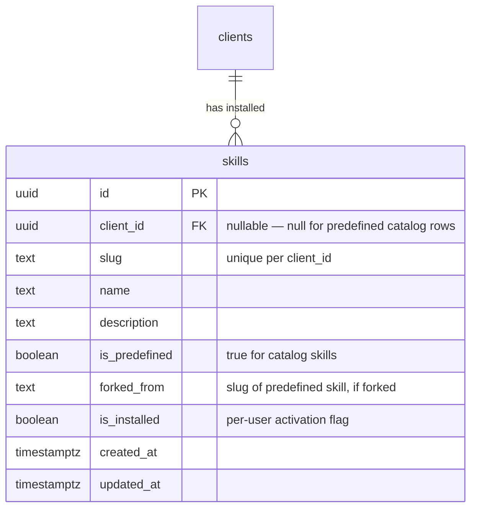

# feat: Unified Skill Infrastructure

## Overview

Collapse Sunder's three-tier skill system into one unified tier where all skills are `type: "custom"` on Anthropic's Skills API. Add a `skills` DB table for metadata/discovery, slash command autocomplete in the chat composer, and install/uninstall UX on the `/skills` page.

## Problem Statement

The agent has three disconnected skill access patterns (Anthropic built-in, predefined custom, user overrides via `storage_read`). It conflates them — e.g. calling `storage_read('/agent/skills/xlsx/SKILL.md')` for a built-in Anthropic skill — deadlocking sessions. Users have no way to discover or explicitly invoke skills. (See origin: `docs/product/ideations/2026-04-13-unified-skill-infrastructure-requirements.md`)

## Proposed Solution

One tier. All skills registered as `type: "custom"` on Anthropic. A `skills` table is the metadata layer. Per-user install/uninstall is a DB flag. The kickoff tells the agent which skills are active per session.

```
managed-agents/skills/{slug}/SKILL.md
         → upload-custom-skills.ts → Anthropic Skills API
         → deploy seed → skills table (Postgres)
         → session kickoff → "active skills: [list]"
```

## Technical Approach

### Architecture



**Key constraint:** `UNIQUE (client_id, slug)` — each user can have at most one row per skill slug. Predefined catalog rows have `client_id = NULL`.

### Implementation Phases

#### Phase 1: Unified Skill Pipeline + DB Foundation

**Goal:** All skills are `type: "custom"` on Anthropic. `skills` table exists and is seeded.

**1a. Fork document processing skills**

Port Anthropic's source-available document skills (xlsx, docx, pptx, pdf) from `github.com/anthropics/skills` into `managed-agents/skills/`.

Each needs a `SKILL.md` with YAML frontmatter (`name` + `description`) matching the existing format. The Anthropic reference implementations include Python scripts for document processing — these run in the session container via bash, so they're bundled as supporting files alongside SKILL.md.

Files:
- `managed-agents/skills/xlsx/SKILL.md` (new)
- `managed-agents/skills/docx/SKILL.md` (new)
- `managed-agents/skills/pptx/SKILL.md` (new)
- `managed-agents/skills/pdf/SKILL.md` (new)

**1b. Remove BUILTIN_SKILLS**

`scripts/managed-agents/load-managed-agent-skills.ts`:
- Delete `BUILTIN_SKILLS` array (lines 14-19)
- All skills now come from the registry — the function just reads `skill-registry.json` and returns custom skill params
- The 4 document skills flow through the same pipeline as the 11 existing Sunder skills

**1c. Run upload pipeline**

```bash
pnpm tsx scripts/managed-agents/upload-custom-skills.ts
```

This uploads the 4 new document skills to Anthropic, updates `skill-registry.json` to have 15 entries (11 existing + 4 new), all `type: "custom"`.

**1d. Create `skills` table migration**

`supabase/migrations/YYYYMMDDHHMMSS_create_skills_table.sql`:

```sql
-- Skills metadata table ("menu board")
-- Content lives on Anthropic (progressive disclosure) and Supabase storage (user overrides).
-- This table stores metadata only — for discovery, autocomplete, and install/uninstall state.
create table public.skills (
  id uuid primary key default gen_random_uuid(),
  client_id uuid references public.clients(client_id) on delete cascade,
  slug text not null,
  name text not null,
  description text not null default '',
  is_predefined boolean not null default false,
  forked_from text,
  is_installed boolean not null default true,
  created_at timestamptz not null default now(),
  updated_at timestamptz not null default now(),

  constraint skills_unique_per_client unique (client_id, slug)
);

-- Predefined catalog rows (client_id IS NULL) also need uniqueness
create unique index skills_predefined_unique_slug
  on public.skills (slug)
  where client_id is null;

-- Fast lookup for kickoff: "what does this user have installed?"
create index skills_client_installed
  on public.skills (client_id)
  where is_installed = true;

-- RLS
alter table public.skills enable row level security;

-- Users can read predefined skills (client_id IS NULL) and their own
create policy skills_select on public.skills for select using (
  client_id is null
  or client_id = public.get_my_client_id()
);

-- Users can only insert/update/delete their own rows
create policy skills_insert on public.skills for insert with check (
  client_id = public.get_my_client_id()
);

create policy skills_update on public.skills for update using (
  client_id = public.get_my_client_id()
);

create policy skills_delete on public.skills for delete using (
  client_id = public.get_my_client_id()
);

comment on table public.skills is
  'Skill metadata for discovery and per-user install state. Content lives on Anthropic (predefined) and Supabase storage (user overrides).';
```

**1e. Seed predefined skills**

A deploy-time seed script reads SKILL.md frontmatter from `managed-agents/skills/*/SKILL.md` and upserts rows into `skills` where `client_id IS NULL`. This uses the same `readSkillBundle()` function from `read-skill-bundle.ts`.

File: `scripts/managed-agents/seed-skills-table.ts`

```typescript
// For each skill in managed-agents/skills/:
//   Parse frontmatter (name, description)
//   Upsert into skills table where client_id IS NULL and slug = slug
```

**Gotcha from PR 51:** Do NOT use `readFile()` + `__dirname` for bundled content at runtime — breaks in Next.js webpack. The seed script runs as a standalone `tsx` script (like `upload-custom-skills.ts`), so filesystem reads are fine here. But if any of this content is needed at runtime in the Next.js app, use TypeScript string constants per the pattern in `src/lib/runner/skills/skill-templates.ts`.

**1f. Per-user default installation**

When a user first uses skills (e.g. opens `/skills` page or sends their first chat message), seed their installed skill rows:

```sql
INSERT INTO skills (client_id, slug, name, description, is_predefined, is_installed)
SELECT :client_id, slug, name, description, true, true
FROM skills
WHERE client_id IS NULL
  AND slug IN ('call-prep', 'daily-briefing', 'draft-outreach', 'xlsx', ...)
ON CONFLICT (client_id, slug) DO NOTHING;
```

This creates per-user rows for the default install set. The `ON CONFLICT DO NOTHING` makes it idempotent — same bootstrap pattern as `bootstrapMemoryFiles()`.

---

#### Phase 2: Kickoff + System Prompt

**Goal:** The agent knows which skills are active per session and how to use them.

**2a. Update system prompt**

`scripts/managed-agents/create-agent.ts` — add a `## Skills` section after `## Tools`:

```markdown
## Skills

You have specialized skills that provide domain-specific workflows. Skills are triggered either by:
- **Explicit invocation:** User message starts with `/skill-name` (e.g. `/call-prep David Lee`)
- **Auto-detection:** You match the user's request to a skill by its description

Available skills:
${skillsList}

Only use skills the kickoff message lists as "active for this session." If a skill has a user customization, call storage_read('/agent/skills/{slug}/SKILL.md') first to load the user's version.
```

The `skillsList` is generated at agent creation time from the skill registry — all 15 skills with name + one-line description.

**2b. Update kickoff content**

`src/lib/managed-agents/session-kickoff.ts` — replace the current customized-skills block with two blocks:

1. **Active skills block:** "Active skills for this session: call-prep, daily-briefing, xlsx, ..."
2. **Override block (if any):** "These skills have user customizations: call-prep. Call `storage_read('/agent/skills/call-prep/SKILL.md')` first."

`src/lib/managed-agents/adapter.ts` — replace `listCustomizedSkillSlugs()` call with two queries:

```typescript
const [installedSkillSlugs, customizedSkillSlugs] = await Promise.all([
  listInstalledSkillSlugs(input.supabase, input.clientId),
  listCustomizedSkillSlugs(input.supabase, input.clientId),
]);
```

New function `listInstalledSkillSlugs()` queries the `skills` table:

```sql
SELECT slug FROM skills
WHERE client_id = :clientId AND is_installed = true
ORDER BY slug;
```

File: `src/lib/runner/skills/list-installed-skill-slugs.ts` (new)

**2c. Update KickoffInput type**

`src/lib/managed-agents/session-kickoff.ts`:
- Add `installedSkillSlugs: string[]` to `KickoffInput`
- Update `buildKickoffContent()` to emit both blocks

---

#### Phase 3: Slash Command Autocomplete

**Goal:** Users type `/` in the composer and see their installed skills.

**3a. Skill list API**

Server action or API route that returns the user's installed skills:

```typescript
// src/lib/runner/skills/get-installed-skills.ts
export async function getInstalledSkills(
  supabase: SupabaseClient,
  clientId: string,
): Promise<{ slug: string; name: string; description: string }[]> {
  const { data } = await supabase
    .from("skills")
    .select("slug, name, description")
    .eq("client_id", clientId)
    .eq("is_installed", true)
    .order("name");
  return data ?? [];
}
```

**3b. Autocomplete component**

The `PromptInput` component already exports Command components (lines 1406-1460 of `prompt-input.tsx`) wrapping cmdk. Build a skill autocomplete that:

1. Listens for `/` typed at the start of input (or after a newline)
2. Opens a Command popover anchored to the cursor position
3. Shows matching skills filtered by typed text after `/`
4. On selection, replaces the `/partial` with `/skill-name ` (with trailing space)
5. Dismisses on Escape or clicking outside

File: `src/components/chat/skill-autocomplete.tsx` (new)

Integration in `src/components/chat/chat-composer.tsx`:
- Fetch installed skills via TanStack Query on mount
- Pass skill list to autocomplete component
- Autocomplete watches `value` for `/` trigger

**3c. TanStack Query hook**

```typescript
// src/hooks/use-installed-skills.ts
export function useInstalledSkills() {
  const clientId = useClientId();
  return useQuery({
    queryKey: ["skills", "installed", clientId],
    queryFn: () => getInstalledSkillsAction(clientId),
    staleTime: 5 * 60 * 1000, // 5 min — skills don't change often
  });
}
```

---

#### Phase 4: Install / Uninstall UX

**Goal:** `/skills` page shows Installed vs Recommended with one-click install/uninstall.

**4a. Update skills page data fetching**

`app/(dashboard)/skills/page.tsx` — replace current `listPredefinedSkills()` + `discoverUserSkills()` with a single query against the `skills` table:

```typescript
// Installed: user's rows with is_installed = true
const installed = await supabase
  .from("skills")
  .select("*")
  .eq("client_id", clientId)
  .eq("is_installed", true);

// Recommended: predefined catalog rows NOT in user's installed set
const recommended = await supabase
  .from("skills")
  .select("*")
  .is("client_id", null)
  .not("slug", "in", `(${installed.data.map(s => s.slug).join(",")})`);
```

**4b. Install/uninstall server actions**

`src/lib/runner/skills/skill-actions.ts` — add:

```typescript
export async function installSkill(clientId: string, slug: string) {
  // Upsert row: client_id + slug with is_installed = true
  // If skill doesn't exist for this user, copy metadata from predefined catalog row
}

export async function uninstallSkill(clientId: string, slug: string) {
  // Update is_installed = false for this client_id + slug
}
```

**4c. Update skills page layout**

Two sections:
- **Installed** — grid of skill cards with "Uninstall" action + existing "Edit" action
- **Recommended** — grid of skill cards with "+ Install" button

Keep the existing skill editor/customization flow (fork, edit SKILL.md, reset) as-is. The install/uninstall is orthogonal to customization.

---

## System-Wide Impact

### Interaction Graph

1. Developer writes SKILL.md → `upload-custom-skills.ts` → Anthropic Skills API → `skill-registry.json`
2. Deploy → `seed-skills-table.ts` → `skills` table (predefined catalog rows)
3. User first use → bootstrap per-user install rows (idempotent)
4. User sends message → adapter queries `skills` table → builds kickoff → Anthropic session
5. User types `/` → frontend queries `skills` table → autocomplete dropdown
6. User installs/uninstalls → DB flag flip → next session kickoff changes

### Error Propagation

- Seed script failure: predefined catalog rows missing → autocomplete empty, kickoff has no active skills. **Mitigation:** fail deploy if seed fails.
- `skills` table query failure in adapter: fall back to empty active skills list (agent still works, just no skill guidance). Log error.
- Autocomplete query failure: hide autocomplete, no user-facing error. Graceful degradation.

### State Lifecycle Risks

- **Orphaned per-user rows:** If a predefined skill is removed from the catalog, per-user rows with that slug become orphaned. Seed script should clean up catalog rows that no longer exist in the repo. Per-user rows can stay (no harm — the skill just won't be in the agent's registry).
- **Stale `skill-registry.json`:** If someone deploys without running the upload pipeline, the agent has skills the DB doesn't know about (or vice versa). **Mitigation:** CI check that registry matches `managed-agents/skills/` directory.

### API Surface Parity

- `/skills` page: switch from `discoverUserSkills()` + `listPredefinedSkills()` to `skills` table queries
- Kickoff: switch from `listCustomizedSkillSlugs()` only to `listInstalledSkillSlugs()` + `listCustomizedSkillSlugs()`
- Chat composer: new autocomplete consuming `skills` table

## Acceptance Criteria

### Functional Requirements

- [ ] All 15 skills (11 Sunder + 4 document) registered as `type: "custom"` on Anthropic. No `BUILTIN_SKILLS` array.
- [ ] `skills` table exists with predefined catalog rows seeded
- [ ] Per-user default install rows created on first use (idempotent)
- [ ] Agent system prompt includes skills section with names + descriptions
- [ ] Kickoff includes "active skills" list based on user's installed skills
- [ ] Kickoff includes "user customizations" override list (existing behavior, now uniform)
- [ ] `/` autocomplete in chat composer shows installed skills
- [ ] Selecting from autocomplete inserts `/skill-name ` into input
- [ ] Agent recognizes `/skill-name` as explicit invocation
- [ ] `/skills` page shows Installed and Recommended sections
- [ ] Install button copies skill to user's installed set (DB flag)
- [ ] Uninstall button removes skill from user's installed set (DB flag)

### Non-Functional Requirements

- [ ] 20-skill-per-session cap respected (15 currently, room for 5)
- [ ] Autocomplete responds in <100ms (single DB query, cached via TanStack Query)
- [ ] Kickoff skill lookup adds <50ms to session start (indexed query)

### Quality Gates

- [ ] `skills` table has RLS policies (client_id scoping)
- [ ] Seed script is idempotent (safe to run repeatedly)
- [ ] Autocomplete gracefully degrades if query fails

## Dependencies & Prerequisites

- Anthropic's source-available document skills at `github.com/anthropics/skills` are accessible and adaptable
- The existing `upload-custom-skills.ts` pipeline handles 15 skills without issues
- `get_my_client_id()` RLS helper function exists (confirmed in codebase)

## Risk Analysis & Mitigation

| Risk | Impact | Mitigation |
|------|--------|------------|
| Document skill adaptation is harder than expected | Phase 1 delays | Start with xlsx only as proof-of-concept, add others incrementally |
| 20-skill cap reached sooner than expected | Can't add new skills | Files API overflow path documented in requirements (v2) |
| Agent ignores "active skills" kickoff instruction | Skills work for everyone regardless of install state | Acceptable soft failure — feature degrades gracefully |
| Autocomplete performance on mobile | Laggy UX | TanStack Query caching + small payload (15 skills max) |

## Sources & References

### Origin

- **Origin document:** [docs/product/ideations/2026-04-13-unified-skill-infrastructure-requirements.md](docs/product/ideations/2026-04-13-unified-skill-infrastructure-requirements.md) — Key decisions: fork built-ins as custom, Skills API for v1, DB table for metadata, soft-toggle install/uninstall
- **Reference architectures:** Multica (PostgreSQL `skill` table + `agent_skill` junction), Fintool (SQL discovery over S3 filesystem, three-tier shadowing)

### Internal References

- Skill upload pipeline: `scripts/managed-agents/upload-custom-skills.ts`
- Skill loading: `scripts/managed-agents/load-managed-agent-skills.ts:14-19` (BUILTIN_SKILLS to remove)
- Agent creation: `scripts/managed-agents/create-agent.ts:90-134` (system prompt)
- Kickoff building: `src/lib/managed-agents/session-kickoff.ts:34-70`
- Adapter skill injection: `src/lib/managed-agents/adapter.ts:385-520`
- Chat composer: `src/components/chat/chat-composer.tsx`
- PromptInput Command components: `src/components/ai-elements/prompt-input.tsx:1406-1460`
- Skill discovery (current): `src/lib/runner/skills/discover-skills.ts`
- Skill bootstrap pattern: `src/lib/runner/skills/skill-bootstrap.ts`
- Bundling gotcha: `docs/product/handovers/2026-03-19-pr51-skill-bundling-fix.md`

### External References

- Anthropic source-available skills: `github.com/anthropics/skills`
- Anthropic Skills API: `platform.claude.com/docs/en/managed-agents/skills`
- Anthropic Skills API limit: 20 skills per session

### Related Work

- PR 51: Instruction skills (initial skill system)
- PR 51a: Frontend skills page
- PR 52: Sandbox skill execution (separate, depends on this infra)
