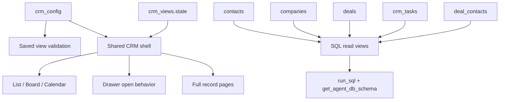

# feat: KISS CRM UX foundation

## Overview

Upgrade Sunder CRM to feel like one coherent operating surface without rebuilding it into a metadata platform. This plan keeps the current relational CRM model, `crm_config`, agent tools, and `custom_fields` JSONB foundation intact, then layers four focused upgrades on top:

1. richer saved views using a single `state` object
2. one shared CRM page shell across People, Companies, Deals, and Tasks
3. real record pages for People, Companies, and Deals while keeping the drawer
4. read-only SQL projection views for agent and reporting reads

This plan carries forward the core origin decisions that Twenty is the **UX reference only**, relational CRM data stays the source of truth, and the first pass should pursue the smallest durable move that gets most of the UX gain (see origin: `docs/product/ideations/2026-04-23-kiss-crm-ux-foundation-requirements.md`).

This plan extends shipped CRM working surfaces and saved views rather than replacing them. In practice it is the next-stage plan after:

- PR 46 / 46a working surfaces (`docs/qa/16-crm-working-surfaces.md`)
- PR 67 saved views (`docs/product/plans/2026-04-05-001-feat-crm-saved-views-plan.md`)

## Problem Statement

Today the CRM works, but its architecture is split in ways that make the UX weaker than it should be:

- **The CRM pages are still hand-rolled.** People, Companies, Deals, and Tasks each compose their own shell around `FilterBar`, `ViewPicker`, `ViewToggle`, `ListTable`, and `RecordDrawer` instead of sharing one higher-level CRM surface (`app/(dashboard)/customers/people/page.tsx`, `.../companies/page.tsx`, `.../deals/page.tsx`, `app/(dashboard)/tasks/page.tsx`).
- **Saved views are too small to feel like real workspaces.** `crm_views` currently stores only root `filters` and `sort`, which leaves view type, column setup, grouping, calendar mode, and record-opening behavior outside the view model (`supabase/migrations/20260405000001_create_crm_views.sql`, `src/hooks/use-crm-views.ts:21-52`).
- **Record detail is mostly drawer-only.** The current `?detail=` contract is reusable, but there are no first-class People / Companies / Deals record routes in the active customers IA (`src/hooks/use-record-drawer.ts:23-62`).
- **The agent tool surface depends on queryable data.** `run_sql` is explicitly the escape hatch for JOINs, aggregates, and complex analysis, so we should improve read ergonomics without moving operational CRM data into a metadata-heavy platform (`src/lib/managed-agents/tools/utility/run-sql.ts:21-55`).
- **CRM configuration already understands saved-view breakage, but only narrowly.** `configure_crm` currently checks `crm_views.filters` for removed vocabulary values and returns warnings; that contract needs to evolve along with the richer saved-view model (`src/lib/managed-agents/tools/crm/configure-crm.ts:236-476`).

The product goal is not “copy Twenty's backend.” The product goal is to get Attio/Twenty-class CRM ergonomics while preserving Sunder's agent-first, SQL-friendly operating model.

## Proposed Solution

Implement a KISS CRM UX foundation in four workstreams:

1. **Promote `crm_views` from filter presets to saved workspace state.**
   - Keep one compact row per view.
   - Replace the current root `filters + sort` model with a richer `state` object.
   - Preserve agent-first creation/editing through `manage_views`.

2. **Introduce one shared CRM shell.**
   - Consolidate page framing, view switching, filter presentation, content-body switching, and record-open behavior into one reusable layer.
   - Keep current low-level widgets where they are already good enough (`ListTable`, `KanbanBoard`, `CrmTasksCalendar`, `ViewPicker`, `ViewToggle`, `FilterBar`).

3. **Support both quick peek and full-page work.**
   - Keep `RecordDrawer` for fast inspection.
   - Add full record pages for People, Companies, and Deals.
   - Reuse the same underlying record-detail content between drawer and page.

4. **Add SQL-friendly projection views.**
   - Create a small set of read-only database views for the most common cross-table CRM reads.
   - Expose them through schema introspection so `run_sql` and `get_agent_db_schema` can use them naturally.

This intentionally does **not** include:

- a custom object engine
- normalized `view_fields` / `view_filters` / `view_groups` tables
- a dynamic favorites/sidebar platform
- a manual filter builder or column builder UI

## Technical Approach

### Architecture

#### Core model

- **Operational CRM data stays relational.**
  - `contacts`
  - `companies`
  - `deals`
  - `crm_tasks`
  - `deal_contacts`
  - `interactions`
  - `record_notes`
  - `record_attachments`

- **CRM vocabulary and field definitions stay in `crm_config`.**
  - `get_crm_config` and `configure_crm` remain the source of truth for labels, fields, and allowed values.
  - Saved views sit on top of this configuration and must validate against it.

- **UX state becomes richer, but still compact.**
  - `crm_views` becomes the single persistence surface for saved workspace state.
  - We do not fan this out into many metadata tables in the first pass.

- **Reporting / agent read surfaces become flatter.**
  - Read-only SQL views provide pre-joined shapes for `run_sql`.
  - They are not sources of truth and do not replace base tables.



#### Saved-view state shape

The first-pass saved-view model should stay compact and explicit:

```json
{
  "version": 1,
  "viewType": "table",
  "filters": {
    "stage": ["closing", "offer"]
  },
  "sort": {
    "column": "updated_at",
    "ascending": false
  },
  "columns": ["name", "stage", "amount", "company_id", "updated_at"],
  "columnOrder": ["name", "amount", "stage", "company_id", "updated_at"],
  "groupBy": "stage",
  "calendarField": "due_date",
  "openMode": "drawer",
  "isDefault": false
}
```

Additional row-level metadata can remain outside `state` only where it materially reduces rollout risk or preserves existing lifecycle handling:

- `view_id`
- `client_id`
- `entity_type`
- `name`
- timestamps
- optional `is_seeded` housekeeping flag

Key rule: **`state` is the only source of saved-view behavior.**

#### View precedence rules

To avoid unclear state intersections:

- when a saved view is active, its `state` is authoritative
- when “All” is active, local ad hoc state remains allowed
- `useViewPreference` stays as the fallback for ad hoc browsing only
- a saved view can choose `openMode = "drawer"` or `openMode = "page"`

This keeps the system simple:

- ad hoc browsing remains lightweight
- saved workflows become deterministic

#### Record-detail reuse model

Do not maintain one implementation for the drawer and another for the full page.

Instead:

- extract shared object-detail content blocks from `src/components/crm/record-drawer/*`
- render those blocks inside:
  - `RecordDrawer`
  - full People / Companies / Deals record pages

This keeps edits, tabs, related-record sections, and timeline behavior aligned across both surfaces.

#### SQL read-view model

Create four read-only views:

- `crm_contacts_index_v`
- `crm_companies_index_v`
- `crm_deals_index_v`
- `crm_tasks_index_v`

First pass should stay modest:

- **`crm_contacts_index_v`**: contact row plus `company_name`
- **`crm_companies_index_v`**: company row plus lightweight related counts if cheap enough
- **`crm_deals_index_v`**: deal row plus `company_name` and `primary_contact_name`
- **`crm_tasks_index_v`**: task row plus `contact_name`, `deal_address`, and `company_name` where derivable

Do **not** add materialized views, write paths, or heavy analytics rollups in this phase.

#### RLS and view security

The read views must not bypass RLS.

Per Supabase guidance, public views bypass RLS by default unless created with `security_invoker`. The SQL-read-surface phase must therefore use:

```sql
create view public.crm_deals_index_v
with (security_invoker = on)
as
select ...
```

If project Postgres version or environment constraints block `security_invoker`, stop and use the fallback called out in Supabase docs before exposing the views through public APIs.

### Implementation Phases

#### Phase 1: Upgrade saved views to state-based workspaces

**Goal:** Replace the current filter/sort preset model with a compact saved-workspace model without breaking current behavior mid-rollout.

**Create**

- `src/lib/crm/view-state.ts`
- `supabase/migrations/YYYYMMDDHHMMSS_upgrade_crm_views_to_state_jsonb.sql`

**Modify**

- `supabase/migrations/20260405000001_create_crm_views.sql` (reference only; do not edit historical migration)
- `src/lib/crm/schemas.ts`
- `src/hooks/use-crm-views.ts`
- `src/lib/managed-agents/tools/crm/manage-views.ts`
- `src/lib/managed-agents/tools/crm/configure-crm.ts`
- `src/components/crm/view-picker.tsx`
- `src/hooks/__tests__/use-crm-views.test.tsx`
- `src/lib/managed-agents/tools/crm/__tests__/manage-views.test.ts`
- `src/lib/managed-agents/tools/crm/__tests__/configure-crm.test.ts`

**Deliverables**

- add `state JSONB` to `crm_views`
- backfill existing rows from `filters` / `sort` to `state`
- keep legacy columns during the migration window for safer rollout and compatibility checks
- introduce a single schema + normalization helper for saved-view state
- update `manage_views` to read/write `state`
- preserve backward compatibility for existing `filters` / `sort` tool calls for one release by normalizing them into `state`
- update `configure_crm` to inspect `state.filters` and view-dependent fields instead of only root `filters`

**Success criteria**

- existing saved views survive migration
- new saved views persist `viewType`, `filters`, `sort`, and display state through `state`
- `configure_crm` still warns when config changes affect saved views
- no list page crashes on old, malformed, or partially migrated view rows

#### Phase 2: Build one shared CRM shell

**Goal:** Stop duplicating list-surface behavior across the four CRM pages.

**Create**

- `src/components/crm/crm-workspace-shell.tsx`
- `src/components/crm/use-active-crm-view-state.ts`
- `src/components/crm/apply-view-columns.ts`

**Modify**

- `app/(dashboard)/customers/people/page.tsx`
- `app/(dashboard)/customers/companies/page.tsx`
- `app/(dashboard)/customers/deals/page.tsx`
- `app/(dashboard)/tasks/page.tsx`
- `src/hooks/use-view-preference.ts`
- `src/components/ui/filter-bar.tsx` (only if prop surface must widen)
- `src/components/crm/view-toggle.tsx`
- `src/lib/crm/build-columns.tsx`
- `src/lib/crm/task-columns.tsx`
- existing page tests under:
  - `app/(dashboard)/customers/people/__tests__/page.test.tsx`
  - `app/(dashboard)/customers/companies/__tests__/page.test.tsx`
  - `app/(dashboard)/customers/deals/__tests__/page.test.tsx`

**Deliverables**

- one shared shell that owns:
  - page header framing
  - active saved-view resolution
  - view type resolution
  - filter / view-picker presentation
  - body switching between list / board / calendar
  - record-open behavior selection
- keep existing low-level widgets for now:
  - `ListTable`
  - `KanbanBoard`
  - `CrmTasksCalendar`
  - `ViewPicker`
  - `ViewToggle`
  - `FilterBar`
- apply saved-view `columns` and `columnOrder` by filtering/reordering existing field-definition-driven columns
- keep “All” mode lightweight by continuing to use ad hoc state where appropriate

**Success criteria**

- all four CRM pages use the same shell component
- saved views can drive mode + sorting + column presentation
- “All” still behaves like ad hoc browsing instead of forcing a saved-workspace flow

#### Phase 3: Add full record pages while keeping the drawer

**Goal:** Keep quick inspection fast while making serious work first-class.

**Create**

- `app/(dashboard)/customers/people/[contactId]/page.tsx`
- `app/(dashboard)/customers/companies/[companyId]/page.tsx`
- `app/(dashboard)/customers/deals/[dealId]/page.tsx`
- `src/components/crm/record-detail/contact-detail-content.tsx`
- `src/components/crm/record-detail/company-detail-content.tsx`
- `src/components/crm/record-detail/deal-detail-content.tsx`
- `src/components/crm/use-record-open-behavior.ts`

**Modify**

- `src/components/crm/record-drawer/record-drawer.tsx`
- `src/components/crm/record-drawer/contact-drawer-content.tsx`
- `src/components/crm/record-drawer/company-drawer-content.tsx`
- `src/components/crm/record-drawer/deal-drawer-content.tsx`
- `src/hooks/use-record-drawer.ts`
- relevant drawer tests under `src/components/crm/record-drawer/__tests__/`

**Deliverables**

- shared content modules render both drawer and full page
- row clicks honor saved-view `openMode`
- default remains quick drawer open unless the active view says otherwise
- drawer gains a stable “Open full page” affordance
- full pages preserve list context through normal browser back behavior and stable routing
- Tasks stay drawer-only in this pass

**Success criteria**

- People / Companies / Deals full pages exist and feel consistent with the drawer
- drawer behavior remains unchanged for users who prefer quick inspection
- no duplicated business logic between drawer and full pages

#### Phase 4: Add SQL-friendly read views and introspection support

**Goal:** Improve agent/reporting reads without changing the source-of-truth data model.

**Create**

- `supabase/migrations/YYYYMMDDHHMMSS_create_crm_index_views.sql`

**Modify**

- `supabase/migrations/20260305030001_create_sql_helper_functions.sql` (reference only; do not edit historical migration)
- create a new migration that updates `public.get_client_accessible_schema()`
- `src/lib/managed-agents/tools/utility/get-agent-db-schema.ts` (only if output formatting needs adjustment)
- `src/lib/managed-agents/tools/utility/run-sql.ts` (only if description/examples should mention the new views)
- `docs/qa/03-crm-tools-via-chat.md`
- `docs/qa/16-crm-working-surfaces.md` (where list/detail behavior changed)

**Deliverables**

- add `crm_contacts_index_v`, `crm_companies_index_v`, `crm_deals_index_v`, `crm_tasks_index_v`
- create each public view with `with (security_invoker = on)` so underlying RLS still applies
- extend `public.get_client_accessible_schema()` so the agent sees the new views in introspection
- decide whether row counts for views should be `null` or computed explicitly; default to `null` if counting the view adds avoidable overhead

**Success criteria**

- `run_sql` can query the new views directly
- `get_agent_db_schema` exposes the new views and their columns
- the new read surfaces make common CRM joins simpler without altering write paths

#### Phase 5: QA, docs, and rollout cleanup

**Goal:** Lock in the new contracts and avoid silent regressions.

**Modify**

- `docs/qa/16-crm-working-surfaces.md`
- `docs/qa/03-crm-tools-via-chat.md`
- `docs/product/reviews/2026-04-13-crm-tool-efficiency-review.md` (optional addendum if useful)
- any relevant page, hook, and tool tests touched in Phases 1-4

**Deliverables**

- update QA docs for:
  - saved workspace behavior
  - drawer vs page open behavior
  - config-change warnings affecting saved views
  - SQL read-view introspection and querying
- refresh test fixtures so saved-view state rows use the new shape
- document any compatibility window for legacy `filters` / `sort`

**Success criteria**

- manual QA scripts match the new behavior
- tool tests, hook tests, and page tests cover the new contracts
- no undocumented legacy behavior remains

## Alternative Approaches Considered

### 1. Full Twenty-style metadata platform

Rejected. It would close more of the gap to Twenty's internal architecture, but it is the wrong cost profile for Sunder right now. It adds a large carrying cost, weakens SQL ergonomics, and conflicts with the origin decision to protect toolability (see origin).

### 2. Keep the current page-by-page architecture and only restyle it

Rejected. That would improve cosmetics while leaving the real product gaps intact:

- weak saved views
- duplicated page behavior
- drawer-only details
- repetitive join-heavy reads for the agent

### 3. Normalize saved views into many tables immediately

Rejected. It front-loads complexity before we know we need it. The origin explicitly chose a compact saved-view model for the first pass (see origin: R5).

### 4. Put more operational CRM data into JSONB/config tables

Rejected. This would make the agent harder to operate, not easier. The relational CRM tables are already the right foundation for `search_crm`, `run_sql`, and reporting.

## System-Wide Impact

### Interaction Graph

**Saved-view-driven list flow**

1. CRM page loads
2. `useCrmViews()` fetches saved views (`src/hooks/use-crm-views.ts:25-52`)
3. shared shell resolves active saved view from URL / default / All fallback
4. shared shell derives:
   - mode
   - filters
   - sort
   - visible columns
   - row open mode
5. entity page hook fetches records with resolved filter/sort inputs
6. row click routes either to:
   - `?detail=<id>` drawer state
   - full record route

**Configuration-change flow**

1. user or agent invokes `configure_crm`
2. tool checks removed vocabulary/custom fields
3. tool evaluates saved views affected by the change (`src/lib/managed-agents/tools/crm/configure-crm.ts:236-290`)
4. tool returns warning payload if relevant (`...:406-475`)
5. frontend or follow-up tool calls prompt the user to review affected views

**Agent reporting flow**

1. agent calls `get_agent_db_schema`
2. introspection includes new SQL read views
3. agent issues `run_sql` against the flatter read surfaces instead of reconstructing common joins each time

### Error & Failure Propagation

- **Malformed view state**
  - handled by normalization helper in `src/lib/crm/view-state.ts`
  - page falls back to safe defaults or “All”
  - no hard crash in CRM pages

- **Saved view references removed config**
  - `configure_crm` warns on known risky removals
  - view-load validation drops invalid filters/columns/grouping and surfaces a review notice
  - product favors warn + review over silent breakage or auto-rewrite

- **Migration/app contract mismatch**
  - phased rollout keeps legacy `filters` / `sort` for one compatibility window
  - tool and hook layers normalize old rows into new state

- **SQL view security mistake**
  - mitigation is explicit `security_invoker`
  - introspection + `run_sql` validation should be tested under tenant-scoped auth, not service-role assumptions

### State Lifecycle Risks

- **Dual source of view truth** between `useViewPreference` and saved views
  - mitigate by making active saved view authoritative
  - keep `useViewPreference` only for “All”

- **Drawer/page divergence**
  - mitigate by extracting shared detail content before building page-only behavior

- **Stale `savedView` URL**
  - invalid view IDs should fall back cleanly to “All”
  - do not crash or strand the user on an empty page

- **Obsolete saved views after CRM reconfiguration**
  - warn at config time
  - degrade gracefully at view-open time
  - do not silently persist invalid state back to the DB without user intent

### API Surface Parity

The following surfaces must stay aligned:

- `manage_views`
- `configure_crm`
- `get_crm_config`
- `useCrmViews`
- list-page saved-view switching UI
- `run_sql`
- `get_agent_db_schema`

`search_crm` does **not** need to move to the SQL read views in this plan. The current contract can stay as-is.

### Integration Test Scenarios

1. **Saved workspace controls the surface**
   - create a deals view with `viewType=kanban`, `filters.stage=["closing"]`, `openMode="page"`
   - verify `/customers/deals?savedView=<id>` opens in board mode and row click navigates to `/customers/deals/[dealId]`

2. **Ad hoc browsing still works**
   - switch `/tasks` to calendar in “All”
   - ensure local ad hoc mode still works when no saved view is active

3. **Config change warning + graceful degradation**
   - create a contacts view filtering on a contact type
   - remove that contact type via `configure_crm`
   - verify warning is returned and the affected view loads with a review notice rather than crashing

4. **Tenant-safe SQL read views**
   - call `run_sql` against `crm_deals_index_v`
   - verify only current-tenant rows are visible

5. **Shared detail content**
   - edit a Deal through the drawer
   - open the full Deal page
   - verify the same detail blocks and updated data are shown

## Acceptance Criteria

### Functional Requirements

- [ ] `crm_views` persists a richer `state` object and old rows are backfilled safely
- [ ] `manage_views` can create, list, update, and delete state-based saved views
- [ ] `manage_views` preserves backward compatibility for existing `filters` / `sort` callers for one rollout window
- [ ] active saved view state can control:
  - [ ] mode
  - [ ] filters
  - [ ] sort
  - [ ] visible columns
  - [ ] column order
  - [ ] group by
  - [ ] calendar field
  - [ ] record open mode
- [ ] People, Companies, Deals, and Tasks all render through one shared CRM shell
- [ ] People / Companies / Deals have full record pages under:
  - [ ] `/customers/people/[contactId]`
  - [ ] `/customers/companies/[companyId]`
  - [ ] `/customers/deals/[dealId]`
- [ ] drawer remains available for quick inspection
- [ ] saved views respect current CRM configuration and warn clearly when configuration changes affect them
- [ ] `crm_contacts_index_v`, `crm_companies_index_v`, `crm_deals_index_v`, and `crm_tasks_index_v` exist as read-only SQL surfaces
- [ ] `get_agent_db_schema` exposes the new SQL views

### Non-Functional Requirements

- [ ] no rewrite of the core relational CRM data model
- [ ] no normalized multi-table metadata platform for saved views in this phase
- [ ] no manual filter-builder UI in this phase
- [ ] public SQL read views respect RLS using `security_invoker` or a documented equivalent fallback
- [ ] malformed or obsolete saved-view state never crashes a CRM page

### Quality Gates

- [ ] Supabase migrations are planned/applied through Supabase MCP during implementation
- [ ] update unit/integration coverage for:
  - [ ] `useCrmViews`
  - [ ] `manage_views`
  - [ ] `configure_crm`
  - [ ] any new saved-view state helpers
- [ ] update page-level tests for People / Companies / Deals / Tasks where shell behavior changes
- [ ] update drawer/detail tests when shared content extraction lands
- [ ] refresh QA docs for CRM working surfaces and CRM tools

## Success Metrics

- CRM list surfaces across People, Companies, Deals, and Tasks share one shell rather than four independent shells.
- Saved views now restore meaningful workspaces instead of only filter presets.
- People / Companies / Deals support both fast inspection and deeper full-page work.
- Common agent/reporting reads no longer require reconstructing the same joins repeatedly.
- CRM reconfiguration and saved-view behavior stay understandable instead of brittle.

## Dependencies & Prerequisites

- Existing relational CRM tables and RLS remain authoritative.
- Existing CRM configuration system remains authoritative for labels, vocabulary, and field definitions.
- Existing saved views implementation is already shipped and must be upgraded in place rather than reintroduced from scratch.
- Postgres / Supabase environment must support secure public views via `security_invoker`; verify project version during implementation.
- `public.get_client_accessible_schema()` must be extended because today it only enumerates a hardcoded table list (`supabase/migrations/20260305030001_create_sql_helper_functions.sql:43-95`).

## Risk Analysis & Mitigation

### Risk 1: Saved-view migration causes split-brain behavior

**Why it matters:** Some rows or callers may still use the old `filters` / `sort` shape while pages begin reading `state`.

**Mitigation**

- backfill old rows immediately in SQL
- add one compatibility layer in the hook/tool layer
- only remove legacy columns after the new model is stable

### Risk 2: Shared shell introduces regressions across four pages at once

**Why it matters:** The payoff is high, but the blast radius is also high.

**Mitigation**

- make the shell a thin composition layer over existing widgets first
- avoid rewriting data hooks in the same pass
- preserve current entity-specific columns and body components initially

### Risk 3: Full record pages duplicate drawer logic

**Why it matters:** Duplication will rot quickly and make future CRM work slower.

**Mitigation**

- extract shared content first
- keep drawer/page wrappers small
- test shared content directly where possible

### Risk 4: SQL read views expose more data than intended

**Why it matters:** This is a real security footgun in Supabase/Postgres if done casually.

**Mitigation**

- create views with `security_invoker`
- validate tenant-scoped behavior with authenticated test clients
- avoid service-role assumptions when verifying the views

### Risk 5: CRM configuration changes leave views confusingly half-broken

**Why it matters:** This is one of the main trust-damaging UX failures in configurable CRMs.

**Mitigation**

- keep config as the master truth
- warn before destructive config changes
- degrade obsolete view state safely
- surface a clear “needs review” message instead of silently guessing

## Future Considerations

- If saved views become materially more complex, normalize them later from evidence, not preemptively.
- If users need sidebar favorites or view pinning later, add them after the shared shell and full record pages are stable.
- If task full pages become necessary, build them on the same shared detail-content pattern from Phase 3.
- If `search_crm` repeatedly needs the same read-model conveniences, it can optionally adopt the SQL projection views later.

## Sources & References

### Origin

- **Origin document:** [docs/product/ideations/2026-04-23-kiss-crm-ux-foundation-requirements.md](/Users/sethlim/Documents/sunder-next-migration-20260225/docs/product/ideations/2026-04-23-kiss-crm-ux-foundation-requirements.md)  
  Key decisions carried forward: Twenty is a UX reference only; relational CRM data stays the source of truth; saved views stay compact in storage but richer in experience.

### Internal References

- Current saved views query hook: `src/hooks/use-crm-views.ts:25-52`
- Current saved view switcher UI: `src/components/crm/view-picker.tsx:39-110`
- Current drawer URL contract: `src/hooks/use-record-drawer.ts:23-62`
- Current `configure_crm` saved-view warning path: `src/lib/managed-agents/tools/crm/configure-crm.ts:236-476`
- Current SQL escape hatch: `src/lib/managed-agents/tools/utility/run-sql.ts:21-55`
- Current CRM working-surface QA: `docs/qa/16-crm-working-surfaces.md`
- Current CRM tools QA: `docs/qa/03-crm-tools-via-chat.md`
- Twenty drift reference: `roadmap docs/Sunder - Source of Truth/references/twenty-crm/crm-ux-gold-standard-drift-analysis.md`

### External References

- Supabase RLS docs — views and `security_invoker`: https://supabase.com/docs/guides/database/postgres/row-level-security
- Supabase Database Advisor — security definer view warning: https://supabase.com/docs/guides/database/database-advisors?queryGroups=lint&lint=0010_security_definer_view

### Related Work

- Previous saved views plan: `docs/product/plans/2026-04-05-001-feat-crm-saved-views-plan.md`
- CRM working surfaces QA (PR 46 / 46a / 67): `docs/qa/16-crm-working-surfaces.md`
