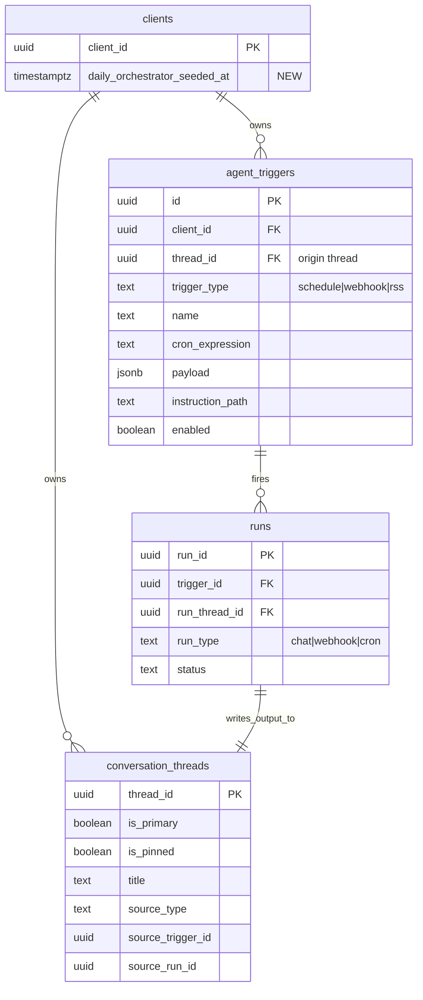

# feat: Replace Autopilot with Daily Orchestrator

## Overview

Replace the hidden Autopilot/pulse system with one seeded default automation, `Daily Orchestrator`, that behaves like every other automation (see origin: `docs/plans/2026-04-24-daily-orchestrator-design.md`).

This is a product simplification, not a new automation framework:

- one visible default automation,
- one morning run per day at `8:00 AM` local time,
- new thread per run,
- no `pulse`,
- no `quiet hours`,
- no separate Autopilot settings surface,
- no child automation creation.

The implementation must preserve the existing **primary Main chat thread**. Current autopilot bootstrap SQL is carrying two unrelated responsibilities at once: primary-thread creation and pulse automation seeding. This plan splits those concerns cleanly instead of deleting the old bootstrap blindly.

No matching `docs/product/ideations/*-requirements.md` file existed for this topic. Planning uses the approved design doc above as the origin foundation.

## Problem Statement

The current codebase has one proactive capability split across two product concepts:

- **Automations** are regular `agent_triggers` rows.
- **Autopilot** is a hidden special case with its own config table, route, card, prompt, scanner branches, and UI exclusions.

That split creates four kinds of drift:

1. **Product drift.** Users have to understand both “Automations” and “Autopilot” even though Autopilot is effectively just one seeded automation.
2. **Runtime drift.** `pulse` gets special handling in trigger schemas, scanner retry logic, quiet-hours suppression, executor dispatch, and list queries instead of reusing the normal schedule path.
3. **Storage drift.** Regular automations use storage-backed `instruction_path` files, but Autopilot bypasses that and injects a hardcoded prompt at runtime.
4. **Bootstrap drift.** `ensure_autopilot_for_client()` currently creates both the primary Main thread and the pulse trigger, so deleting Autopilot naively would break unrelated chat and Telegram flows.

## Proposed Solution

Implement `Daily Orchestrator` as a **normal `schedule` trigger row** seeded once per client, with a **normal storage-backed instruction file** and the **existing thread-per-run model**.

### Default automation shape

| Field | Value |
|---|---|
| `name` | `Daily Orchestrator` |
| `trigger_type` | `schedule` |
| `cron_expression` | `0 8 * * *` |
| `payload.cron` | `0 8 * * *` |
| `payload.timezone` | browser IANA timezone captured at seed time |
| `instruction_path` | `state/triggers/daily-orchestrator.md` |
| `enabled` | `true` |
| `thread_id` | existing primary Main thread ID, used only as required origin-thread linkage |

### Core implementation decisions

- Keep the **primary Main thread** concept intact.
- Remove the `pulse` trigger type entirely.
- Remove `autopilot_config`, quiet-hours logic, and the separate Autopilot settings route/card.
- Seed `Daily Orchestrator` through an **authenticated app bootstrap path**, not pure SQL bootstrap.
- Store the default prompt as a **normal editable file** in Supabase Storage.
- Use a **one-time seed marker** so deleting the automation does not cause it to be recreated later.
- Keep `agent_triggers.thread_id` pointed at the primary thread for this seeded automation because the current schema still requires an origin thread.

## Technical Approach

### Architecture

### Bootstrap split

Current SQL bootstrap couples primary-thread repair with autopilot pulse creation in `supabase/migrations/20260422110000_rename_primary_thread_agent_to_main.sql:4-110`.

The new shape should be:

1. **Database bootstrap**
   - Ensure the primary Main thread exists and remains pinned/primary.
   - Do not create any automation rows.

2. **Authenticated app bootstrap**
   - Capture browser timezone.
   - Seed `state/triggers/daily-orchestrator.md` in Storage if needed.
   - Insert the `Daily Orchestrator` schedule trigger if it has never been seeded.
   - Mark the client as seeded so later deletions are respected.

This split is required because SQL bootstrap cannot reliably:

- write the editable instruction file to Storage,
- know the browser timezone needed for “8:00 AM local time”,
- distinguish “never seeded” from “user intentionally deleted it.”

### Runtime simplification

After seeding, `Daily Orchestrator` should run through the same code path as any other schedule trigger:

- scanner treats it as `schedule`,
- executor uses `instruction_path` + trigger event message,
- spawn path records `run_type = 'cron'`,
- automations list/detail/hooks no longer exclude `pulse`.

There should be no remaining “if pulse then ...” logic in app runtime.

## Implementation Phases

### Phase 1: Remove Autopilot-only schema and split bootstrap responsibilities

**Goals**

- Preserve primary-thread creation/repair.
- Remove database ownership of proactive automation seeding.
- Delete pulse/autopilot-only schema and constraints.

**Tasks**

- Create a Supabase migration that:
  - removes `pulse` from `agent_triggers.trigger_type` constraints,
  - removes pulse-specific scheduling constraints and indexes,
  - drops `autopilot_config`,
  - drops `autopilot_interval_to_cron`, `autopilot_next_fire_at`, `sync_autopilot_trigger_from_config`, `bootstrap_autopilot`, and `ensure_autopilot_for_client`,
  - adds a new bootstrap path that only ensures the primary Main thread exists,
  - removes `autopilot` from the `runs.run_type` constraint.
- Add a nullable client-scoped seed marker, recommended as `clients.daily_orchestrator_seeded_at TIMESTAMPTZ`.
- Delete existing `pulse` trigger rows as part of the migration rather than trying to convert them in SQL.
  - Rationale: the replacement automation needs a Storage file and browser timezone, both of which belong in app bootstrap.
- Update generated database types.
- Update migration contract tests that currently assert `autopilot_config`, `pulse`, or `ensure_autopilot_for_client`.

**Success criteria**

- Database no longer exposes `autopilot_config` or `pulse`.
- New clients still get a primary Main thread.
- Existing `is_primary` flows continue to resolve the Main thread correctly.

### Phase 2: Seed `Daily Orchestrator` through authenticated app bootstrap

**Goals**

- Create the default automation exactly once.
- Use browser timezone.
- Seed a normal editable instruction file.
- Never recreate after user deletion.

**Tasks**

- Add a small authenticated bootstrap route or server action, e.g. `POST /api/automations/bootstrap-default`.
- Input schema: `{ timezone: string }`.
- On the server:
  - resolve the current client,
  - ensure the primary Main thread exists,
  - exit early if `clients.daily_orchestrator_seeded_at` is already set,
  - write `state/triggers/daily-orchestrator.md` via `createAgentFileClient()` using a code-owned default prompt body,
  - insert a normal `schedule` trigger row for `Daily Orchestrator`,
  - set `clients.daily_orchestrator_seeded_at = now()`.
- Add a lightweight client bootstrap effect under the authenticated dashboard shell that:
  - reads `Intl.DateTimeFormat().resolvedOptions().timeZone`,
  - calls the bootstrap route once,
  - invalidates thread/trigger queries on success.
- Keep prompt content close to the approved design:
  - concise morning briefing,
  - can do obvious internal work,
  - can prepare external drafts,
  - must not execute external-facing actions unprompted,
  - must not create child automations.

**Success criteria**

- First authenticated load creates `Daily Orchestrator` once.
- Its schedule resolves to `8:00 AM` in the browser timezone used during seeding.
- Deleting the automation does not recreate it on later loads.

### Phase 3: Remove pulse-specific runtime branches and surface exclusions

**Goals**

- Make the seeded automation run like a normal schedule trigger.
- Delete `pulse` branches from runtime and agent tooling.

**Tasks**

- Update trigger schemas to only support `schedule`, `webhook`, and `rss`:
  - `src/lib/triggers/schemas.ts:15-18`
  - related tests in `src/lib/triggers/__tests__/schemas.test.ts`
- Remove the pulse executor branch and hardcoded prompt injection:
  - `src/lib/triggers/executor.ts:136-163`
- Remove scanner branches for:
  - pulse timezone fallback,
  - pulse quiet-hours lookup,
  - pulse retry behavior,
  - pulse dispatch failure handling:
  - `src/lib/triggers/scanner.ts:102-177`
  - `src/lib/triggers/scanner.ts:230-289`
  - `src/lib/triggers/scanner.ts:352-362`
- Remove `autopilot` from persisted run-type unions:
  - `src/lib/runner/run-types.ts:7-15`
  - related SQL constraint migrations/tests.
- Update `spawnTriggerRun()` input types so automation runs only use `cron` or `webhook`.
- Remove `pulse` analytics mappings in trigger tooling:
  - `src/lib/managed-agents/tools/triggers/setup-trigger.ts`
- Stop hiding pulse rows from app UI and tool responses by deleting `.neq("trigger_type", "pulse")` filters:
  - `src/lib/triggers/automation-trigger-query.ts:57-64`
  - `src/hooks/use-triggers.ts:65-85`
  - `src/lib/managed-agents/tools/triggers/manage-active-triggers.ts:163-169`
- Remove `pulse` labels from automation UI components such as:
  - `src/components/automations/automations-table.tsx`

**Success criteria**

- There is no app runtime branch that depends on `trigger_type === "pulse"`.
- `Daily Orchestrator` executes through the existing schedule path.
- Webhook and RSS behavior is unchanged.

### Phase 4: Remove the separate Autopilot product surface

**Goals**

- Make Automations the only proactive-work surface inside the app.
- Remove Autopilot-only settings and copy in app surfaces.

**Tasks**

- Remove the Autopilot settings route and card:
  - `app/api/settings/autopilot/route.ts:1-84`
  - `app/settings/agent/general/page.tsx:1-46`
  - `src/components/settings/autopilot-card.tsx`
- Delete autopilot-only constants and quiet-hours helpers:
  - `src/lib/autopilot/constants.ts:7-73`
  - `src/lib/autopilot/quiet-hours.ts`
- Update user-facing app copy that references autopilot runs/settings where it now means normal automations.
  - Example: `app/settings/notifications/page.tsx`
- Keep public marketing positioning out of scope unless it directly confuses logged-in product UX.
  - Do not broaden this pass into a site-wide brand rewrite.

**Success criteria**

- Logged-in product surfaces no longer teach Autopilot as a separate concept.
- The default proactive behavior is visible from Automations only.

### Phase 5: Regression coverage, docs, and cleanup

**Goals**

- Remove stale autopilot assumptions from tests and docs.
- Prove that main-thread behavior and seeded automation behavior both work.

**Tasks**

- Replace autopilot migration contract tests with new bootstrap/default-automation tests.
- Add coverage for:
  - first-load seeding,
  - seed marker preventing recreation after delete,
  - schedule execution path for `Daily Orchestrator`,
  - continued primary-thread resolution for `/agent`, Telegram pairing, and default messaging helpers.
- Update QA docs that currently describe Autopilot Pulse:
  - `docs/qa/08-triggers-and-automations.md`
- Remove stale verification SQL that asserts autopilot_config or pulse invariants.
- Regenerate database types and keep AGENTS/docs aligned with the new concept model.

**Success criteria**

- No tests or QA docs refer to `pulse` or `autopilot_config`.
- Main-thread flows and Daily Orchestrator flows both pass.

## Alternative Approaches Considered

### 1. UI-only unification, keep `pulse` under the hood

Rejected. This would leave the real complexity intact:

- separate prompt injection,
- separate config table,
- separate scanner/executor branches,
- separate filters in list/tool surfaces.

It improves naming, not architecture.

### 2. Keep one persistent thread for the default automation

Rejected. The current automation model is one thread per run, and the approved design explicitly kept that model. Making `Daily Orchestrator` the one immortal exception would reintroduce a special system.

### 3. Pure SQL bootstrap for the new default automation

Rejected. SQL bootstrap cannot seed the editable Storage file, cannot know browser timezone, and cannot distinguish “never seeded” from “user deleted it on purpose.”

## System-Wide Impact

### Interaction Graph

1. Authenticated dashboard load
   - resolve client ID in `app/(dashboard)/layout.tsx`
   - client bootstrap effect posts browser timezone
   - bootstrap route ensures primary thread, seeds instruction file, inserts trigger row, stamps seed marker
   - triggers/threads queries revalidate and the automation appears in UI

2. Daily run
   - scanner claims the schedule trigger
   - executor builds the normal trigger event message using `instruction_path`
   - `spawnTriggerRun()` creates the run thread
   - managed-agent session runs
   - finalize persists output to the run thread

### Error & Failure Propagation

- Bootstrap route errors should not break dashboard rendering; they should be logged and retriable.
- Storage upload failure must not mark the seed as complete.
- Trigger row insert failure after file upload must either clean up or tolerate deterministic overwrite on retry.
- Scanner/executor failures should surface as normal trigger statuses, not pulse-only statuses such as `skipped_quiet_hours`.

### State Lifecycle Risks

- **Primary-thread regression:** removing autopilot bootstrap code can accidentally break `/agent` redirects or Telegram pairing if the main thread is not preserved.
- **Delete semantics regression:** without a seed marker, a deleted Daily Orchestrator would be recreated forever.
- **Partial bootstrap writes:** file and DB row creation are not in one transaction. The route must be idempotent.
- **Timezone drift:** if browser timezone is not captured at seed time, the “8:00 AM local time” guarantee collapses to product-default timezone behavior.

### API Surface Parity

The following interfaces must stay aligned:

- automations page queries and cards,
- automation detail views,
- `manage_active_triggers`,
- trigger scanner/executor,
- run type persistence and analytics,
- settings/general surfaces,
- primary-thread consumers (`/agent`, Telegram pairing, messaging preferences).

### Integration Test Scenarios

1. New client opens the dashboard for the first time:
   - Main thread exists,
   - `Daily Orchestrator` is created once,
   - timezone is stored from the browser,
   - the automation appears in Automations.
2. User deletes `Daily Orchestrator`, refreshes, and it does not come back.
3. Scanner fires `Daily Orchestrator` as a normal `schedule` trigger and creates a run thread with `run_type = 'cron'`.
4. `/agent` still redirects to the primary Main thread after all autopilot code is removed.
5. Telegram pairing still resolves to the primary Main thread and does not depend on any deleted autopilot bootstrap path.

## Acceptance Criteria

### Functional Requirements

- [ ] `Daily Orchestrator` is the only seeded proactive automation concept in the logged-in product.
- [ ] It is created as a normal `schedule` trigger with a normal editable instruction file.
- [ ] It is enabled by default and scheduled for `8:00 AM` in the client browser timezone used during seeding.
- [ ] It appears in the Automations UI and is editable, disable-able, rename-able, and deletable like any other automation.
- [ ] Deleting it does not recreate it automatically.
- [ ] It uses the existing per-run thread model.
- [ ] The primary Main thread still exists and remains the default messaging/chat thread.
- [ ] No runtime branch depends on `pulse` or `autopilot_config`.

### Non-Functional Requirements

- [ ] Bootstrap remains idempotent across repeated dashboard loads.
- [ ] Webhook and RSS automations do not regress.
- [ ] Run history and thread source linkage continue to work.

### Quality Gates

- [ ] Supabase migration(s) are executed via Supabase MCP when implementation happens.
- [ ] Database types are regenerated after schema changes.
- [ ] Automated coverage exists for bootstrap, delete semantics, primary-thread continuity, and schedule execution.
- [ ] QA docs are updated to match the new model.

## Dependencies & Prerequisites

- Existing automation instruction editing flow and `instruction_path` model stay in place.
- Existing run-thread architecture from the automations overhaul stays in place.
- Supabase Storage agent-files client remains the mechanism for seeding the default instruction file.

## Risk Analysis & Mitigation

| Risk | Why it matters | Mitigation |
|---|---|---|
| Primary-thread bootstrap accidentally removed | Breaks `/agent`, Telegram pairing, and default messaging resolution | Split bootstrap explicitly; add regression tests around `getPrimaryThread()` consumers |
| Seed route recreates deleted automation | Violates the approved product behavior | Add `clients.daily_orchestrator_seeded_at` and never reseed once stamped |
| Missing or stale instruction file | Seeded trigger exists but cannot run/edit correctly | Upload deterministic file path before row insert; retry safely |
| Timezone defaults to product fallback | User expectation for “8:00 AM local time” is broken | Capture timezone from browser in the bootstrap request |
| Hidden pulse references remain | Code compiles but behavior is inconsistent | Use repo-wide search gates for `pulse`, `autopilot_config`, and `run_type = 'autopilot'` before merge |

## Future Considerations

- If `agent_triggers.thread_id` becomes nullable later, `Daily Orchestrator` can stop pointing at the primary thread as an origin-thread compatibility holdover.
- Prompt tuning can evolve independently after the architecture simplification lands.
- Template galleries or additional seeded automations remain explicitly out of scope.

## Sources & References

### Origin

- **Origin document:** [docs/plans/2026-04-24-daily-orchestrator-design.md](/Users/sethlim/Documents/sunder-next-migration-20260225/docs/plans/2026-04-24-daily-orchestrator-design.md)
  - Carried-forward decisions: one seeded automation, keep per-run threads, remove `pulse`, remove quiet hours, no child automations.

### Internal References

- Hardcoded pulse prompt and config schema: `src/lib/autopilot/constants.ts:7-73`
- Pulse scanner branches and quiet-hours fetch: `src/lib/triggers/scanner.ts:102-177`, `src/lib/triggers/scanner.ts:230-289`, `src/lib/triggers/scanner.ts:352-362`
- Pulse executor branch: `src/lib/triggers/executor.ts:136-163`
- Hidden pulse filters in automation queries: `src/lib/triggers/automation-trigger-query.ts:57-64`, `src/hooks/use-triggers.ts:65-85`, `src/lib/managed-agents/tools/triggers/manage-active-triggers.ts:163-169`
- Separate Autopilot route and settings page: `app/api/settings/autopilot/route.ts:1-84`, `app/settings/agent/general/page.tsx:1-46`
- Primary-thread helpers and consumers: `src/lib/chat/threads.ts:12-58`, `src/lib/chat/threads.ts:102-118`, `app/(dashboard)/agent/page.tsx:1-24`, `src/lib/settings/profile/messaging-preferences.ts:51-64`
- Current bootstrap coupling: `supabase/migrations/20260422110000_rename_primary_thread_agent_to_main.sql:4-110`
- Current pulse-only schema: `supabase/migrations/20260306030000_create_autopilot_config.sql:1-50`, `supabase/migrations/20260306030001_add_pulse_trigger_type.sql:1-22`

### Related Work

- Existing automations run-thread architecture: [docs/product/plans/2026-04-12-001-feat-automations-ux-overhaul-plan.md](/Users/sethlim/Documents/sunder-next-migration-20260225/docs/product/plans/2026-04-12-001-feat-automations-ux-overhaul-plan.md)
- KISS automations revamp baseline: [docs/tasks/2026-04-19-kiss-managed-agent-automations-tasklist.md](/Users/sethlim/Documents/sunder-next-migration-20260225/docs/tasks/2026-04-19-kiss-managed-agent-automations-tasklist.md)
