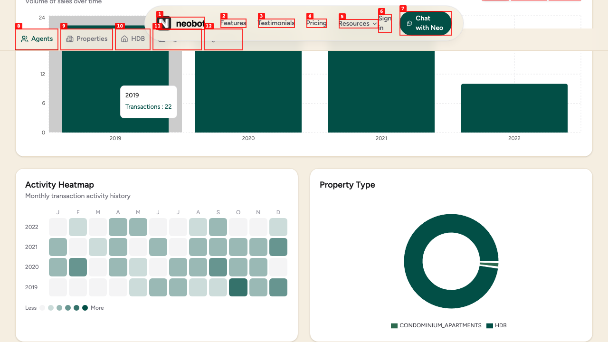
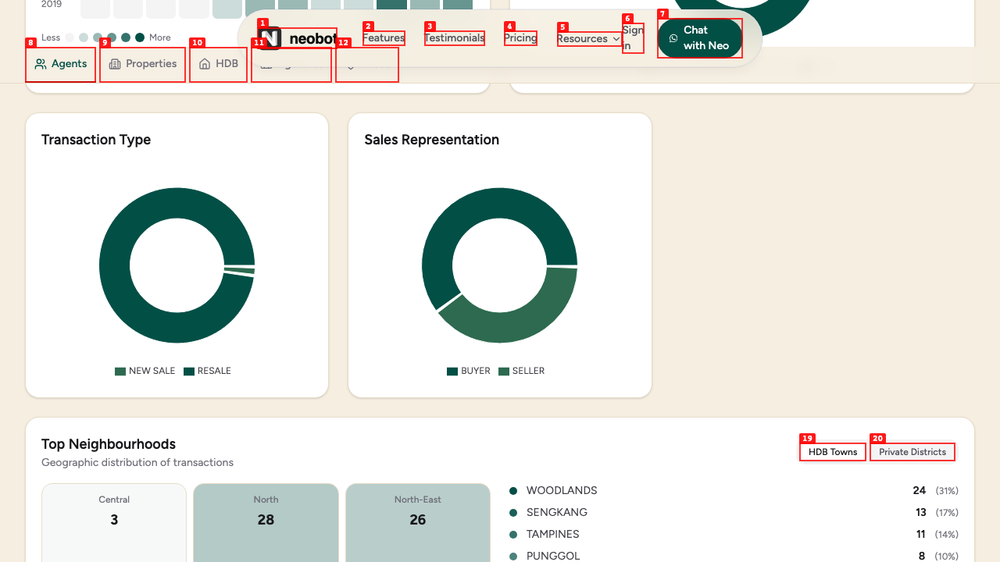
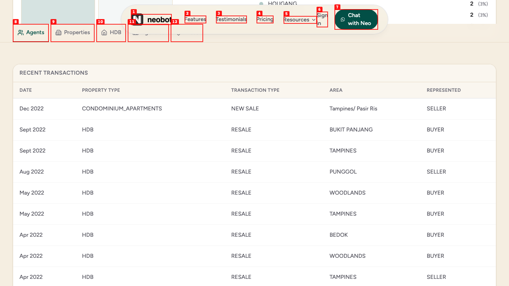
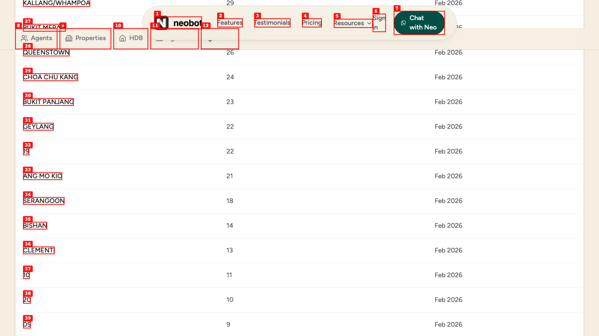
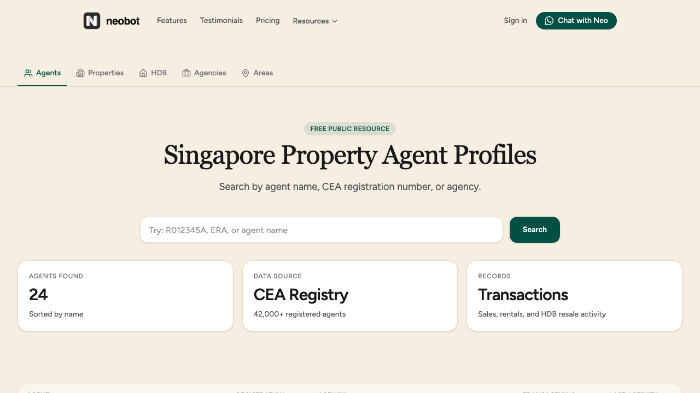
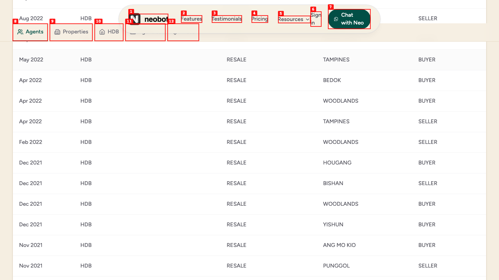
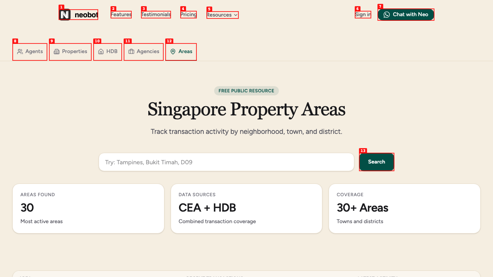

# Dogfood Report: Sunder Market Data Hub

| Field | Value |
|-------|-------|
| **Date** | 2026-03-01 |
| **App URL** | http://localhost:3000 |
| **Session** | market-data-hub |
| **Scope** | Market Data Hub feature — /market/*, sub-navigation, category cards, CTAs, agent profile enhancements, redirects from old routes |

## Summary

| Severity | Count |
|----------|-------|
| Critical | 0 |
| High | 0 |
| Medium | 4 |
| Low | 3 |
| **Total** | **7** |

## What Works Well

- Hub landing page (/market) renders correctly with all 5 category cards and CTA banner
- Sub-navigation highlights the active section on all pages
- All 5 listing pages load correctly under /market/*
- Redirects from old routes (308 permanent) work for both index and deep-links (e.g., /agents/R060832J → /market/agents/R060832J)
- Agent profile stat cards display correctly (Total Transactions, Last 12 Months, Last Transaction, Avg Txn/Quarter, Active Years)
- Transaction Volume chart with Yearly/Quarterly/Monthly toggle works correctly
- Activity Heatmap renders with correct year/month data
- Property Type donut chart renders
- Transaction Type and Sales Representation donut charts render
- Top Neighbourhoods section with region cards and town list renders
- Header navigation links updated to /market/* paths
- No JavaScript errors in console across all pages tested
- Search functionality returns results and updates count label

## Issues

### ISSUE-001: Raw database enum values displayed across charts and tables

| Field | Value |
|-------|-------|
| **Severity** | medium |
| **Category** | content |
| **URL** | http://localhost:3000/market/agents/R060832J |
| **Repro Video** | N/A |

**Description**

Chart legends and the Recent Transactions table display raw database enum values instead of human-readable labels. This affects multiple data fields:

- **Property Type:** "CONDOMINIUM_APARTMENTS" instead of "Condominium / Apartments"
- **Transaction Type:** "NEW SALE", "RESALE" instead of "New Sale", "Resale"
- **Representation:** "BUYER", "SELLER" instead of "Buyer", "Seller"
- **Town/Area names in charts and neighbourhoods list:** "WOODLANDS", "SENGKANG", "TAMPINES" in ALL CAPS instead of title case

This appears across the Property Type donut legend, Transaction Type donut legend, Sales Representation donut legend, Top Neighbourhoods town list, and all rows of the Recent Transactions table.

**Repro Steps**

1. Navigate to http://localhost:3000/market/agents (click any agent)
   

2. Scroll to the charts section — observe "CONDOMINIUM_APARTMENTS" and "HDB" in the Property Type legend
   

3. Scroll to the Recent Transactions table — all column values are raw DB enums
   

---

### ISSUE-002: Areas page shows bare district numbers without labels

| Field | Value |
|-------|-------|
| **Severity** | medium |
| **Category** | content |
| **URL** | http://localhost:3000/market/areas |
| **Repro Video** | N/A |

**Description**

The Areas listing page shows some entries as bare numeric values ("19", "10", "20", "05", "21", "23", "03") instead of proper labels like "District 19" or "D19 — Hougang / Punggol". These are private property district codes displayed without any context. A user seeing just "19" in a list of area names like "WOODLANDS" and "TAMPINES" has no idea what it refers to.

**Repro Steps**

1. Navigate to http://localhost:3000/market/areas and scroll down past the named towns
   

2. **Observe:** Entries like "19" (22 txns), "10" (11 txns), "20" (10 txns), "05" (9 txns) are mixed in with named areas

---

### ISSUE-003: Inconsistent area name formatting in transactions table

| Field | Value |
|-------|-------|
| **Severity** | low |
| **Category** | content |
| **URL** | http://localhost:3000/market/agents/R060832J |
| **Repro Video** | N/A |

**Description**

The AREA column in the Recent Transactions table has inconsistent formatting. Most entries are ALL CAPS (e.g., "BUKIT PANJANG", "TAMPINES") but one entry shows "Tampines/ Pasir Ris" in mixed case with an extra space before the slash. This appears to be a data inconsistency between HDB and private property data sources.

**Repro Steps**

1. Navigate to an agent profile and scroll to the Recent Transactions table
   

2. **Observe:** First row shows "Tampines/ Pasir Ris" while all other rows show ALL CAPS like "BUKIT PANJANG"

---

### ISSUE-004: Search query not persisted in URL

| Field | Value |
|-------|-------|
| **Severity** | medium |
| **Category** | ux |
| **URL** | http://localhost:3000/market/agents |
| **Repro Video** | videos/issue-search.webm |

**Description**

When searching on the Agents page (and likely all listing pages), the search query is not reflected in the URL as a query parameter. After searching "ERA", the URL remains `/market/agents` instead of `/market/agents?q=ERA`. This means:

- Search results cannot be shared via URL
- Refreshing the page loses the search query
- Browser back button doesn't preserve search state

**Repro Steps**

1. Navigate to http://localhost:3000/market/agents
   

2. Type "ERA" and click Search — results update correctly (24 agents found matching "ERA")
   

3. **Observe:** URL bar still shows `/market/agents` with no query parameter

---

### ISSUE-005: No pagination on agent transactions table

| Field | Value |
|-------|-------|
| **Severity** | medium |
| **Category** | ux |
| **URL** | http://localhost:3000/market/agents/R060832J |
| **Repro Video** | N/A |

**Description**

The Recent Transactions table on the agent profile page shows all transactions in a single unpaginated list. For the test agent (77 transactions), this creates a very long scrollable table. High-volume agents could have hundreds or thousands of transactions, making the page excessively long and hard to navigate.

**Repro Steps**

1. Navigate to any agent profile (e.g., http://localhost:3000/market/agents/R060832J)
2. Scroll to the Recent Transactions section
   

3. **Observe:** All 77 transactions are rendered in a single list with no pagination, page size control, or "load more" mechanism. Previous/Next buttons exist but are for a different section.

---

### ISSUE-006: Spelling inconsistency — "neighborhood" vs "neighbourhoods"

| Field | Value |
|-------|-------|
| **Severity** | low |
| **Category** | content |
| **URL** | http://localhost:3000/market/areas |
| **Repro Video** | N/A |

**Description**

The Areas page uses American English spelling "neighborhood" in its description ("Track transaction activity by neighborhood, town, and district.") while the agent profile uses British/Singapore English "Neighbourhoods" ("Top Neighbourhoods"). Singapore follows British English conventions, so "neighbourhood" should be used consistently.

**Repro Steps**

1. Navigate to http://localhost:3000/market/areas — subtitle reads "neighborhood"
   

2. Navigate to any agent profile, scroll to Top Neighbourhoods — heading reads "Neighbourhoods"
   

---

### ISSUE-007: Repeated CSS preload warning on every navigation

| Field | Value |
|-------|-------|
| **Severity** | low |
| **Category** | console |
| **URL** | All /market/* pages |
| **Repro Video** | N/A |

**Description**

Every page navigation within `/market/*` generates a console warning: "The resource http://localhost:3000/_next/static/css/da6512f5b0afe8ea.css was preloaded using link preload but not used within a few seconds from the window's load event." This is a Next.js CSS preload issue that generates noise in the console. Not user-facing but indicates a potential performance optimization opportunity.

**Repro Steps**

1. Open browser DevTools console
2. Navigate to any `/market/*` page
3. **Observe:** CSS preload warning appears, and accumulates with each navigation

---
